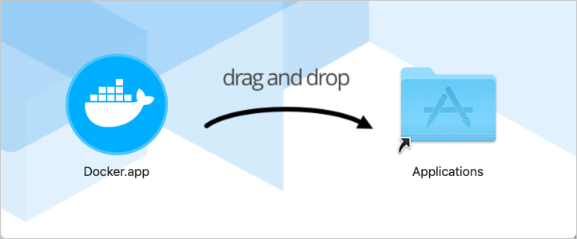
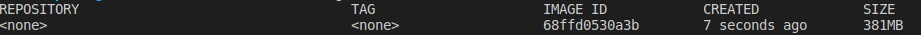
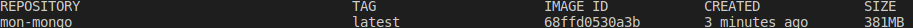
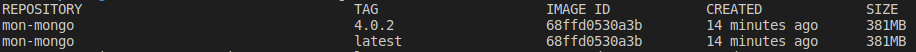

# Docker RefCard
*Version française*

RefCard d'utilisation de docker.

## Sommaire

1. [Présentation](#presentation)
2. [Architecture](#architecture)
3. [Docker définitions ](#docker-definitions)
4. [Installer docker](#installer-docker)
5. [Exécuter un conteneur](#executer-un-conteneur)
6. [Récupérer une image depuis un dépôt](#executer-une-image-depuis-un-depot)
7. [Construire une image avec Dockerfile](#construire-une-image-avec-dockerfile)
8. [Versionner les images](#versionner-les-images)
9. [Déployer une image dans un dépôt](#deployer-une-image-dans-un-depot)
10. [Démarrer, Arrêter un conteneur](#demarrer-arreter-un-conteneur)
11. [Volumes](#volumes)
12. [Réseau](#reseau)
13. [Cheat Sheet](#cheat-sheet)

[Pour aller plus loin](#pour-aller-plus-loin)

14. [Docker Machine](#docker-machine)
15. [Docker Compose](#docker-compose)

## Présentation

Docker est un outil conçu pour faciliter la création, le deploiement et l'exécution d'applications distribuées et cloud native. Il fournit un ensemble d'outils qui permettent aux développeurs de créer des templates appelés images. Ces derniers peuvent être utilisés pour créer des machines virtuelles appelé conteneurs dans lesquels on y inclut les  applications et leurs dépendances.

Docker permet aussi aux organisations d'automatiser leur infrastructure, isoler les applications, maintenir la cohérence et améliorer l'utilisation des ressources.

Docker est une solution open source et disponible gratuitement en version communauté ou en souscrivant une édition entreprise. Il est nativement exécuté dans des environnements Linux du fait de sa genèse mais il fonctionne aussi sous Mac et Windows.

## Architecture

Docker est basé sur l'architecture client-server. Le client communique avec le démon (daemon) docker, qui lui construit, exécute et distribue les conteneurs.

Le démon docker ainsi que le client peuvent cohabiter dans le même système. Dans le cas où ils sont sur des machines différentes, ils comuniquent par API Rest via des sockets UNIX ou une interface réseau.


### Le démon docker

Le démon docker `dockerd` écoute les requêtes de l'API et gère les objets tels que les images, les conteneurs, les réseaux et les volumes.
> Il faut noter qu'un démon peut également communiquer avec d'autres démons pour gérer les services docker.

### Le client docker

Le client `docker` est le premier moyen pour interagir avec Docker. Lorsque l'on exécute des commandes telles `docker run`, le client envoie ces commandes au démon, qui les exécutent.


### Le dépôt (registry) docker

Le registry est un dépôt d'images publiques ou privées. Docker est configuré par defaut pour utiliser docker hub qui est un dépôt publique. 

> Il est possible de créer son propre registry privé dans des plateformes comme `artifactory`, `nexus`.
> La plupart des plateformes cloud on leurs propres registry.
> `Amazon ECR (Elastic Container Registry)` pour AWS, `GCR (Google Container Registry)` pour GCP et `ACR (Azure Container Registry)` pour Azure.


## Docker définitions

**Couche** - Un ensembe de fichiers en lecture seule pour provisionner un system.

**Image** - Un template prêt à l'emploi avec des instructions pour la création d'un conteneur.

**Conteneur** - Une instance d'une image exécuté dans un système.

**Registry** - Un espace de stockage des images.

**Docker machine** - Une machine virtuelle dans laquelle sont exécutés les conteneurs.

**Docker compose** - Un utilitaire qui permet d'exécuter plusieurs conteneurs comme un système.

## Installer docker

Docker est disponible pour la plus part des OS. 

### Installer Docker sous Windows 10

> Les versions concernées ici sont windows 10 professionnel ou entreprise 64-bits

1. S'assurer que la `Hyper-V` est activé sinon ouvrir Powershell et exécuter les commandes suivantes:
    > Enable-WindowsOptionalFeature -Online -FeatureName Microsoft-Hyper-V -All
    > Enable-WindowsOptionalFeature -Online -FeatureName containers -All
  
  [!NOTE]: Rédémarrer l'ordinateur pour que l'activation d'Hyper-V soit active
2. Créer un compte sur hub.docker.com puis télécharger dokcer-ce: https://hub.docker.com/editions/community/docker-ce-desktop-windows 

### Installer docker sous mac

> Les versions concernées sont celles supérieures ou égale à OS X 10.13

1. Télécharger docker sous Mac https://hub.docker.com/editions/community/docker-ce-desktop-mac/
2. Double cliquer sur `Docker.dmg` pour ouvrir l'installateur puis glisser l'icône `Docker.app` dans le dossier Applications.
   
3. Double cliquer sur `Docker.app` dans le dossier Applications pour démarrer docker
   

### Installer docker sous linux ubuntu

> Les versions concernées sont Eoan 19.10, Bionic 18.04 (LTS), Xenial 16.04 (LTS), toutes en versions 64 bits.

1. Désinstaller les versions antérieures de docker
   > $ sudo apt-get remove docker docker-engine docker.io containerd runc
2. Mettre à jour l'index des paquets
   > $ sudo apt-get update
3. Installer les paquets nécessaires pour permettre à `apt` de communiquer avec le dépôt via `https`
   > $ sudo apt-get install \
     apt-transport-https \
    ca-certificates \
    curl \
    gnupg-agent \
    software-properties-common
4. Ajouter la clé officielle de docker
   > $ curl -fsSL https://download.docker.com/linux/ubuntu/gpg | sudo apt-key add -
5. Ajouter le dépôt pour les versions stables de docker
   > $ sudo add-apt-repository \
   "deb [arch=amd64] https://download.docker.com/linux/ubuntu \
   $(lsb_release -cs) \
   stable"
6. Mettre à nouveau à jour l'index des paquets
7. Installer la dernière version de docker
   > $ sudo apt-get install docker-ce docker-ce-cli containerd.io


## Exécuter un conteneur

Après l'installation de docker, on peut maintenant exécuter des conteneurs en ligne de commande. Si l'image que l'on souhaite exécuter n'existe pas en local, Docker la téléchargera automatiquement de dockerhub et la démarrera ensuite.

Pour démarrer une image docker hello-world, on exécute la commande suivante
> docker run --rm hello-world

Après téléchargement de l'image et démarrage du conteneur, le texte `Hello from Docker!` s'affiche ainsi que toute les étapes de démarrage du conteneur.
L'utilisation de l'option `--rm` supprime automatiquement le conteneur pour libérer de l'espace.

## Récupérer une image depuis un dépôt

Le moyen le plus simple d'avoir une image c'est de consulter la page hub.docker.com pour trouver une image déjà prête. Docker hub certifie déjà un bon nombre de comptes afin de s'assurer de l'authencité des images (officielles). Il y a aussi des images créées par de simples utilisateurs.

Puisque par défaut docker télécharge les images de dockerhub, il suffit donc d'éxécuter la commande `pull` pour télécharger la dernière version de l'image souhaitée.
> docker pull mongodb

Pour télécharger une version spécifique il suffit d'ajouter un tag à la suite de nom de l'image.
> docker pull mongodb:4.0.2

Si l'image que l'on souhaite télécharger n'est pas pas hébergée par dockerhub, il faudra préciser le lien du dépôt sans `https` dans le nom de l'image comme suit:
> $ docker pull mondepot.local:5000/mongoperso:maversion

[!NOTE]: S'assurer d'être connecté au dépôt

## Construire une image avec Dockerfile

Dockerfile est un script qui contient un ensemble de commandes et d'instructions qui seront automatiquement exécutées séquentiellement dans l'environnement de docker pour créer une nouvelle image.

```
FROM mongo:4.0.2 (1)
COPY init.json /init.json (2) 
CMD mongoimport --host mongodb --db exampleDb --collection contacts --type json --file /init.json --jsonArray (3)
```
**(1)** Télécharge l'image mongo:4.0.2 comme base de l'image qui sera créée. La commande FROM doit toujours être la première du fichier dockerfile

**(2)** Copie le fichier init.json dans le répertoire root et garde le même nom init.json. 

**(3)** Exécute la commande mongoimport lorsqu'un nouveau conteneur est créé à partir de l'image.

Une fois le fichier dockerfile prêt, on exécute la commande `build` de docker pour lancer la construction. Cette commande utilisée sans options crée une image sans nom.

> docker build .



Pour donner un nom à l'image, il suffit de rajouter l'option `-t`

> docker build -t mon-mongo .



## Versionner les images

La version par défaut quand on crée une image docker avec l'option -t est `latest`. Afin de reconnaître les images il est fortément recommander d'y ajouter des versions. Il suffit à la suite du nom de l'image ajouter `:version` pour que docker crée une image avec la version associée.

> docker build -t mon-mongo:4.0.2 .



## Déployer une image dans un dépôt

Pour rendre disponible une image docker, il faut la déployer dans un dépôt. Pour ce faire, il faut se connecter au dépôt dockerhub ou celui privé exécuter la commande:

**Déployer dans dockerhub**
> docker push utilisateur/mon-mongo:4.0.2

**Déployer dans un dépôt privé**
> $ docker push mon-depot-artifactory/mon-mongo:4.0.2


## Démarrer, Arrêter un conteneur

Une fois qu'un conteneur est en cours d'éxécution, on peut l'arrêter à l'aide de la commande `stop`.

> docker stop mon-mongo (1)

**(1)** nom du conteneur ou identifiant du conteneur

L'état complet du conteneur est écrit sur le disque. Par conséquent, si l'on souhaite le réexécuter dans l'état où il se trouvait lors de son arrêt, si suffit d'utiliser la commande `start`.

> docker start mon-mongo

## Volumes

## Réseau

## Cheat sheet

#### Télécharger une image
`docker pull image_name`

#### Exécuter et arrêter un conteneur
`docker [start | restart | stop] [container_name | container_full_id | container_startwith_id]`

#### Afficher l'historique d'une image
`docker history [image_name | image_full_id | image_startwith_id]`

#### Créer une image tagguée
`docker tag sourtce_image[:tag] target_image[:tag]`

#### Remove one or multiple images
`docker rmi [...images_names | ...images_ids]`

#### Créer et démarrer un conteneur par la commande run
`docker run -ti --name container_name image_name command`

#### Créer et démarrer un conteneur par la commande run et l'arrêter s'il y a une erreur.
`docker run --rm -ti image_name command`

#### Exécuter une commande dans un conteneur
`docker exec -ti [container_name | container_id] [command.sh | (bash | sh) -c "command"]`

#### Afficher les logs d'un conteneur
`docker logs -ft [container_name | container_id]`

#### Exemple de démarrage d'un conteneur avec exposition de port, montage de volume et mise à jour d'une variable d'environnement
`docker run -it --rm -p 8080:8080 -v /path/to/agent.jar:/agent.jar -e JAVA_OPTS=”-javaagent:/agent.jar” tomcat:9.0.14-jre11`


## Commandes utiles pour nettoyer un système

#### Tuer tous les conteneurs en cours d'exécution
`docker kill $(docker ps -q)`

#### Supprimer tous les conteneurs arrêtés
`docker rm $(docker ps -aq)`

#### Supprimer les images dont le statut est 'dangling'
`docker rmi $(docker images -qf dangling=true)`
