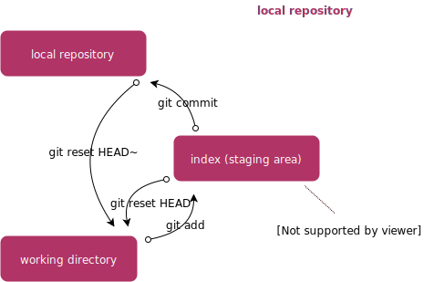
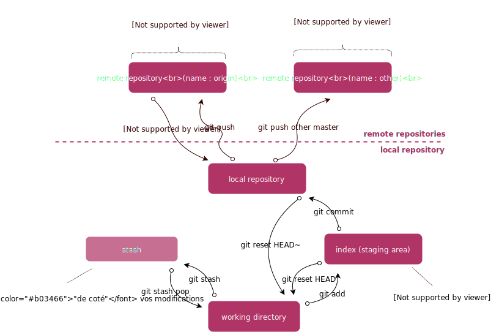
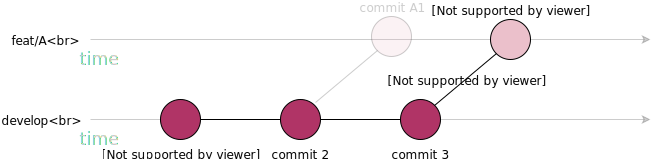

# Git RefCard
*English version*

Git 2.37.0 Usage RefCard

Written by Ludovic Dussart.

## Summary

1. [Presentation](#presentation)
2. [Operating principles](#operating-principles)
3. [Cheat Sheet](#cheat-sheet)
    * [Rules and good practices](#rules-good-practices)
    * [Who ? What ? How?](#who--what--how-)
    * [Frequent orders](#frequent-orders)
4. [Start with a project](#start-with-a-project)
5. [Minimum configuration](#minimum-configuration)
6. [Ignore files (.gitignore)](#ignore-files-gitignore)
7. [Typical development workflow with Git](#workflow-type-of-development-with-git)
8. [Branches and Conventions Workflow](#workflow-of-branches-and-agreements)
9. [Commit conventions](#commit-conventions)

[To go further](#to-go-further)

10. [More Orders](#more-orders)
10. [Enrich the Git configuration](#enrich-the-git-configuration)
11. [Tag creation](#tag-creation)
12. [Branch merge](#branch-merge)
13. [Branch rebase](#branch-rebase)
14. [Add interactive](#add-interactive)
15. [Storage](#storage)
16. [Conflict management](#conflict-management)
17. [Reflog (your safety net)](#reflog-your-safety-net)
18. [Use a versioning platform](#use-a-versioning-platform)
19. [Glossary](#glossary)
20. [References](#references)
21. [The Bear](#bear)

## Presentation

Git is a version manager that records (historicizes) the evolution of changes made to a file or set of files over time.

Created in 2005 (on the initiative of Linus Torvalds, the creator of Linux), this new system offers the following promises:
* speed
* simple design
* support for non-linear developments (thousands of parallel branches)
* fully distributed
* ability to effectively manage large projects such as the Linux kernel (speed and compactness of data)

Since its birth in 2005, Git has evolved and matured to be easy to use while maintaining its initial qualities. The community quickly adopted it and today it is the reference tool for file versioning:


Credits : [GitPrime](https://blog.gitprime.com/git-didnt-beat-svn-github-did)

## Functioning principles

To use Git optimally, it is necessary to understand how it works to version your files.

### The Git Object Model

#### The **SHA-1**

Git manipulates objects that are identified and verified by a **unique** 40-character control string (SHA-1 fingerprint).
Very important concept, this fingerprint is calculated according to the content of the file or the structure of the directory considered.

A SHA-1 fingerprint looks like this:

`24b9da6552252987aa493b52f8696cd6d3b00373`

#### Objects

Each object consists of 3 elements: a type, a size and a content.

* The **blob**


A **blob** is used to store file data.
It is nothing more than a piece of binary data. It doesn't reference anything and has no attributes, not even a filename.

> The `git show` command allows to examine the contents of a blob

* The **tree**


A **tree** is like a directory — it references a list of other "trees" and/or other "blobs" (i.e. files and subdirectories).
It allows to reconstruct the file hierarchy of a snapshot (*commit*).

> The `git ls-tree` command allows to examine the contents of a tree (in a more detailed way than a `git show`)

* The **commit** (instantaneous)


A "commit" points to a single "tree" and marks it to represent the project at a certain point in time. It contains meta information about that point in time, such as a description, a timestamp, the author of the content since the last commit, a pointer to the last commit(s) , etc.

Note that a "commit" does not contain information about what has been modified; all changes are calculated by comparing the contents of the "tree" referenced in this "commit" with the "tree" associated with the parent(s) of the "commit".

> The `git show` or `git log --pretty=raw` command allows you to examine your favorite “commits”

##### Example representation

If we have a simple project with the following folder/file structure:

```ruby
$>tree
.
|-- README
`--lib
     |-- inc
     | `-- tricks.rb
     `-- mylib.rb

2 directories, 3 queues
```

It will be handled by Git like this:


* The tag**


The **tag** allows you to put a label on a commit. Generally used to manage *releases*. This object is used to tag a source code version at a given time.

It contains an object name (simply named "object"), an object type, a tag name, the name of the person ("tagger") who created the tag, and a message (which may contain a signature , viewable using `git cat-file`)

### Git stores snapshots, not diffs on your files:

Unlike other systems, Git does not manage and store the list of files and the changes made to each file over time. It captures a snapshot of your workspace content and saves a reference to that snapshot. To be efficient, if the files haven't changed, Git doesn't store the file again, just a reference to the original file it already checked in.

### Almost all operations are local

Unlike other systems, the logging of changes and the operations performed on your workspace are managed locally. Everything is stored on your disk and is **your local repository**. The publication of the changes on *remote servers* is done in a second step.

### Nothing is lost with Git

Generally, Git just adds data.
When you perform actions in Git, almost all of them simply add data to the Git database. It is very difficult to make the system perform actions that are not reversible or to make it erase data in any way. However, as in most version control systems, you can lose or corrupt changes that have not yet been entered into the database; but once you've committed a snapshot to Git, it's very hard to lose it, especially if you additionally sync your local database with a remote repository.

### The Three States

**This concept is essential**

Git supports three states in which files can reside: **modified**, **indexed**, and **committed**
* **Modified**: means that you have modified the file but that it has not yet been validated in the database
* **Indexed**: means that you have marked a modified file in its current version to be part of the next snapshot (*commit*) of the project
* **Validated**: means the data is stored securely in your local database


*Working directory (WD), index area and Git directory.*

Credits: [Git-scm](https://git-scm.com/book/fr/v2/D%C3%A9marrage-rapide-Rudiments-de-Git)


* **The working directory** (named **WD** thereafter) is a single extraction of a version of the project. These files are extracted from the compressed database in the Git directory and placed on disk for use or modification.
* **The index area** is a simple file, usually located in the Git directory, that stores information about what will be part of the next snapshot (*commit*). It is also sometimes called the preparation area.
* **The Git directory** is where Git stores your project's metadata and object database. It's the most important part of Git, and it's what gets copied when you clone a repository from another source.

The standard use of Git takes place in 3 steps:
1. you **modify** files in your *working directory*
2. You **index** modified files, which adds snapshots of those files to the *index area*
3. you **commit**, which has the effect of switching snapshots of files from the index to *the database in the Git directory*



> [Inspiration: Git - Basics](https://git-scm.com/book/fr/v2/D%C3%A9marrage-rapide-Rudiments-de-Git)
>
> [Credits: Git-book](https://alexgirard.com/git-book/intro/modele-objet-git/)

## Cheat Sheet
### Rules & best practices
* Create a branch for any new development (cf. [Workflow of branches and conventions](#workflow-de-branches-et-conventions))
* Prefix the name of your branch with a **type** (cf. [Workflow of branches and conventions](#workflow-de-branches-et-conventions))
* A commit = a task (cf. [Interactive addition](#addition-interactive))
* Prefer the indexing of lines (**hunks**) rather than files (cf. [Add interactive](#addition-interactive))
* Use commit conventions (cf. [Commit conventions](#commit-conventions))
* Rework your branch history before proposing it to be integrated (cf. [Rebase interactive](#rebase-interactif))
* Do not rewrite a history published on a collaborative remote branch

### Who ? What ? How ?

#### I'm a tech lead

* I need to merge a `feature branch` on `develop`: cf. [Branch merge](#branch-merge)
* I need to *label* my application: cf. [Tag creation](#Creation-of-tag)

#### I'm a developer

* I don't know where to start: cf. [Typical development workflow with Git](#workflow-type-of-development-with-Git)
* My branch is not up to date with the `develop` branch: cf. [Branch rebasing](#branch-rebasing)
* I have just updated my branch and it has conflicts: cf. [Conflict management](#Conflict-management)
* I need to rewrite (clean up) the history of my branch: cf. [Interactive rebase](#Rebase-interactive)
* I made a bad manipulation and I lost my modifications: cf. [Reflog](#reflog-your-safety-net)
* I have finished working on my task and I must propose it to my team: cf. [Submit a merge request](#submit-a-branch-merge-request)

### Frequent Orders
#### Setup

```shell
git config --global -l
```
Displays all global configurations. Use `--local` or `--system` to change the scope.

```shell
git config --global -e
```
Allows you to edit global configurations. Use `--local` or `--system` to change the scope.

```shell
git config --global <parameter> <value>
```
Allows you to define a global configuration. Use `--local` or `--system` to change the scope.

#### Around the commit

```shell
git-status
```
Lists all changes that have not yet been committed.

```shell
git diff#WD vs index
git diff --staged # index vs HEAD (last commit)
git diff HEAD # WD & index vs HEAD (last commit)
git diff <sha1-commit1> <sha1-commit2> # commit1 vs commit2
```
Displays the differences between two object references.

```shell
git-log
```
Displays the current branch's commit history. Use the options `--oneline --graph` for readability and `--all` to display the history of all branches.

```shell
git show <optional ref>
```
Allows you to view the contents of an object.

```shell
git reflog
```
Shows the history of everything that happened on your local repository. Add the `--relative-date` option to add a notion of time.

#### Indexing and cancellation

```shell
git add --all
git add -A
git add .
```
Adds all changes from all files to the index ready for commit.

```shell
git add <file>
```
Adds all changes in the file to the index so they are ready for commit.

```shell
git add -p <optional file>
```
Proposes the addition of changes, **line by line** of one or more files so that they are ready to be committed.

```shell
git reset <optional file>
```
Moves changes of one or more files from index area to WD.

```shell
git restore <file>
```
Cancel local modifications of a file.

#### Commit and Undo Commit

```shell
git commit -m "<type>(<optional scope>): <commit message>"
```
Creates a commit of previously indexed changes with a simple description. Chain the `-m` to also enter `body` and `footer`.

```shell
gitcommit
```
Provides a prompt for creating a commit message, with previously indexed changes.

```shell
git commit --amend
```
Incorporates previously indexed changes into the latest commit (`HEAD`). Add the `--no-edit` option to not edit the message.

```shell
git reset HEAD~<optional amount>
```
Undo one or more commits. Their content (modifications to the files) is returned to the WD.

#### Branches

```shell
git branch
```
Lists all local branches. Add the `--all` option to show remote branches.

```shell
git branch <branch name>
```
Creates a new branch (from the `HEAD`) with the given name. Change the name of a branch with the ` -m <old-name> <new-name>` option.

```shell
git switch <branch name>
```
Switch the `HEAD` to the designated branch and update the working directory. Use `git switch -` to switch to the previous reference.

```shell
git switch -c <branch name> <optional base-ref>
```
Creates a new branch and positions itself on it. A second `<base-ref>` parameter initiates the branch from the targeted object.

```shell
git branch -d <branch name>
```
Deletes the specified branch.

#### Tags

```shell
git tag <tagname>
```
Create a tag on the `HEAD` commit.

```shell
git push <remote> <tagname>
```
Publish the tag to the remote repository.

#### Going back

```shell
git reset --hard <SHA-1>
```
Undoes all commits after the commit id but does not keep the changes.

```shell
git revert <SHA-1>
```
Replays the **reverse** modifications of the targeted commit and creates a new *"revert"* commit.

#### Remote repository & synchronization

```shell
git remote -v
```
Lists all configured remote repositories.

```shell
git remote show <remote>
```
Show details about the remote repository.

```shell
git remote add <remote> <url>
```
Adds a remote repository.

```shell
git fetch <remote> <branch>
```
Updates the state of a remote repository in your local repository (but does not update the WD). Use the `--all` option to update all states of all remote repositories.

```shell
git merge <branch name>
```
Merges (**from above**) the commits of the specified branch onto the current branch.

```shell
git rebase <branch name>
```
**Rewrites** the commit history of the current branch by replaying, **from below**, that of the specified branch.

```shell
git pull <remote> <branch>
```
Updates the status of a remote repository to your local repository and merges the changes into your workspace (WD).

```shell
git push -u <remote> <branch>
```
Publish the commits of the specified branch to the remote repository (`-u` sets the upstream). Use `<branch>:<new name>` to publish the branch under a different name.

## Start with a project

```shell
git init <project name>
```
Creation of a new local repository (`.git/`) with the given name.

```shell
git clone <remote repository url>
```
Clone a remote repository with all of its contents to your local repository. The `-b` option allows you to clone only the contents of a specific branch.

## Minimum Requirements

```shell
git config --global user.name "<your identity>"
```
Sets the text that will be associated with commits for all projects. To configure it locally, remove the `--global`.

```shell
git config --global user.email "<your email address>"
```
Sets the email address that will be associated with commits for all projects. To configure it locally, remove the `--global`.

```shell
git config --global alias.lg "log --color --graph --pretty=format:'%Cred%h%Creset -%C(yellow)%d%Creset %s %Cgreen(%cr) %C( bold blue)<%an>%Creset' --abbrev-commit"
```
Defines an `lg` **alias** providing a less verbose and more actionable view of the `git log`. You can add any other options after `git lg`.

## Ignore files (.gitignore)

> [Inspiration: Atlassian - gitignore](https://fr.atlassian.com/git/tutorials/saving-changes/gitignore)


Git provides a mechanism to **ignore** files in your workspace. Files to ignore are usually build artifacts (`target` on Maven, `dist` or `build` on NPM for example) and machine generated files that are either derived from your source repository or shouldn't be commits (`/node_modules`, `/.idea`, compiled code, etc).
Items specified in `.gitignore` will no longer appear in the output of `git status`, `git add`, etc. commands.

1. Create a `.gitignore` file at the **root** of your project
2. Complete it with **patterns** of files to ignore based on [development patterns](https://linux.die.net/man/7/glob). Here are some examples :
    * `**/logs`: the double `*` targets all directories everywhere in the local repository
    * `*.log`: all files that end with `.log`
    * `!important.log`: the `!` allows you to add exceptions to force the element to be taken into account and invalidate the general rule
    * `debug.log`: by default, patterns match files in any directory
3. Index and commit your `.gitignore` file

> A global `.gitignore` can be used thanks to the `core.excludesFile` configuration:
> ```shell
> git config --global core.excludesFile ~/.gitignore
> ```

### Skip a previously committed file

If you want to ignore a file that you have committed in the past, you will need to remove the file from your repository before adding a `.gitignore` rule for it. If you use the `--cached` option with `git rm`, the file will be removed from your repository, but will remain in your working directory as an ignored file.

```shell
echo debug.log >> .gitignore
git rm debug.log
git commit -m "chore(.gitignore): Start ignoring debug.log"
```

## Typical development workflow with Git

This chapter aims to guide you step by step in your daily use with Git.



> * To initiate or retrieve a project: [Start with a project](#start-with-a-project)
> * Git minimum configurations must be done: [Git configurations](#minimum-configuration)

### 1. Create a new branch from the desired snapshot

> Use the branch workflows and naming conventions detailed in the chapter [Branches and conventions workflow](#workflow-de-branches-et-conventions)

1. Synchronize the initial branch with the remote repository version: `git pull origin <reference to starting snapshot>`

     Example: `git pull origin develop`

2. Create your new branch from a snapshot (usually another branch): `git switch -c <your branch name> <reference to starting snapshot>`

    Examples:
    * `git switch -c <type>/<branch description> develop`
    * `git switch -c <type>/<branch description> 38a1303`
    * `git switch -c <type>/<branch description> 1.0.0`

### 2. Version your changes

1. Edit your files
2. Add your changes to the index
    * For all files (not recommended): `git add .` or `git add --all`
    * File by file (better): `git add <filename>`
    * Line by line (hunk by hunk) (ideal): `git add -p` for all files, `git add -p <filename>` individually (see the chapter on [interactive addition ](#add-interactive))
3. Check the status of your workspace (WD)
    * To view changes tracked (indexed), or not: `git status`
    * To compare the differences between your changes
        * Between your workspace and the index: `git diff`
        * Between index and `HEAD`: `git diff --staged`
        * Between your workspace + index and the `HEAD`: `git diff HEAD`
4. Undo adding changes if needed
    * To undo additions to the index (revert your changes back to WD): `git reset`
5. Create a snapshot (**commit**) containing your changes in the index: `git commit`
    * Commit conventions must be enforced. Refer to the chapter [Conventions de commits](#conventions-de-commits)
    * To create a single line commit message: `git commit -m "<type>(<optional scope>): <your message in 50 chars. max>"`
    * To enter edit mode (and be able to enter a message header, body, and footer): `git commit`
        > Then use the format
        >
        > ```
        > <type>(<optional scope>): <description>
        > <BLANK LINE>
        > <optional body>
        > <BLANK LINE>
        > <optional footer>
        > ```
    * To embed your changes in the previous commit (`HEAD`): `git commit --amend`
        * and without modifying the message: `git commit --amend --no-edit`
    * To link your modifications to one of the previous commits (i.e. if these modifications concern an already created commit): `git commit --fixup=<SHA-1 of the target commit>`
6. Undo created snapshots if needed
    * To modify the last snapshot and revert its modifications to the WD: `git reset HEAD~`
        * To keep his changes in the index area: `git reset --soft HEAD~`
    * To undo multiple commits:
        * `git reset <SHA-1 which will become the last commit>`
        * `git reset HEAD~<number of commits to undo>`
6. View snapshot history or contents: `git lg` or `git show <SHA-1 of commit>`
7. Repeat the previous steps

At this point, everything you've done resides in your local repository (`.git/` directory) and will remain there until you publish your changes.

### 3. Publish your changes to the remote repository

1. Add a remote repository if needed: `git remote add <remote> <url>`
    * List your remote repositories with: `git remote -v`
2. Update your workspace with the contents of the starting **remote** branch: `git pull origin <starting branch>`
    * If modifications are still present in your WD: `git stash`
    * Resolve [conflicts](#conflict-management) if needed
    * Apply your `stash` if needed: `git stash apply`
3. Review your history: `git lg`
4. Clean up your history by reworking commits (merge commits linked by the same task together for example):
    * Identify the number of commits specific to your branch (from the `HEAD` to the first commit of your branch)
    * Perform a commit rewrite on this number of commits: `git rebase -i --autosquash HEAD~<number of commits>`
    * Refer to the chapter [Rebase interactive](#rebase-interactif) to position the actions on your commits
    * Walk through the `rebase` steps and resolve potential conflicts
        * Use `git rebase --continue` after each resolution
        * Use `git rebase --abort` if you want to abort the `rebase`
    * Rerun your history: `git lg`
        * Make sure your branch's parent commit hasn't been rewritten (**reference to the original branch should still appear**)
4. Publish your branch to the remote repository
    * If it hasn't been released yet or you haven't rewritten the history: `git push <remote> <branch name>`
    * If you rewrote the history:
        1. `git push <remote> <branch name> --force-with-lease`
        2. Tell your teammates that your branch has been *force pushed*
5. Create a [request to integrate your changes on one of the branches of the remote repository](#submit-a-request-to-merge-a-branch)
    * or do [the merge by yourself](#merge-your-branch) if your organization allows it

## Branches and conventions workflow

In order to effectively control the life cycle of your developments, it is necessary to impose rules and processes for the management of the branches of your project. The most common workflow is **branch by feature**:

* Each feature is developed in a dedicated branch rather than in the `master` branch. Thanks to this encapsulation, several developers can easily work on the same functionality without modifying the main code base. This also means that the `master` branch will never contain buggy code: a big plus for continuous integration environments.
* This operation will make it possible to propose the modifications present on a branch to the versioning platforms in an isolated manner. It is then extremely easy for your team to give feedback on the work carried out.

### Gitflow

Starting from this basic principle, [Vincent Driessen (nvie)](http://nvie.com/posts/a-successful-git-branching-model/) popularized a workflow offering great flexibility to teams; named **Gitflow**:

> GitFlow is ideal for projects with a planned release cycle

* Two main branches are identified and **must be protected**
    * `master`: houses the production code. This branch is deployable
    * `develop`: houses the pre-production code. It often contains the code of the next features **tested and validated**


* branches named `hotfix/<branch>` may be created when **patching** production (`master`), usually to fix a bug.
    - patch branch must be initiated from `master`
    - it must be merged on `master`
    - as well as on `develop` so that the fixes are incorporated into the **next tagged** version of `develop`


 
* All other branches will be **feature branches**. Whether it's a new feature, a fix, improvements to the documentation, or *refactoring* work: these developments should be **isolated** in dedicated branches, *prefixed* with a **type**, delimited by a `-` or a `/`: `<type>/<branch name>`
    - the types introduced by the [commits conventions](#commits-conventions) can be taken over (`feat`, `fix`, `refactor`, etc)
    - each new development must start from a branch (usually `develop`)
    - the developments on these branches will be integrated sooner or later (when tested and validated) to the `develop` branch


> There are other branch workflows. You are free to choose (or mix?) the one that best suits the size and maturity of your team:
> * [Atlassian - Comparing Workflows](https://fr.atlassian.com/git/tutorials/comparing-workflows)
> * [Github Flow](https://guides.github.com/introduction/flow/)
> * [Gitlab Flow](https://docs.gitlab.com/ee/workflow/gitlab_flow.html)


## Commit conventions

With the growing adoption of the tool among OSS communities in particular, a need to standardize the description of commits quickly became apparent.
Driven by the Angular teams in particular, a commit convention quickly gained unanimous support and is now described [in the form of a specification](https://www.conventionalcommits.org/).

 This specification provides a simple set of rules for creating an explicit and readable commit history. This convention ties into [SemVer](https://semver.org/), describing features, fixes, and significant changes to commit messages.

The commit message should be structured as follows:

```
<type>(<optional scope>): <subject>
<BLANK LINE>
<optional body>
<BLANK LINE>
<optional footer>
```

- **kind** :
    - **fix**: fixes a bug in the code (this is correlated with PATCH in SemVer).
    - **hotfix**: fixes a bug in the **production** code (this correlates with PATCH in SemVer).
    - **feat**: introduces a new feature in the code (this correlates with MINOR).
    - **chore** / **docs** / **style** / **perf** / **test** / …: at the discretion of the teams
- **scope**: section of the code impacted by the modification
- **subject**: short description of less than 50 characters on the modifications made to the code
- **body**: long description (paragraphs) entering the details of the code modification.
    - Must start with an empty line
    - May contain `BREAKING CHANGE` block: introduces an API breaking change (this correlates with MAJOR in SemVer)
- **footer**: additional issue references regarding code changes (Fixes #13)
    - Must start with an empty line
    - May only contain `BREAKING CHANGE`, external links, publication references and other meta information

> * You can find sample commits at [https://www.conventionalcommits.org](https://www.conventionalcommits.org)
> * You can automatically generate a CHANGELOG from your commits, based on these conventions: [Conventional-changelog](https://github.com/conventional-changelog)

## For further

### More Orders

> Use `git` + **TAB** to have the terminal prompt you with the commands
>
> Use **TAB** anytime to make Git autocomplete your command (commands, branch names, etc)

```shell
git help everyday
```
A step-by-step guide to daily use of Git.

#### WD & Index

```shell
git clean -f
```
Delete untracked files from WD. Use the `-d` option to delete directories as well.

```shell
git rm <file>... # git rm *.log
```
Checks out and removes one or more files from WD and the Git index. Use `--dry-run` to test for the presence of the file. Use `--cached` to remove it only in the index area.

```shell
git mv <source> <destination>
```
Moves a file or directory. The changes are added to the index but the commit is still required.

```shell
git add -N <optional file>
```
Tells Git that changes to the file will be added later. **Required** to *index* new files (without their modifications) before the `git add -p`.

#### Checkout

```shell
git sparse-checkout set <path>
```
Allows you to recover only part of the files of a project. Practice on mono-repository projects.

#### Commit

```shell
git commit --fixup <commit>
```
Create a `fixup` commit to be integrated into the `<commit>` commit during a `rebase -i --autosquash`.

```shell
git commit -p
```
Creates a commit after an interactive add phase.

```shell
git cherry-pick <ref>
```
Applies the object reference (commits, branch, etc) to the current branch by creating a new commit.

```shell
git revert <commit>
```
Plays changes from the commit in *the reverse direction* and creates a new commit. Handy for reverting changes to a shared branch.

#### Branches

```shell
git rebase -i <commit>~ --autosquash
```
Allows you to edit the commit history, from the `<commit>` commit to the `HEAD`. see [Rebase interactive](#rebase-interactive).

```shell
git rebase --onto <new branch> <old branch> <current branch>
```
Allows you to change the home branch of the current branch. see [Rebase --onto](#rebase---onto).

#### Around the commit

```shell
git shortlog
```
Shows commits grouped by author.

```shell
git difftool
```
Starts the comparison with the tool configured via `diff.tool`. Add the `-t` option to specify the tool to use (example: `git difftool -t vscode`).

```shell
git blame <file>
```
Allows you to list the last modification date of a line and its author for a given file.

```shell
git grep <text>
```
Similar to Unix `grep`: search for text in WD files. Many options are available.

#### Notes

```shell
git notes add <ref>
git notes append <ref>
```
Allows you to add a note to an object.

```shell
git notes show <ref>
```
Allows you to view an item's rating.

```shell
git push <remote> refs/notes/*
```
Allows you to publish notes to a remote repository.

#### Remote

```shell
git remote rename <remote> <new name> # git remote rename origin ineat
```
Allows you to rename a remote repository.

```shell
git remote set-url <remote> <url> # git remote set-url origin git@github.com:ineat/refcards.git
```
Allows you to redefine the url of a remote repository.

```shell
git clone -b <branch> --depth=<x> <url> <local dir>
```
Clone only `<x>` commits from branch `<branch>` of remote repository `<url>` to a local directory `<local dir>`.

#### Others

```shell
git show-ref
```
Allows you to list the references of the local repository.

### Enrich Git configuration

> * The `--system` option allows you to set a configuration to an entire system.
> * `export LANG=<locale>` allows to change the display language of Git messages (ex: `export LANG=en_US.UTF-8`)

#### Core
* `git config --global core.editor <path/to/tool>`: Allows to use an editor other than `vi` or `vim`
    * For Notepad++ (Windows) for example:
    ```shell
        git config --global core.editor "'C:/Program Files (x86)/Notepad++/notepad++.exe' -multiInst -notabbar -nosession -noPlugin"
    ```
* `git config --global core.pager ''`: Disable `pager` for all commands.
* `git config --global core.autocrlf true`: Automatically convert Windows line endings to Unix format (and vice versa).
* `git config --global core.excludesFile <path/to/.gitignore>`: Allows to define a global `.gitignore`.
* `git config --global alias.<name> "<definition>"`: Allows you to define a reusable alias.

#### Commit
* `git config --global commit.template <path/to/template>`: Set a default template for commit messages.

#### Fetch
* `git config --global fetch.prune true`: The `fetch` command will be played with the `--prune` option automatically.

#### Sweater
* `git config --global pull.rebase merges`: Retain *merge* commits when they exist on the branch the changes came from.

#### Merge
* `git config --global merge.ff only`: Only allow **fast-forward** merges (to guard against *merge* commits).
* `git config --global merge.tool kdiff3`: Configure the `kdiff3` tool for conflict resolution.
    * `git config --global diff.tool kdiff3`: Configure the `kdiff3` tool for displaying diffs.
* `git config --global mergetool.keepBackup false`: Delete `.orig` files after conflict resolution.
* `git config --global mergetool.keepTemporaries false`: Remove temporary files after conflict resolution.

#### Rebase
* `git config --global rebase.autosquash true`: Position `fixup` commits automatically during a `rebase -i` (option `--autosquash`).
* `git config --global rebase.autoStash true`: `stash` your WD changes before a `pull`, and apply that `stash` right after.
* `git config --global sequence.editor interactive-rebase-tool`: use [interactive-rebase-tool](https://github.com/MitMaro/git-interactive-rebase-tool) when doing `rebase -i `.

#### Others
* `git config --global difftool.vscode.cmd 'code --wait --diff $LOCAL $REMOTE'`: Configures the command to run when using `git difftool -t vscode`.
* `git config --global rerere.enabled true`: Enable [`git-rerere`](https://git-scm.com/docs/git-rerere), i.e Git will remember some conflict resolutions and will automatically reapply in future resolutions for similar conflicts.
* `git config --global pager.branch false`: Allows viewing of all branches outside of edit mode. The `pager` attribute works for other commands like `tag`, `log`, `diff`, etc.
* `git config --global help.autoCorrect immediate`: If you mistype a command, Git will correct your input to play the inferred command automatically (test with `git stats` for example).

### Tag creation

Git gives you the ability to _tag_ your snapshots. Generally we use this feature to mark the publication states, ie the version numbers of *releases* (deliverables intended to be deployed on environments).

1. Go to the branch where the snapshot you want to tag is located
2. Invoke the command `git tag <tag number>`
    * By default, the tag will carry the description of the annotated commit
    * You can specify a message specific to your tag using the `-m` option: `git tag -a <tag number> -m <tag label>`
3. List the tags present on your local repository: `git tag`
4. Publish your tag to the remote repository: `git push <remote> <tag number>`

### Branch merge

You can merge your branch in two different ways:
* via a so-called **merge** commit (explicit merge)
* or in **fast-forward** (implicit merge)

Consider the `feat/A` branch initiated from `develop`:


#### Commit to "merge"

This is the default merge policy. It creates a new commit with the last commit of both branches as its parent:


> A *merge* commit will be created by Git if `fast-forward` is not possible or if the `no-ff` option is explicitly passed to `git merge`

* Use the *merge* commit only to highlight the addition of a new feature on your `develop`
* Use *fast-forward* in all other cases

#### Fast forward

The `fast-forward` allows to obtain a **linear** history after a merge. `Fast-forward` is possible if the first commit pointed to by the branch you merged **is a direct descendant** of the commit you were on before the merge.


* Use `git merge --ff-only` or `git config --global merge.ff only` to guard against a *merge* commit.
    * To make `fast-forward` possible, use **rebasing** on the branch to be merged.
* Use `fast-forward` to keep your branch history linear, clean, and readable.

#### Merge your branch

1. Go to the branch that will receive the new changes: `git switch <receiving branch name>`
2. Merge your branch on it, favoring `fast-forward`: `git merge <type>/<branch description> --ff-only`
    * Resolve conflicts if needed
        * Invoke `git merge --continue` after resolution
    * If branches have been initiated since the branch update:
        * Perform a **rebase** of the latter on the branches in question: `git rebase <your branch name>`
3. Publish the new state of your branch to the remote repository: `git push`
    * and branches that have been **rebased** if needed
4. Delete the branch you just merged: `git branch -d <branch>`
    * If also present on the remote repository: `git push --delete <remote> <branch>`

### Branch rebasing

Rebasing (`rebase`) allows to synchronize a branch (_from below_) with another. Very practical to benefit from the updates introduced since the initiation of your branch.

There are 3 kinds of branch rebasing:
* The **standard** mode: rebase (synchronize) a branch with respect to another
* The **interactive** mode: allows you to rewrite (rework) the history of the current branch
* **onto** mode: allows to attach the first commit of a branch to the `HEAD` of another branch

Consider that you are working on the `feat/A` branch:


#### Standard mode

A commit has just been added to the `develop`, which means that the `feat/A` branch is overdue.


It is therefore necessary here to update the `feat/A` branch compared to the `develop` branch using the `git rebase` command. This is an _underneath_ update: ie the new `develop` commits will be played on the target branch. Existing commits (those in the `feat/A` branch) are overwritten since **their parent commits change**.

The `git rebase` can lead to conflicts if changes to common files collide. For more details on this part, see the chapter [Conflict management](#Conflict-management).



#### Interactive Rebase

In your versioning workflow, you will have to create more commits (`fixup` commit?) than tasks to perform. At the end of your developments, you **must** rework the history of your branch to:
* **merge** commits that relate to the same task
* **rewrite** the description of your commits if it is incomplete/wrong
* **remove** commits if needed
* in short, **offer a clean and readable history** to your team


This is why the **interactive rebase** is used. This is a classic `rebase` option: `git rebase -i`.
You need to tell `rebase -i` which parent commit you want to rewrite your history from:
* using the **SHA-1** of the parent commit: `git rebase -i <SHA-1-of-commit>`.
* using a number of commits to rewrite from the `HEAD`: `git rebase -i HEAD~<number of commits to rewrite>`.

    Examples:
    - `git rebase -i 2edb99f` if you want to rework all commits above the `2edb99f` commit
    - `git rebase -i HEAD~8` if you want to touch up your last 8 commits

Git offers you a list of documented actions, of which the main ones are:

- `pick`: leave the commit unchanged
- `reword`: allows to rewrite only the message of the commit
- `edit`: allows to integrate other modifications to the commit (equivalent to `git commit --amend`)
- `squash`: allows to merge 2 commits and to modify the message of the final commit
- `fixup`: allows you to merge the contents of the commit into the parent commit, without keeping the commit message.
- `drop`: allows you to delete a commit and the associated code
- `reorder commits`: you can reorder commits from top (**oldest**) to bottom (**newest**). Indispensable for the `fixup` or the `squash` in particular, which apply to a parent commit

You have to position the commands instead of the `pick` depending on what you want to do. Git will then pop out all the commands and ask you to perform actions when necessary (entering a new message, resolving conflicts, etc.).

It is important to note that all commits affected by the `rebase` will be rewritten, even those left as is.

> You can use [git-interactive-rebase-tool](https://github.com/MitMaro/git-interactive-rebase-tool) to make your life easier during interactive rebases.

#### Rebase --onto

During the development phases, it regularly happens that branches are initiated from other branches under development, as shown in the following diagram:


Some of these branches of development can evolve independently of each other. Here is one of the most frequent cases:

- the `develop` branch evolves. New commits are pushed (fixes, merged features, etc)
- the team in charge of the `feat/A` branch decides to *rebase* its branch with `develop` (remember, the `git rebase` generally rewrites the history)

This gives the following situation:


- finally, the `feat/B` branch, initiated from the `A2` commit of the `feat/A` branch, must be merged before `feat/A` and no longer needs the modifications introduced in `feat/A` `

The `rebase --onto` allows to attach the current branch to the `HEAD` of a new branch by *determining the patches from the common ancestor of the branches*: `git rebase --onto <new branch> <old branch > <current branch>`


### Interactive add

You normally use the `git add` command to index your files before making a commit. One of the concepts of Git is to group together in a commit all the modifications related to a task. It often happens that a file contains changes that are not relevant to the current task.
It is then necessary to add only part of the lines of the file to the next commit.

The command `git add -p` allows to perform this action. Git will **iterate over the modified files** and will offer you to add, or not, the lines (**hunks**) of each of the files.

You have several choices here: (`Stage this hunk [y,n,q,a,d,s,e,?]?`)
It is difficult to know what these letters correspond to.

- Press the **Enter** key once (or type `?` then **Enter**) to discover the details.
- `y (yes)`: indexes the proposed portion of code then moves on to the next portion.
- `n (no)`: Do not index the proposed portion of code, go to the next portion.
- `s (split)`: split the proposed portion of code into a smaller portion if possible
- `q (quit)`: does not index the proposed portion of code, nor those remaining.

Sometimes the `split` command of `git add -p` fails to split **hunks** into smaller chunks (usually when changes follow each other). It is possible to switch to **edit** mode (`e`) in order to manually choose which part of the file you want to index.

Here's how to use the **edit** mode:

The Git editor offers you all the **modified** lines, prefixed by a symbol (i.e. `context`)
* `-` indicates a deleted line
    * If you don't want this deleted row to be indexed, change the `context` from `-` to `' '`
* `+` indicates an added line
    * If you don't want this added row to be indexed, delete it
* a modified line has two lines: the old (`-`) and the new (`+`)
    * If you don't want this modified line to be indexed, delete the line indicated by `+` and change the `context` of the deleted line from `-` to `' '`

> The idea is to create a version of your changes as you want them to appear in the index area. If modified lines should not be taken into account, restore their states for this `add -p` as explained above.
> P.S: It is important not to touch the unmodified lines of the file!

### Storage

Git offers a `git stash` command that allows you to put your changes aside and avoid dragging them around in the WD of other branches.

Here is a use case where the `stash` is useful:

- You are on a branch, **feat/A**, and you have made some modifications, still present in your WD.
- You must do a `git pull` or a `git rebase develop` on your branch: Git will refuse because you still have changes in your WD.

1. Use the `git stash` command to temporarily **stash** your changes
2. A new `stash` entry is created. You can view your `stash` list via `git stash list`
3. Do what you need to do (`pull`, work on other branches, etc)
3. Use `git stash apply` to apply the last created `stash` on your WD

> * Prefer `git stash apply` to `git stash pop` to keep your old stashes
> * Clean up via `git stash drop <stash>` if some `stash`s are no longer useful
> * Use `git stash apply <stash>` (example: `git stash apply stash@{0}`) to apply your `stash` to the WD
> * Use `git stash -p` to stash only part of your changes.

### Conflict management

One or more conflicts may appear during a `git merge`, `git rebase` or even a `git cherry-pick`. This happens when the same line is modified on the 2 branches concerned by the command.

If you edit the conflicting file, you'll see how Git handles changes:

* `<<<<<<< HEAD` and `=======` encapsulate the modifications present initially
* `=======` and `>>>>>>>` encapsulate the new changes to integrate

- It's up to you to make your choice and delete obsolete modifications

**Merging** your modifications via these markers can be laborious. There are tools to help you manage conflict in a more visual way.

* See the list of [supported merge tools]((https://git-scm.com/docs/git-config#Documentation/git-config.txt-diffguitool)) default by Git

After downloading the tool of your choice:
1. Tell Git how to use it: `git config --global merge.tool <tool>`
    - You can have multiple tools configured and change the value of `merge.tool` as needed
2. If this tool is not declared in your `$PATH`, use the configuration `git config --global mergetool.<tool>.path <path>`
3. You may not keep temporary files generated by Git during and after the conflict:
    * `git config --global mergetool.keepBackup false`
    * `git config --global mergetool.keepTemporaries false`
4. You're ready, invoke `git mergetool` during conflicts to get Git to launch the visual editor for you!
    * Use `git commit` and/or `git merge --continue` to move to the next resolution
    * Use `git merge --abort` to abort a conflict resolution

### Reflog (your safety net)

Reference logs or `reflogs` are a mechanism used by Git to record updates applied to branch tips (`HEAD`) and other commit references.
The reflog allows you to roll back commits even if they are not referenced by a branch or tag. Once the history is rewritten, the `reflog` contains information about the old state of the branches and allows you to return to it if necessary.
Every time you update your branch's `HEAD` tip for whatever reason (changing branches, pulling new changes, rewriting history, or just adding new commits), a new entry is added to the reflog.

1. Consult the `reflog` via:
    * `git reflog` to display the `reflog` of your `HEAD`
    * `git reflog --relative-date` if you want to have a timestamped view
    * `git reflog --all` to see the `reflog` of all your refs
    * `git reflog <branch>` to view the `reflog` of a particular branch
2. Go back to the desired history state
    * `git reset <reflog state>` (example: `git reset HEAD@{2}`)


## Use a versioning platform

A versioning platform relies on Git to offer you **decentralized** hosting of your source code and many other features (WYSIWYG, bug tracker, documentation, CI/CD, etc). These platforms offer remote repositories that will interact with your local repository via `fetch`, `pull` and `push` commands.

### Configure your authentication on the platform

You can contact remote servers in two ways:

#### Through HTTPS

By entering your username and password (at each `push` or `fetch`)

- Set configuration `git config --global credential.helper cache` to avoid re-entry
- You can define a **personal-access-token** which will be associated with your account and **will replace** your password when entering:
> This **personal-access-token** should be used by your CI/CD tools so as not to directly use your account password

* For Github: https://help.github.com/en/articles/creating-a-personal-access-token-for-the-command-line
* For Gitlab: https://docs.gitlab.com/ee/user/profile/personal_access_tokens.html
* For Bitbucket: https://confluence.atlassian.com/bitbucketserver/personal-access-tokens-939515499.html

#### Via SSH

Authentication between your workstation and the platform will be carried out using your public SSH key, declared on the platform.

1. Generate your SSH key if you don't already have one from a terminal (`Git Bash` by default): `ssh-keygen -t rsa -b 4096 -C "<your email>"`
2. Leave the default build path: `~/.ssh/id_rsa`
3. Enter (_or not_) a **passphrase** (which you will be asked for each `push` or `fetch`)
    - On Mac, your **passphrase** is saved automatically the first time you enter it
    - For other systems, it is necessary to add your key to the **ssh-agent**: `ssh-add ~/.ssh/id_rsa`
4. Declare your public SSH key (`cat ~/.ssh/id_rsa.pub`) on your platform:
    * For Github: https://help.github.com/en/enterprise/2.16/user/articles/adding-a-new-ssh-key-to-your-github-account
    * For Gitlab: https://docs.gitlab.com/ee/ssh/#adding-an-ssh-key-to-your-gitlab-account
    * For Bitbucket: https://confluence.atlassian.com/bitbucket/set-up-an-ssh-key-728138079.html


### Submit a Branch Merge Request

Depending on the platform you are using, the terminology and workflow will be different but the concepts and principles remain the same.

Based on the chapter [Typical workflow for development with Git](#workflow-type-dun-développement-avec-git):

1. Do your development on a dedicated branch, making sure that the starting branch _always stays in sync_
2. Publish your branch to the remote repository
3. Create the merge request from the platform
    * For Github: https://help.github.com/en/articles/creating-a-pull-request
    * For Gitlab: https://docs.gitlab.com/ee/user/project/merge_requests/
    * For Bitbucket: https://confluence.atlassian.com/bitbucket/create-a-pull-request-945541466.html
4. Depending on the result of the **code review** of your submission, either your branch will be integrated into `develop`, or you will have to rework it before its integration.

## Glossary

###HEAD

`HEAD` is a pointer to the current branch reference, which is in turn a pointer to the last commit made on that branch. This means that `HEAD` will be the parent of the next commit to be created. It's usually easier to think of `HEAD` as the snapshot of your last commit.
Git uses other such references like
* `ORIG_HEAD`: state of the `HEAD` before a `git reset`
* `FETCH_HEAD`: state of the branch you just updated (via `git fetch`)
* `MERGE_HEAD`: state of the branch after a `git merge`
* `CHERRY_PICK_HEAD`: state of the branch after a `git cherry-pick`

### Index

The index is the area that contains the changes for the next commit you will make. This is the "stage area" powered by `git add`. This is what Git looks at when you run `git commit`.

### The working directory (WD)

Also called `Working Tree`, this is where you edit your files. You have to think of the working directory as a sandbox where you can try out your modifications before transferring them to your index and then committing them to your history, or throwing them in the trash (`clean`).

## References

* [Official Git documentation](https://git-scm.com/book/fr/v2)
* [Visual Cheat Sheet](http://ndpsoftware.com/git-cheatsheet.html)
* [GitFlow Workflow](https://nvie.com/posts/a-successful-git-branching-model/)
* [Become a git guru - Tutorials](https://www.atlassian.com/git/tutorials)
* [Commits Convention](https://www.conventionalcommits.org)
* [Merge vs. Rebase](https://fr.atlassian.com/git/tutorials/merge-vs-rebasing)
* [Git Reflog](https://fr.atlassian.com/git/tutorials/rewriting-history/git-reflog)


This guide was written by Ludovic Dussart with the help of Gabin Darras in July 2019.
Last updated July 2022.

Thanks to our reviewers: Kelsey Rider, Antoine Caron, Lucas Declercq, Mathias Deremer-Accettone, Pamela Rossignol, Emmanuel Peru, Clément Poissonnier.

Art direction and illustrations are the work of Jean-François Tranchida.

> "I'm just a self-absorbed bastard, so I name all my projects after myself. First Linux, then Git."
> Linus Torvalds
>
> Git (*noun*): _an unpleasant or contemptible person._


