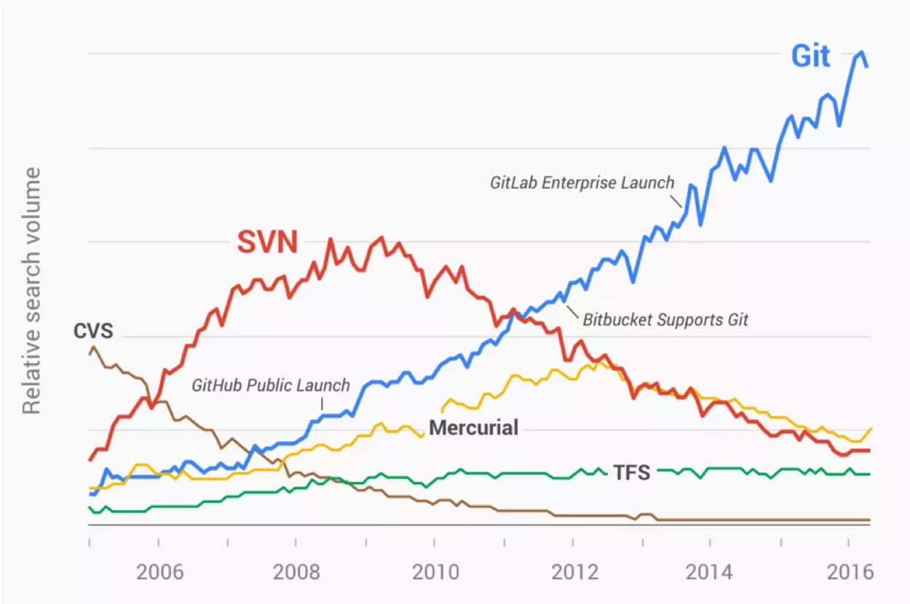

[//]: # (main: #fde8de)
[//]: # (second: #ef3428)

# Git RefCard
*Version française*

RefCard d'utilisation de Git 2.22.0

Co-écrit par Ludovic Dussart et Gabin Darras.

## Sommaire

1. [Présentation](#présentation)
2. [Principes de fonctionnement](#principes-de-fonctionnement)
3. [Cheat Sheet](#cheat-sheet)
    * [Règles & bonnes pratiques](#règles-bonnes-pratiques)
    * [Qui ? Quoi ? Comment ?](#qui--quoi--comment-)
    * [Commandes fréquentes](#commandes-fréquentes)
4. [Débuter avec un projet](#débuter-avec-un-projet)
5. [Configuration minimale](#configuration-minimale)
6. [Ignorer des fichiers (.gitignore)](#ignorer-des-fichiers-gitignore)
7. [Workflow type d'un développement avec Git](#workflow-type-dun-développement-avec-git)
8. [Workflow de branches et conventions](#workflow-de-branches-et-conventions)
9. [Conventions de commits](#conventions-de-commits)

[Pour aller plus loin](#pour-aller-plus-loin)

10. [Plus de commandes](#plus-de-commandes)
11. [Création de tag](#création-de-tag)
12. [Fusion de branche](#fusion-de-branche)
13. [Rebasage de branche](#rebasage-de-branche)
14. [Ajout interactif](#ajout-interactif)
15. [Le remisage](#le-remisage)
16. [Gestion des conflits](#gestion-des-conflits)
17. [Reflog (votre filet de secours)](#reflog-votre-filet-de-secours)
18. [Utiliser une plateforme de versioning](#utiliser-une-plateforme-de-versioning)
19. [Glossaire](#glossaire)
20. [Références](#références)
21. [L'ours](#lours)

## Présentation

Git est un gestionnaire de version qui enregistre (historise) l'évolution des modifications opérées sur un fichier ou un ensemble de fichiers au fil du temps.

Créé en 2005 (à l'initiative de Linus Torvalds, le créateur de Linux), ce nouveau système offre les promesses suivantes :
* vitesse 
* conception simple
* support pour les développements non linéaires (milliers de branches parallèles)
* complètement distribué 
* capacité à gérer efficacement des projets d’envergure tels que le noyau Linux (vitesse et compacité des données)

Depuis sa naissance en 2005, Git a évolué et mûri pour être facile à utiliser tout en conservant ses qualités initiales. La communauté l'a très rapidement adopté et c'est aujourd'hui l'outil de référence pour le versioning de fichiers :


Crédits : [GitPrime](https://blog.gitprime.com/git-didnt-beat-svn-github-did)

## Principes de fonctionnement

Pour utiliser Git de manière optimale, il est nécessaire de comprendre comment il fonctionne pour versionner vos fichiers.

### Le modèle objet Git

#### Le **SHA-1**

Git manipule des objets qui sont identifiés et vérifiés par une chaîne de contrôle **unique** sur 40 caractères (empreinte SHA-1).
Concept très important, cette empreinte est calculée en fonction du contenu du fichier ou de la structure du répertoire considéré. 

Une empreinte SHA-1 ressemble à ceci :

`24b9da6552252987aa493b52f8696cd6d3b00373`

#### Les objets

Chaque objet se compose de 3 éléments : un type, une taille et un contenu. 

* Le **blob**


Un **blob** est utilisé pour stocker les données d’un fichier.
Il n’est rien de plus qu’un morceau de données binaires. Il ne fait référence à rien et n’a aucun attribut, même pas un nom de fichier.

> La commande `git show` permet d'examiner le contenu d'un blob

* Le **tree**


Un **tree** est comme un répertoire — il référence une liste d’autres « tree » et/ou d’autres « blobs » (i.e. fichiers et sous-répertoires).
Il permet de reconstituer la hiérarchie des fichiers d'un instantané (*commit*).

> La commande `git ls-tree` permet d'examiner le contenu d'un tree (de manière plus détaillée qu'un `git show`)

* Le **commit** (instantané)


Un « commit » pointe vers un unique « tree » et le marque afin de représenter le projet à un certain point dans le temps. Il contient des méta-informations à propos de ce point dans le temps, comme une description, un timestamp, l’auteur·trice du contenu depuis le dernier commit, un pointeur vers le (ou les) dernier(s) commit(s), etc.

Notez qu’un « commit » ne contient pas d’information à propos de ce qui a été modifié ; tous les changements sont calculés en comparant les contenus du « tree » référencés dans ce « commit » avec le « tree » associé au(x) parent(s) du « commit ».

> La commande `git show` ou `git log --pretty=raw` permet d'examiner vos « commits » favoris

##### Exemple de représentation

Si nous avons un simple projet avec la structure de dossiers/fichiers suivante :

```ruby
$>tree
.
|-- README
`-- lib
    |-- inc
    |   `-- tricks.rb
    `-- mylib.rb

2 directories, 3 files
```

Elle sera gérée par Git de cette manière :


* Le **tag**


Le **tag** permet de poser une étiquette sur un commit. Généralement utilisé pour gérer les *releases*. Cet objet permet d'étiqueter une version du code source à un instant donné.

Il contient un nom d’objet (simplement nommé « object »), un type d’objet, un nom de tag, le nom de la personne (« taggeur ») qui a créé le tag et un message (qui peut contenir une signature, visible en utilisant `git cat-file`)

### Git stocke des instantanés, pas des différences sur vos fichiers :

Contrairement aux autres systèmes, Git ne gère pas et ne stocke pas la liste de fichiers et les modifications effectuées sur chaque fichier dans le temps. Il capture un instantané du contenu de votre espace de travail et enregistre une référence à cet instantané. Pour être efficace, si les fichiers n’ont pas changé, Git ne stocke pas le fichier à nouveau, juste une référence vers le fichier original qu’il a déjà enregistré.

### Presque toutes les opérations sont locales

Contrairement aux autres systèmes, l'historisation des changements et les opérations effectuées sur votre espace de travail sont gérées localement. Tout est stocké sur votre disque et constitue **votre dépôt local**. La publication des modifications sur *des serveurs distants* s'effectue dans un second temps.

### Rien n'est perdu avec Git

Généralement, Git ne fait qu’ajouter des données.
Quand vous réalisez des actions dans Git, la quasi-totalité d’entre elles ne fait qu’ajouter des données dans la base de données de Git. Il est très difficile de faire réaliser au système des actions qui ne soient pas réversibles ou de lui faire effacer des données d’une quelconque manière. Par contre, comme dans la plupart des systèmes de gestion de version, vous pouvez perdre ou corrompre des modifications qui n’ont pas encore été entrées en base ; mais dès que vous avez validé un instantané dans Git, il est très difficile de le perdre, spécialement si en plus vous synchronisez votre base de données locale avec un dépôt distant.

### Les trois états

**Ce concept est primordial**

Git gère trois états dans lesquels les fichiers peuvent résider : **modifié**, **indexé** et **validé**
* **Modifié** : signifie que vous avez modifié le fichier mais qu’il n’a pas encore été validé en base
* **Indexé** : signifie que vous avez marqué un fichier modifié dans sa version actuelle pour qu’il fasse partie du prochain instantané (*commit*) du projet
* **Validé** : signifie que les données sont stockées en sécurité dans votre base de données locale


*Répertoire de travail (WD), zone d’index et répertoire Git.*

Crédits : [Git-scm](https://git-scm.com/book/fr/v2/D%C3%A9marrage-rapide-Rudiments-de-Git)


* **Le répertoire de travail** (nommé **WD** par la suite) est une extraction unique d’une version du projet. Ces fichiers sont extraits depuis la base de données compressée dans le répertoire Git et placés sur le disque pour pouvoir être utilisés ou modifiés. 
* **La zone d’index** est un simple fichier, généralement situé dans le répertoire Git, qui stocke les informations concernant ce qui fera partie du prochain instantané (*commit*). On l’appelle aussi des fois la zone de préparation.
* **Le répertoire Git** est l’endroit où Git stocke les métadonnées et la base de données des objets de votre projet. C’est la partie la plus importante de Git, et c’est ce qui est copié lorsque vous clonez un dépôt depuis une autre source.

L’utilisation standard de Git se déroule en 3 étapes :
1. vous **modifiez** des fichiers dans votre *répertoire de travail*
2. vous **indexez** les fichiers modifiés, ce qui ajoute des instantanés de ces fichiers dans *la zone d’index*
3. vous **validez**, ce qui a pour effet de basculer les instantanés des fichiers de l’index dans *la base de données du répertoire Git*


>  [Inspiration : Git - Rudiments](https://git-scm.com/book/fr/v2/D%C3%A9marrage-rapide-Rudiments-de-Git)
>
>  [Crédits : Git-book](https://alexgirard.com/git-book/intro/modele-objet-git/)

## Cheat Sheet
### Règles & bonnes pratiques
* Créez une branche pour tout nouveau développement (cf. [Workflow de branches et conventions](#workflow-de-branches-et-conventions))
* Préfixez le nom de votre branche par un **type** (cf. [Workflow de branches et conventions](#workflow-de-branches-et-conventions))
* Un commit = une tâche (cf. [Ajout interactif](#ajout-interactif))
* Préférez l'indexation de lignes (**hunks**) plutôt que de fichiers (cf. [Ajout interactif](#ajout-interactif))
* Utilisez les conventions de commits (cf. [Conventions de commits](#conventions-de-commits))
* Retravaillez votre historique de branche avant de la proposer pour qu'elle soit intégrée (cf. [Rebase interactif](#rebase-interactif))
* Ne pas réécrire un historique publié sur une branche distante collaborative

### Qui ? Quoi ? Comment ?

#### Je suis tech lead

* J'ai besoin de fusionner une `feature branch` sur `develop` : cf. [Fusion de branche](#fusion-de-branche)
* J'ai besoin *d'étiqueter* mon application : cf. [Création de tag](#Création-de-tag)

#### Je suis développeur

* Je ne sais pas par où commencer : cf. [Workflow type d'un développement avec Git](#workflow-type-dun-développement-avec-Git)
* Ma branche n'est pas à jour avec la branche `develop` : cf. [Rebasage de branche](#rebasage-de-branche)
* Je viens de mettre ma branche à jour et cette dernière a des conflits : cf. [Gestion des conflits](#Gestion-des-conflits)
* J'ai besoin de réécrire (nettoyer) l'historique de ma branche : cf. [Rebasage interactif](#Rebase-interactif)
* J'ai fait une mauvaise manipulation et j'ai perdu mes modifications : cf. [Reflog](#reflog-votre-filet-de-secours)
* J'ai fini de travailler sur ma tâche et je dois la proposer à mon équipe : cf. [Soumettre une demande de merge](#soumettre-une-demande-de-fusion-de-branche)

### Commandes fréquentes
#### Configuration

```shell
git config --global -l
```
Affiche toutes les configurations globales. Utilisez `--local` ou `--system` pour changer le scope.

```shell
git config --global -e
```
Permet d'éditer les configurations globales. Utilisez `--local` ou `--system` pour changer le scope.

```shell
git config --global <paramètre> <valeur>
```
Permet de définir une configuration globale. Utilisez `--local` ou `--system` pour changer le scope.

#### Autour du commit

```shell
git status
```
Liste toutes les modifications qui n'ont pas encore été commitées.

```shell
git diff # WD vs index
git diff --staged # index vs HEAD (last commit)
git diff HEAD # WD & index vs HEAD (last commit)
git diff <sha1-commit1> <sha1-commit2> # commit1 vs commit2
```
Affiche les différences entre deux références d'objet.

```shell
git log
```
Affiche l'historique de commits de la branche courante. Utilisez les options `--oneline --graph` pour plus de lisibilité et `--all` pour afficher l'historique de toutes les branches.

```shell
git show <optional ref>
```
Permet de consulter le contenu d'un objet.

```shell
git reflog
```
Affiche l'historique de tout ce qu'il s'est passé sur votre dépôt local. Ajoutez l'option `--relative-date` pour ajouter une notion temporelle.

#### Indexation et annulation

```shell
git add --all
git add -A
git add .
```
Ajoute toutes les modifications de tous les fichiers à l'index pour qu'elles soient prêtes à être commitées.

```shell
git add <file>
```
Ajoute toutes les modifications du fichier à l'index pour qu'elles soient prêtes à être commitées.

```shell
git add -p <optional file>
```
Propose l'ajout des modifications, **ligne par ligne** d'un ou plusieurs fichiers pour qu'elles soient prêtes à être commitées.

```shell
git reset <optional file>
```
Déplace les modifications d'un ou plusieurs fichiers, de la zone d'index au WD.

```shell
git checkout <file>
```
Annule les modifications locales d'un fichier.

#### Commit et annulation de commit

```shell
git commit -m "<type>(<optional scope>): <commit message>"
```
Crée un commit des modifications précédemment indexées avec une description simple. Enchainez les `-m` pour saisir également `body` et `footer`.

```shell
git commit
```
Propose un prompt de création d'un message de commit, avec les modifications précédemment indexées.

```shell
git commit --amend
```
Intègre les modifications précédemment indexées dans le dernier commit (`HEAD`). Ajoutez l'option `--no-edit` pour ne pas modifier le message.

```shell
git reset HEAD~<optional amount>
```
Annule un ou plusieurs commits. Leurs contenus (modifications sur les fichiers) est remis dans le WD.

#### Branches

```shell
git branch
```
Liste l'ensemble des branches locales. Ajoutez l'option `--all` pour afficher les branches distantes.

```shell
git branch <branch name>
```
Crée une nouvelle branche (depuis la `HEAD`) avec le nom donné. Modifiez le nom d'une branche avec l'option ` -m <old-name> <new-name>`.

```shell
git checkout <branch name>
```
Bascule la `HEAD` sur la branche désignée et met à jour le répertoire  de travail. Utilisez `git checkout -` pour basculer sur la référence précédente.

```shell
git checkout -b <branch name> <optional base-ref>
```
Crée une nouvelle branche et se positionne dessus. Un second paramètre `<base-ref>` initie la branche depuis l'objet ciblé.

```shell
git branch -d <branch name>
```
Supprime la branche spécifiée.

#### Tag

```shell
git tag <tagname>
```
Crée un tag sur le commit de `HEAD`.

```shell
git push <remote> <tagname>
```
Publie le tag sur le dépôt distant.

#### Retour arrière

```shell
git reset --hard <SHA-1>
```
Annule tous les commits qui se trouvent après l'identifiant du commit mais ne conserve pas les changements.

```shell
git revert <SHA-1>
```
Rejoue les modifications **inverses** du commit ciblé et crée un nouveau commit de *"revert"*.

#### Dépôt distant & synchronisation

```shell
git remote -v
```
Liste l'ensemble des dépôts distants configurés.

```shell
git remote show <remote>
```
Affiche les détails sur le dépôt distant.

```shell
git remote add <remote> <url>
```
Ajoute un dépôt distant.

```shell
git fetch <remote> <branch>
```
Met à jour l'état d'un dépôt distant dans votre dépôt local (mais ne met pas à jour le WD). Utilisez l'option `--all` pour mettre à jour tous les états de tous les dépôts distants.

```shell
git merge <branch name>
```
Fusionne (**par le dessus**) les commits de la branche spécifiée sur la branche courante.

```shell
git rebase <branch name>
```
**Réécrit** l'historique de commits de la branche courante en y rejouant, **par le dessous**, celui de la branche spécifiée.

```shell
git pull <remote> <branch>
```
Met à jour l'état d'un dépôt distant dans votre dépôt local et fusionne les changements dans votre espace de travail (WD).

```shell
git push -u <remote> <branch>
```
Publie les commits de la branche spécifiée sur le dépôt distant (`-u` définit le upstream). Utilisez `<branch>:<new name>` pour publier la branche sous un nom différent.

## Débuter avec un projet

```shell
git init <nom du projet>
```
Création d'un nouveau dépôt local (`.git/`) avec le nom donné.

```shell
git clone <url du dépôt distant>
```
Clone un dépôt distant avec l'entièreté de son contenu dans votre dépôt local. L'option `-b` permet de ne cloner que le contenu d'une branche spécifique.

## Configuration minimale

```shell
git config --global user.name "<votre identité>"
```
Définit le texte qui sera associé aux commits de tous les projets. Pour le configurer localement, retirer le `--global`.

```shell
git config --global user.email "<votre adresse email>"
```
Définit l'adresse email qui sera associée aux commits de tous les projets. Pour la configurer localement, retirer le `--global`.

```shell
git config --global alias.lg "log --color --graph --pretty=format:'%Cred%h%Creset -%C(yellow)%d%Creset %s %Cgreen(%cr) %C(bold blue)<%an>%Creset' --abbrev-commit"
```
Définit un **alias** `lg` proposant une vue moins verbeuse et plus exploitable du `git log`. Vous pouvez ajouter n'importe quelles autres options à la suite de `git lg`.

## Ignorer des fichiers (.gitignore)

>  [Inspiration : Atlassian - gitignore](https://fr.atlassian.com/git/tutorials/saving-changes/gitignore)


Git offre un mécanisme pour **ignorer** des fichiers de votre espace de travail. Les fichiers à ignorer sont généralement des artefacts de build  (`target` sous Maven, `dist` ou `build` sous NPM par exemple) et des fichiers générés par la machine qui sont dérivés de votre dépôt de source ou qui ne devraient pas être commités (`/node_modules `, `/.idea`, le code compilé, etc).
Les éléments renseignés dans le `.gitignore` n'apparaitront plus dans le résultat des commandes `git status`, `git add`, etc.

1. Créez un fichier `.gitignore` à la **racine** de votre projet
2. Complétez-le avec les **patterns** de fichiers à ignorer en vous basant sur les [modèles de développement](https://linux.die.net/man/7/glob). Voici quelques exemples :
    * `**/logs` : le double `*` cible tous les répertoires partout dans le dépôt local
    * `*.log` : tous les fichiers qui se terminent par `.log`
    * `!important.log` : le `!` permet d'ajouter des exceptions pour forcer la prise en compte de l'élément et invalider la règle générale
    * `debug.log` : par défaut, les modèles correspondent aux fichiers de tout répertoire
3. Indexez et commitez votre fichier `.gitignore`

> Un `.gitignore` global peut être utilisé grâce à la configuration `core.excludesFile` :
> ```shell
>   git config --global core.excludesFile ~/.gitignore
> ```

### Ignorer un fichier commité au préalable

Si vous souhaitez ignorer un fichier que vous avez commité par le passé, vous devrez supprimer le fichier de votre dépôt avant d'ajouter une règle `.gitignore` pour ce dernier. Si vous utilisez l'option `--cached` avec `git rm`, le fichier sera supprimé de votre dépôt, mais demeurera dans votre répertoire de travail en tant que fichier ignoré.

```shell
echo debug.log >> .gitignore
git rm debug.log
git commit -m "chore(.gitignore): Start ignoring debug.log"
```

## Workflow type d'un développement avec Git

Ce chapitre a pour objectif de vous guider pas à pas dans vos usages quotidiens avec Git.


> * Pour initier ou récupérer un projet : [Débuter avec un projet](#débuter-avec-un-projet)
> * Des configurations minimales Git doivent être effectuées : [Configurations de Git](#configuration-minimale)

### 1. Créez une nouvelle branche à partir de l'instantané désiré

> Utilisez les workflows et les conventions de nommage de branches détaillées dans le chapitre [Workflow de branches et conventions](#workflow-de-branches-et-conventions)

1. Synchronisez la branche initiale avec la version du dépôt distant : `git pull origin <référence à l'instantané de départ>`

    Exemple : `git pull origin develop` 

2. Créez votre nouvelle branche depuis un instantané (généralement une autre branche) : `git checkout -b <nom de votre branche> <référence à l'instantané de départ>`

    Exemples : 
    * `git checkout -b <type>/<branch description> develop`
    * `git checkout -b <type>/<branch description> 38a1303`
    * `git checkout -b <type>/<branch description> 1.0.0`

### 2. Versionnez vos modifications 

1. Modifiez vos fichiers
2. Ajoutez vos modifications à l'index
    * Pour tous les fichiers (non recommandé) : `git add .` ou `git add --all`
    * Fichier par fichier (mieux) : `git add <nom du fichier>`
    * Ligne par ligne (hunk par hunk) (idéal) : `git add -p` pour l'ensemble des fichiers, `git add -p <nom du fichier>` de manière unitaire (consultez le chapitre sur l'[ajout interactif](#ajout-interactif))
3. Contrôlez l'état de votre espace de travail (WD)
    * Pour visionner les modifications trackées (indéxées), ou non : `git status`
    * Pour comparer les différences entre vos modifications
        * Entre votre espace de travail et l'index : `git diff`
        * Entre l'index et la `HEAD` : `git diff --staged`
        * Entre votre espace de travail + l'index et la `HEAD` : `git diff HEAD`
4. Annulez l'ajout de modifications si besoin 
    * Pour annuler des ajouts à l'index (repasser vos modifications dans le WD) : `git reset`
5. Créez un instantané (**commit**) contenant vos modifications dans l'index : `git commit`
    * Des conventions de commits doivent être appliquées. Se référer au chapitre [Conventions de commits](#conventions-de-commits)
    * Pour créer un message de commit sur une seule ligne : `git commit -m "<type>(<optional scope>): <votre message sur 50 chars. max>"`
    * Pour entrer dans le mode édition (et pouvoir saisir un en-tête, un corps et un pied de message): `git commit`
        > Utilisez alors le format
        >    
        > ```
        > <type>(<optional scope>): <description>
        > <BLANK LINE>
        > <optional body>
        > <BLANK LINE>
        > <optional footer>
        > ```
    * Pour embarquer vos modifications dans le commit précédent (`HEAD`) : `git commit --amend`
        * et sans en modifier le message : `git commit --amend --no-edit`
    * Pour lier vos modifications à un des commits précédents (i.e. si ces modifications concernent un commit déjà créé): `git commit --fixup=<SHA-1 du commit cible>`
6. Annulez les instantanés créés si besoin
    * Pour modifier le dernier instantané et repasser ses modifications dans le WD : `git reset HEAD~`
        * Pour que ses modifications restent dans la zone d'index : `git reset --soft HEAD~`
    * Pour annuler plusieurs commits : 
        * `git reset <SHA-1 qui deviendra le dernier commit>`
        * `git reset HEAD~<nombre de commits à annuler>`
6. Consultez l'historique des instantanés ou leurs contenus : `git lg` ou `git show <SHA-1 du commit>`
7. Réitérez les étapes précédentes

À ce stade, tout ce que vous avez fait réside dans votre dépôt local (répertoire `.git/`) et y restera tant que vous n'aurez pas publié vos modifications.

### 3. Publiez vos modifications sur le dépôt distant

1. Ajoutez un dépôt distant si besoin : `git remote add <remote> <url>`
    * Listez vos dépôts distants avec : `git remote -v`
2. Mettez à jour votre espace de travail avec le contenu de la branche **distante** de départ : `git pull origin <branche de départ>`
    * Si des modifications sont encore présentes dans votre WD : `git stash`
    * Résolvez les [conflits](#gestion-des-conflits) si besoin
    * Appliquez votre `stash` si besoin : `git stash apply`
3. Effectuez une revue de votre historique : `git lg`
4. Nettoyez votre historique en retravaillant les commits (fusionnez les commits liés par la même tâche ensemble par ex.) : 
    * Identifiez le nombre de commits propres à votre branche (de la `HEAD` au premier commit de votre branche)
    * Effectuez une réécriture de commits sur ce nombre de commit : `git rebase -i --autosquash HEAD~<nombre de commits>`
    * Référez-vous au chapitre [Rebase interactif](#rebase-interactif) pour positionner les actions sur vos commits
    * Déroulez les étapes du `rebase` et résolvez les conflits potentiels 
        * Utilisez `git rebase --continue` après chaque résolution
        * Utilisez `git rebase --abort` si vous souhaitez annuler le `rebase`
    * Effectuez une nouvelle revue de votre historique : `git lg`
        * Assurez-vous que le commit parent de votre branche n'a pas été réécrit (**la référence à la branche initiale doit toujours apparaître**)
4. Publiez votre branche sur le dépôt distant
    * Si elle n'a pas encore été publiée ou que vous n'avez pas réécrit l'historique : `git push <remote> <branch name>`
    * Si vous avez réécrit l'historique :
        1. `git push <remote> <branch name> --force-with-lease`
        2. Prévenez vos équipiers que votre branche a été *force push* 
5. Créez une [demande d'intégration de vos modifications sur l'une des branches du dépôt distant](#soumettre-une-demande-de-fusion-de-branche)
    * ou faites [la fusion par vous-même](#fusionnez-votre-branche) si votre organisation le permet 

## Workflow de branches et conventions

Afin de maîtriser efficacement le cycle de vie de vos développements, il est nécessaire d'imposer des règles et des processus pour la gestion des branches de votre projet. Le workflow le plus courant est celui **de branche par fonctionnalité** :

* Chaque fonctionnalité est développée dans une branche prévue à cet effet plutôt que dans la branche `master`. Grâce à cette encapsulation, plusieurs développeurs peuvent travailler aisément sur une même fonctionnalité sans modifier la base de code principale. Cela signifie également que la branche `master` ne contiendra jamais de code bogué : un avantage non négligeable pour les environnements d'intégration continue.
* Ce fonctionnement va permettre de proposer les modifications présentes sur une branche aux plateformes de versioning de manière isolée. Il est alors extrêmement facile pour votre équipe de faire des retours sur le travail effectué.

### Gitflow

Partant de ce principe de base, [Vincent Driessen (nvie)](http://nvie.com/posts/a-successful-git-branching-model/) a popularisé un workflow offrant une grande flexibilité aux équipes; nommé **Gitflow** : 

> GitFlow est parfaitement adapté aux projets avec un cycle de livraison planifié

* Deux branches principales sont identifiées et **doivent être protégées**
    * `master` : abrite le code de production. Cette branche est déployable 
    * `develop` : abrite le code de pré-production. Elle contient souvent le code des prochaines features **testées et validées**


* des branches nommées `hotfix/<branch>` peuvent être créées lorsqu'il s'agit de **patcher** la production (`master`), généralement pour corriger un bogue.
    - la branche du correctif doit être initiée depuis `master`
    - elle doit être fusionnée sur `master`
    - ainsi que sur `develop` pour que les correctifs soient intégrés à **la prochaine version taguée** de `develop`


 
* Toutes les autres branches seront **des branches de fonctionnalité**. Qu'il s'agisse d'une nouvelle fonctionnalité, d'un correctif, d'améliorations apportées à la documentation, ou de travaux de *refactoring* : ces développements doivent être **isolés** dans des branches dédiées, *préfixée* avec un **type**, délimité par un `-` ou un `/` : `<type>/<branch name>` 
    - les types introduits par les [conventions de commits](#conventions-de-commits) peuvent être repris (`feat`, `fix`, `refactor`, etc)
    - chaque nouveau développement doit partir d'une branche (généralement `develop`)
    - les développements sur ces branches seront intégrés tôt ou tard (quand testés et validés) à la branche `develop`


> Il existe d'autres workflow de branches. Libre à vous de choisir (ou de mélanger ?) celui qui convient le mieux à la taille et la maturité de votre équipe :
>    * [Atlassian - Comparaison de workflows](https://fr.atlassian.com/git/tutorials/comparing-workflows)
>    * [Github Flow](https://guides.github.com/introduction/flow/)
>    * [Gitlab Flow](https://docs.gitlab.com/ee/workflow/gitlab_flow.html) 


## Conventions de commits

Avec l'adoption croissante de l'outil auprès des communautés OSS notamment, un besoin d'uniformisation de la description des commits s'est rapidement fait sentir.
Impulsée par les équipes Angular notamment, une convention de commit a rapidement fait l'unanimité et est à présent décrite [sous forme d'une spécification](https://www.conventionalcommits.org/).

 Cette spécification fournit un ensemble simple de règles pour créer un historique de commit explicite et lisible. Cette convention est liée à [SemVer](https://semver.org/), en décrivant les fonctionnalités, les correctifs et les modifications importantes apportées aux messages de commit.

Le message du commit doit être structuré comme suit :

```
<type>(<optional scope>): <subject> 
<BLANK LINE>
<optional body>
<BLANK LINE>
<optional footer>
```

- **type** : 
    - **fix** : corrige un bogue dans le code (cela est en corrélation avec PATCH en SemVer).
    - **hotfix** : corrige un bogue dans le code **de production** (cela est en corrélation avec PATCH en SemVer).
    - **feat** : introduit une nouvelle fonctionnalité dans le code (cela est en corrélation avec MINOR).
    - **chore** / **docs** / **style** / **perf** / **test** / …: à la discrétion des équipes
- **scope** : section du code impactée par la modification 
- **subject** : description courte de moins de 50 caractères sur les modifications opérées sur le code
- **body** : description longue (paragraphes) entrant dans les détails de la modification du code. 
    - Doit commencer par une ligne vide
    - Peut contenir le bloc `BREAKING CHANGE` :  introduit un changement cassant l’API (cela est en corrélation avec MAJOR en SemVer)
- **footer** :  références de problèmes supplémentaires concernant les modifications du code (Fixes #13)
    - Doit commencer par une ligne vide
    - Ne peut contenir que `BREAKING CHANGE`, des liens externes, des références de publication et d’autres méta-informations

> * Vous pouvez retrouver des exemples de commits sur [https://www.conventionalcommits.org](https://www.conventionalcommits.org) 
> * Vous pouvez générer automatiquement un CHANGELOG issue de vos commits, basés sur ces conventions : [Conventional-changelog](https://github.com/conventional-changelog)


## Pour aller plus loin

### Plus de Commandes 

> Utilisez `git` + **TABULATION** pour que le terminal vous propose les commandes
> 
> Utilisez **TABULATION** n'importe quand pour que Git auto-complète votre commande (commandes, noms de branches, etc)

```shell
git help everyday
```
Un guide step-by-step d'un usage de Git à la journée.

#### WD & Index

```shell
git clean -f
```
Supprime les fichiers non trackés du WD. Utilisez l'option `-d` pour supprimer également les répertoires.

```shell
git rm <file>... # git rm *.log
```
Extrait et supprime un ou plusieurs fichiers du WD et de l'index Git. Utilisez `--dry-run` pour tester la présence du fichier. Utilisez `--cached` pour ne le supprimer que dans la zone d'index.

```shell
git mv <source> <destination>
```
Déplace un fichier ou un répertoire. Les modifications sont ajoutées à l'index mais le commit reste nécessaire.

```shell
git add -N <optional file>
```
Indique à Git que les modifications sur le fichier seront ajoutées plus tard. **Indispensable** pour *indexer* les nouveaux fichiers (sans leurs modifications) avant le `git add -p`.

#### Commit

```shell
git commit --fixup <commit>
```
Crée un commit de `fixup` destiné à être intégré dans le commit `<commit>` lors d'un `rebase -i --autosquash`. 

```shell
git cherry-pick <ref>
```
Applique la référence d'objet (commits, branche, etc) à la branche courante en créant un nouveau commit.

```shell
git revert <commit>  
```
Joue les modifications du commit dans *le sens inverse* et en crée un nouveau commit. Pratique pour annuler les changements sur une branche partagée.

#### Branches

```shell
git rebase -i <commit>~ --autosquash
```
Permet de retoucher l'historique de commits, du commit `<commit>` à la `HEAD`. cf. [Rebase interactif](#rebasage-interactif).

```shell
git rebase --onto <nouvelle branche> <ancienne branche> <branche courante>
```
Permet de changer la branche de rattachement de la branche courante. cf. [Rebase --onto](#rebase---onto).


#### Autour du commit

```shell
git difftool 
```
Lance la comparaison avec l'outil configuré via `diff.tool`. Ajoutez l'option `-t` pour préciser l'outil à utiliser (exemple : `git difftool -t vscode`).

```shell
git blame <file>
```
Permet de lister la dernière date de modification d'une ligne et son auteur pour un fichier donné.

```shell
git grep <text>
```
Similaire au `grep` Unix : permet de rechercher du texte dans les fichiers du WD. De nombreuses options sont disponibles.

#### Notes 

```shell
git notes add <ref>
git notes append <ref>
```
Permet d'ajouter une note à un objet.

```shell
git notes show <ref>
```
Permet de consulter la note d'un objet.

```shell
git push <remote> refs/notes/*
```
Permet de publier les notes sur un dépôt distant.

#### Remote

```shell
git remote rename <remote> <nouveau nom> # git remote rename origin ineat
```
Permet de renommer un dépôt distant.

```shell
git remote set-url <remote> <url> # git remote set-url origin git@github.com:ineat/refcards.git
```
Permet de redéfinir l'url d'un dépôt distant.

```shell
git clone -b <branch> --depth=<x> <url> <local dir>
```
Clone uniquement les `<x>` commits de la branche `<branch>` du dépôt distant `<url>` dans un dossier local `<local dir>`.

#### Autres

```shell
git show-ref
```
Permet de lister les références du dépôt local.

#### Enrichir la configuration de Git

> * L'option `--system` permet de définir une configuration à un système entier.
> * `export LANG=<locale>` permet de changer la langue d'affichage des messages de Git (ex : `export LANG=en_US.UTF-8`)

##### Core
* `git config --global core.editor <path/to/tool>` : Permet d'utiliser un autre éditeur que `vi` ou `vim` 
    * Pour Notepad++ (Windows) par exemple : 
    ```shell
        git config --global core.editor "'C:/Program Files (x86)/Notepad++/notepad++.exe' -multiInst -notabbar -nosession -noPlugin"
    ```
* `git config --global core.pager ''` : Désactive les `pager` pour toutes les commandes.
* `git config --global core.autocrlf true` : Convertit automatiquement les fins de ligne Windows en format Unix (et inversement).
* `git config --global core.excludesFile <path/to/.gitignore>` : Permet de définir un `.gitignore` global.
* `git config --global alias.<name> "<definition>"` : Permet de définir un alias réutilisable.

##### Commit
* `git config --global commit.template <path/to/template>`: Permet de définir un template par défaut pour les messages de commit.

##### Fetch
* `git config --global git fetch.prune true` : La commande `fetch` sera jouée avec l'option `--prune` automatiquement.

##### Pull
* `git config --global pull.rebase merges` : Conserve les commits de *merge* quand ils existent sur la branche d'où viennent les modifications.

##### Merge
* `git config --global merge.ff only` : N'autorise que les fusions en **fast-forward** (pour se pré-munir des commits de *merge*).
* `git config --global merge.tool kdiff3` : Configure l'outil `kdiff3` pour la résolution de conflits.
    * `git config --global diff.tool kdiff3` : Configure l'outil `kdiff3` pour l'affichage des différences.
* `git config --global mergetool.keepBackup false` : Supprime les fichiers `.orig` après la résolution des conflits.
* `git config --global mergetool.keepTemporaries false` : Supprime les fichiers temporaires après la résolution des conflits.

##### Rebase
* `git config --global rebase.autosquash true` : Positionne les commits de `fixup` automatiquement lors d'un `rebase -i` (option `--autosquash`).
* `git config --global rebase.autoStash true` : `stash` les modifications de votre WD avant un `pull`, et applique ce `stash` juste après.

##### Autres
* `git config --global difftool.vscode.cmd 'code --wait --diff $LOCAL $REMOTE'` : Configure la commande à lancer lors de l'utilisation de `git difftool -t vscode`.
* `git config --global rerere.enabled true` : Active [`git-rerere`](https://git-scm.com/docs/git-rerere), i.e Git se souviendra de certaines résolutions de conflits et les réappliquera automatiquement dans les futures résolutions pour des conflits similaires .
* `git config --global pager.branch false` : Permet de visualiser l'ensemble des branches en dehors du mode édition. L'attribut `pager` fonctionne pour d'autres commandes comme `tag`, `log`, `diff`, etc.

### Création de tag 

Git vous donne la possibilité d'_étiqueter_ vos instantanés. Généralement on utilise cette fonctionnalité pour marquer les états de publication, c'est à dire les numéros de version des *releases* (livrables destinés a être déployés sur des environnements).

1. Placez-vous sur la branche où se trouve l'instantané que vous souhaitez étiqueter
2. Invoquez la commande `git tag <numero du tag>`
    * Par défaut, le tag portera la description du commit annoté
    * Vous pouvez spécifier un message propre à votre tag grâce à l'option `-m` : `git tag -a <numero du tag> -m <libellé du tag>`
3. Listez les tags présents sur votre dépôt local : `git tag`
4. Publiez votre tag sur le dépôt distant : `git push <remote> <numero du tag>`

### Fusion de branche 

Vous pouvez fusionner votre branche de deux manières différentes :
* via un commit dit de **merge** (merge explicite)
* ou en **fast-forward** (merge implicite)

Considérez la branche `feat/A` initiée depuis `develop` :


#### Commit de "merge"

C'est la politique de fusion par défaut. Elle crée un nouveau commit ayant pour parent le dernier commit des deux branches :


> Un commit de *merge* sera créé par Git si le `fast-forward` n'est pas possible ou si l'option `no-ff` est explicitement passée au `git merge`

* Utilisez le commit de *merge* uniquement pour mettre en évidence l'ajout d'une nouvelle fonctionnalité sur votre `develop`
* Utilisez le *fast-forward* dans tous les autres cas 

#### Fast-forward

Le `fast-forward` permet d'obtenir un historique **linéaire** après une fusion. Le `fast-forward` est possible si le premier commit pointé par la branche que vous avez fusionnée **est directement descendant** du commit sur lequel vous vous trouvez avant la fusion.


* Utilisez `git merge --ff-only` ou `git config --global merge.ff only` pour vous prémunir d'un commit de *merge*.
    * Pour rendre le `fast-forward` possible, utilisez le **rebasage** sur la branche à fusionner. 
* Utilisez le `fast-forward` pour garder un historique de vos branches linéaire, propre et lisible.

#### Fusionnez votre branche 

1. Placez-vous sur la branche qui va recevoir les nouvelles modifications : `git checkout <nom de la branche de réception>`
2. Fusionnez votre branche dessus en privilégiant le `fast-forward` : `git merge <type>/<branch description> --ff-only`
    * Résolvez les conflits si besoin
        * Invoquez `git merge --continue` après la résolution
    * Si des branches ont été initiées depuis la mise à jour de la branche :
        * Effectuez un **rebasage** de cette dernière sur les branches en question : `git rebase <nom de votre branche>` 
3. Publiez le nouvel état de votre branche sur le dépôt distant : `git push`
    * et des branches ayant été **rebasées** si besoin 
4. Supprimez la branche que vous venez de fusionner : `git branch -d <branch>`
    * Si elle est également présente sur le dépôt distant : `git push --delete <remote> <branch>`

### Rebasage de branche

Le rebasage (`rebase`) permet de synchroniser une branche (_par le dessous_) avec une autre. Très pratique pour bénéficier des mises à jour introduites depuis l'initiation de votre branche.

Il existe 3 sortes de rebasage de branche : 
* Le mode **standard** : rebaser (synchroniser) une branche par rapport à une autre
* Le mode **interactif** : permet de réécrire (retravailler) l'historique de la branche courante
* Le mode **onto** : permet de rattacher le premier commit d'une branche à la `HEAD` d'une autre branche

Considérez que vous travaillez sur la branche `feat/A` :


#### Mode standard

Un commit vient d'être ajouté sur la `develop`, ce qui veut dire que la branche `feat/A` est en retard.


Il faut donc ici mettre à jour la branche `feat/A` par rapport à la `develop` grâce à la commande `git rebase`. C'est une mise à jour _par le dessous_ : c'est à dire que les nouveaux commits de la `develop` vont être joués sur la branche cible. Les commits existants (ceux de la branche `feat/A`) sont réécrits puisque **leurs commits parents changent**.

Le `git rebase` peut engendrer des conflits si des modifications sur des fichiers communs entrent en collision. Pour plus de détails sur cette partie consultez le chapitre [Gestion des conflits](#Gestion-des-conflits).


#### Rebase interactif

Dans votre workflow de versioning, vous serez amené à créer plus de commits (commit de `fixup` ?) que de tâches à réaliser. A la fin de vos développements, vous **devez** retravailler l'historique de votre branche pour :
* **fusionner** les commits qui concernent la même tâche
* **réécrire** la description de vos commits si elle est incomplète/erronée 
* **supprimer** des commits si besoin
* bref, **proposer un historique propre et lisible** à votre équipe


C'est pour ce besoin que le **rebase interactif** est utilisé. Il s'agit d'une option du `rebase` classique : `git rebase -i`.
Vous devez indiquer au `rebase -i` à partir de quel commit parent vous souhaitez réécrire votre historique : 
* en utilisant le **SHA-1** du commit parent : `git rebase -i <SHA-1-du-commit>`.
* en utilisant un nombre de commits à réécrire à partir de la `HEAD` : `git rebase -i HEAD~<nombre de commits à réécrire>`.

    Exemples :
    - `git rebase -i 2edb99f` si vous souhaitez retoucher à tous les commits au dessus du commit `2edb99f`
    - `git rebase -i HEAD~8` si vous souhaitez retoucher à vos 8 derniers commits

Git vous propose une liste d'actions documentées dont voici les principales :

- `pick` : laisser le commit inchangé
- `reword` : permet de réécrire uniquement le message du commit 
- `edit` : permet d'intégrer d'autres modifications au commit (équivaut au `git commit --amend`)
- `squash` : permet de fusionner 2 commits et de modifier le message du commit final
- `fixup` : permet de fusionner le contenu du commit dans le commit parent, sans garder le message de commit.
- `drop` : permet de supprimer un commit et le code associé
- `réorganiser des commits` : vous pouvez réordonner les commits de haut (**plus ancien**) en bas (**plus récent**). Indispensable pour le `fixup` ou le `squash` notamment, qui s'appliquent à un commit parent

Vous devez positionner les commandes à la place des `pick` en fonction de ce que vous voulez faire. Git va ensuite dépiler l'ensemble des commandes et vous demander d'effectuer des actions quand nécessaires (saisie d'un nouveau message, résolution de conflits, etc).

Il est important de noter que tous les commits concernés par le `rebase` seront réécrits, même ceux laissés tels quels.

#### Rebase --onto

Lors des phases de développements, il arrive régulièrement que des branches soient initiées depuis d'autres branches en cours de développement comme l'illustre le schéma suivant :


Certaines de ces branches de développement peuvent évoluer indépendamment les unes des autres. Voici un des cas les plus fréquents :

- la branche `develop` évolue. De nouveaux commits sont poussés (correctifs, fonctionnalités fusionnées, etc)
- l'équipe en charge de la branche `feat/A` décide de *rebaser* sa branche avec `develop` (rappelez-vous, le `git rebase` réécrit généralement l'historique)

Cela donne la situation suivante :


- finalement, la branche `feat/B`, initiée depuis le commit `A2` de la branche `feat/A`, doit être fusionnée avant `feat/A` et n'a plus besoin des modifications introduites dans `feat/A`

Le `rebase --onto` permet de rattacher la branche courante à la `HEAD` d'une nouvelle branche en *déterminant les patchs depuis l'ancêtre commun des branches* : `git rebase --onto <nouvelle branche> <ancienne branche> <branche courante>`


### Ajout interactif

Vous avez normalement l'habitude d'utiliser la commande `git add` pour indexer vos fichiers avant d'effectuer un commit. Un des concepts de Git est de regrouper dans un commit l'ensemble des modifications liées à une tâche. Il arrive souvent qu'un fichier abrite des modifications qui ne concernent pas la tâche en cours. 
Il est alors nécessaire de n'ajouter qu'une partie des lignes du fichier au prochain commit.

La commande `git add -p` permet d'effectuer cette action. Git va **itérer sur les fichiers modifiés** et va vous proposer d'ajouter, ou non, les lignes (**hunks**) de chacun des fichiers.

Plusieurs choix vous sont proposés ici : (`Stage this hunk [y,n,q,a,d,s,e,?]?`)
Difficile de savoir à quoi correspondent ces lettres.

-  Appuyez une fois sur la touche **Entrée** (ou  tapez `?` puis **Entrée**) pour en découvrir le détail.
- `y (yes)` : permet d'indexer la portion de code proposée puis de passer à la portion suivante.
- `n (no)` : N'indexe pas la portion de code proposée, passe à la portion suivante.
- `s (split)` : découpe la portion de code proposée en une plus petite portion si possible
- `q (quit)` : n'indexe pas la portion de code proposée, ni celles restantes. 

Il arrive parfois que la commande `split` du `git add -p` ne parvienne pas à diviser les **hunks** en plus petites portions (généralement quand les modifications se suivent). Il est possible de passer en mode **edition** (`e`) afin de choisir manuellement quelle partie du fichier vous souhaitez indexer.

Voici comment utiliser le mode **édition** :

L'éditeur Git vous propose l'ensemble des lignes **modifiées**, préfixées par un symbole (i.e. `context`)
* `-` indique une ligne supprimée
    * Si vous ne voulez pas que cette ligne supprimée soit indexée, passez le `context` de `-` à `' '`
* `+` indique une ligne ajoutée
    * Si vous ne voulez pas que cette ligne ajoutée soit indexée, supprimez-la
* une ligne modifiée possède deux lignes : l'ancienne (`-`) et la nouvelle (`+`)
    * Si vous ne voulez pas que cette ligne modifiée soit indexée, supprimez la ligne indiquée par `+` et passez le `context` de la ligne supprimée de `-` à `' '`

> L'idée est de créer une version de vos modifications comme vous souhaitez les voir dans la zone d'index. Si des lignes modifiées ne doivent pas être prises en compte, restaurez leurs états pour ce `add -p` en suivant les explications ci-dessus.
> P.S : Il est important de ne pas toucher aux lignes du fichier non modifiées !

### Le remisage

Git propose une commande `git stash` qui vous permet de mettre vos modifications de côté et éviter de les balader dans le WD des autres branches.

Voici un cas d'utilisation où le `stash` est utile :

- Vous êtes sur une branche, **feat/A**, et vous avez fait quelques modifications, encore présentes dans votre WD.
- Vous devez faire un `git pull` ou un `git rebase develop` sur votre branche : Git refusera car vous avez encore des modifications dans votre WD.

1. Utilisez la commande `git stash` pour **remiser** temporairement vos modifications
2. Une nouvelle entrée du `stash` est créée. Vous pouvez consulter la liste de vos `stash` via `git stash list`
3. Faites ce que vous devez faire (`pull`, travaux sur d'autres branches, etc)
3. Utilisez `git stash apply` pour appliquer le dernier `stash` créé sur votre WD

> * Préférez le `git stash apply` au `git stash pop` pour conserver vos anciens stashs
> * Faites le ménage via `git stash drop <stash>` si certains `stash`s ne sont plus utiles
> * Utilisez `git stash apply <stash>` (exemple : `git stash apply stash@{0}`) pour appliquer votre `stash` au WD

### Gestion des conflits

Un ou plusieurs conflits peuvent apparaître pendant un `git merge`, `git rebase` ou encore un `git cherry-pick`. Cela arrive lorsque la même ligne est modifiée sur les 2 branches concernées par la commande.

Si vous éditez le fichier en conflit, vous découvrirez comment Git gère les modifications :

* `<<<<<<< HEAD` et `=======` encapsulent les modifications présentes initialement
* `=======` et `>>>>>>>` encapsulent les nouvelles modifications à intégrer

- A vous de faire votre choix et de supprimer les modifications obsolètes

**Fusionner** ses modifications via ces marqueurs peut se révéler laborieux. Il existe des outils pour vous aider à gérer les conflits de manière plus visuelle.

* Consultez la liste des [outils de merge supportés]((https://git-scm.com/docs/git-config#Documentation/git-config.txt-diffguitool)) par défaut par Git

Après avoir téléchargé l'outil de votre choix :
1. Indiquer à Git comment l'utiliser : `git config --global merge.tool <tool>`
    - Vous pouvez avoir plusieurs outils configurés et changer la valeur de `merge.tool` au besoin
2. Si cet outil n'est pas déclaré dans votre `$PATH`, utilisez la configuration `git config --global  mergetool.<tool>.path <path>`
3. Vous pouvez ne pas garder les fichiers temporaires générés par Git pendant et après le conflit :
    * `git config --global mergetool.keepBackup false`
    * `git config --global mergetool.keepTemporaries false`
4. Vous êtes prêt, invoquez `git mergetool` lors des phases de conflits pour que Git vous lance l'éditeur visuel !
    * Utilisez `git commit` et/ou `git merge --continue` pour passer à la résolution suivante
    * Utilisez `git merge --abort` pour annuler une résolution de conflits
    
### Reflog (votre filet de secours)

Les logs de référence ou `reflogs` constituent un mécanisme utilisé par Git pour enregistrer les mises à jour appliquées aux pointes (`HEAD`) des branches et à d'autres références de commit. 
Le reflog vous permet de revenir sur les commits même s'ils ne sont pas référencés par une branche ou un tag. Une fois l'historique réécrit, le `reflog` contient des informations sur l'ancien état des branches et vous permet d'y revenir si nécessaire. 
À chaque mise à jour de la pointe `HEAD` de votre branche quelle qu'en soit la raison (en changeant les branches, en faisant un pull de nouveaux changements, en réécrivant l'historique ou simplement en ajoutant de nouveaux commits), une nouvelle entrée est ajoutée au reflog.

1. Consultez le `reflog` via : 
    * `git reflog ` pour afficher le `reflog` de votre `HEAD`
    * `git reflog --relative-date` si vous souhaitez avoir une vue horodatée
    * `git reflog --all` pour consulter le `reflog` de toutes vos réfs
    * `git reflog <branch>` pour consulter le `reflog` d'une branche en particulier
2. Revenez en arrière sur l'état de l'historique souhaité
    * `git reset <reflog state>` (exemple : `git reset HEAD@{2}`)


## Utiliser une plateforme de versioning

Une plateforme de versioning s'appuie sur Git pour vous proposer un hébergement **décentralisé** de votre code source et bien d'autres fonctionnalités (WYSIWYG, bug tracker, documentation, CI/CD, etc). Ces plateformes proposent des dépôts distants qui interagiront avec votre dépôt local via les commandes `fetch`, `pull` et `push`.

### Configurer votre authentification sur la plateforme

Vous pouvez contacter les serveurs distants de deux façons :

#### Via HTTPS

En saisissant votre identifiant et votre mot de passe (à chaque `push` ou `fetch`) 

- Définissez la configuration `git config --global credential.helper cache` pour éviter la re-saisie
- Vous pouvez définir un **personal-access-token** qui sera associé à votre compte et **remplacera** votre mot de passe lors de la saisie :
> Ce **personal-access-token** doit être utilisé par vos outils de CI/CD afin de ne pas utiliser directement votre mot de passe de compte

* Pour Github : https://help.github.com/en/articles/creating-a-personal-access-token-for-the-command-line
* Pour Gitlab : https://docs.gitlab.com/ee/user/profile/personal_access_tokens.html
* Pour Bitbucket : https://confluence.atlassian.com/bitbucketserver/personal-access-tokens-939515499.html

#### Via SSH

L'authentification entre votre poste et la plateforme sera effectuée grâce à votre clé SSH publique, déclarée sur la plateforme.

1. Générez votre clé SSH si vous n'en avez pas déjà une depuis un terminal (`Git Bash` par défaut) : `ssh-keygen -t rsa -b 4096 -C "<your email>"`
2. Laissez le chemin de génération par défaut : `~/.ssh/id_rsa`
3. Saisissez (_ou non_) une **passphrase** (qui vous sera demandée à chaque `push` ou `fetch`) 
    - Sous Mac, votre **passphrase** est sauvegardée automatiquement à la première saisie
    - Pour les autres systèmes, il est nécessaire d'ajouter votre clé au **ssh-agent** : `ssh-add ~/.ssh/id_rsa`
4. Déclarez votre clé SSH publique (`cat ~/.ssh/id_rsa.pub`) sur votre plateforme :
    * Pour Github : https://help.github.com/en/enterprise/2.16/user/articles/adding-a-new-ssh-key-to-your-github-account
    * Pour Gitlab : https://docs.gitlab.com/ee/ssh/#adding-an-ssh-key-to-your-gitlab-account
    * Pour Bitbucket : https://confluence.atlassian.com/bitbucket/set-up-an-ssh-key-728138079.html


### Soumettre une demande de fusion de branche

Dépendant de la plateforme que vous utilisez, la terminologie et le workflow seront différents mais les concepts et principes restent les mêmes.

En vous basant sur le chapitre [Workflow type d'un développement avec Git](#workflow-type-dun-développement-avec-git) :

1. Effectuez vos développements sur une branche dédiée en vous assurant que la branche de départ _reste toujours synchronisée_
2. Publiez votre branche sur le dépôt distant
3. Créez la demande de fusion depuis la plateforme
    * Pour Github : https://help.github.com/en/articles/creating-a-pull-request
    * Pour Gitlab : https://docs.gitlab.com/ee/user/project/merge_requests/
    * Pour Bitbucket : https://confluence.atlassian.com/bitbucket/create-a-pull-request-945541466.html
4. Dépendant du résultat du **code review** de votre soumission, soit votre branche sera intégrée à `develop`, soit vous devrez la retravailler avant son intégration.

## Glossaire

### HEAD

`HEAD` est un pointeur sur la référence de la branche actuelle, qui est à son tour un pointeur sur le dernier commit réalisé sur cette branche. Ceci signifie que `HEAD` sera le parent du prochain commit à créer. C’est généralement plus simple de penser `HEAD` comme l’instantané de votre dernière validation.
Git utilise d'autres références de ce type comme 
* `ORIG_HEAD` : état de la `HEAD` avant un `git reset`
* `FETCH_HEAD` : état de la branche que vous venez de mettre à jour (via `git fetch`)
* `MERGE_HEAD` : état de la branche après un `git merge`
* `CHERRY_PICK_HEAD` : état de la branche après un `git cherry-pick`

### Index

L’index est la zone qui contient les modifications du prochain commit que vous ferez. C'est la « zone de préparation » alimentée par `git add`. C’est ce que Git examine lorsque vous lancez `git commit`.

### Le répertoire de travail (WD)

Aussi nommé `Working Tree`, c'est l'endroit où vous modifiez vos fichiers. Il faut penser le répertoire de travail comme un bac à sable où vous pouvez essayer vos modifications avant de les transférer dans votre index puis les valider dans votre historique, ou les jeter à la poubelle (`clean`).

## Références

* [Documentation officielle de Git](https://git-scm.com/book/fr/v2)
* [Cheat Sheet visuelle](http://ndpsoftware.com/git-cheatsheet.html)
* [Worflow GitFlow](https://nvie.com/posts/a-successful-git-branching-model/)
* [Become a git guru - Tutoriels](https://www.atlassian.com/git/tutorials)
* [Convention de commits](https://www.conventionalcommits.org)
* [Merge vs Rebase](https://fr.atlassian.com/git/tutorials/merging-vs-rebasing)
* [Git Reflog](https://fr.atlassian.com/git/tutorials/rewriting-history/git-reflog)


Ce guide a été écrit par Ludovic Dussart et Gabin Darras.

Merci à nos relecteurs : Kelsey Rider, Antoine Caron, Lucas Declercq, Mathias Deremer-Accettone, Pamela Rossignol, Emmanuel Peru, Clément Poissonnier.

La direction artistique et les illustrations sont l'œuvre de Jean-François Tranchida.

> "Je ne suis qu'un sale égocentrique, donc j'appelle tous mes projets d'après ma propre personne. D'abord Linux, puis Git."
> Linus Torvalds
> 
> Git (*noun*): _an unpleasant or contemptible person._
