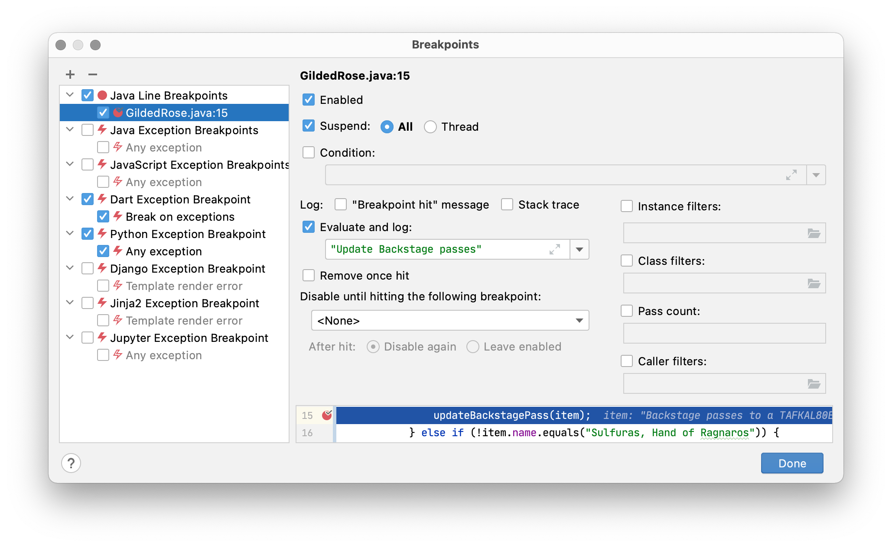
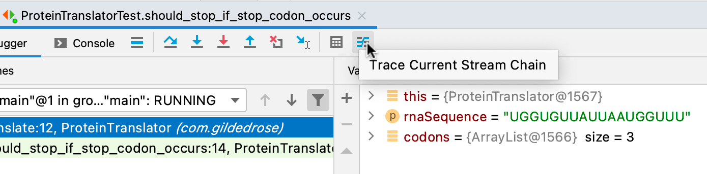

# IntelliJ RefCard
*Version française*

RefCard d'utilisation d'IntelliJ IDEA 2020.3

Écrit par Clément Poissonnier.

## Sommaire


<!--
Pour regénérer le sommaire : https://github.com/ekalinin/github-markdown-toc
-->

  * [Présentation](#présentation)
  * [Général](#général)
     * [Étendre/réduire sa sélection](#étendreréduire-sa-sélection)
     * [Faire des actions contextuelles](#faire-des-actions-contextuelles)
     * [Générer du code](#générer-du-code)
     * [Manipuler du code](#manipuler-du-code)
     * [Reformater](#reformater)
     * [Rechercher/Remplacer](#rechercherremplacer)
     * [Commenter](#commenter)
  * [Navigation](#navigation)
     * [Rechercher et ouvrir](#rechercher-et-ouvrir)
     * [Naviguer dans ses fichiers](#naviguer-dans-ses-fichiers)
     * [Naviguer dans le fichier courant](#naviguer-dans-le-fichier-courant)
     * [Naviguer vers les tests](#naviguer-vers-les-tests)
     * [Naviguer dans ses projets](#naviguer-dans-ses-projets)
  * [Productivité](#productivité)
     * [Postfix completion](#postfix-completion)
     * [Live template](#live-template)
     * [Configurer les templates](#configurer-les-templates)
     * [Auto completion](#auto-completion)
        * [Basique](#basique)
        * [Smart](#smart)
        * [Statement completion](#statement-completion)
     * [Multi curseur](#multi-curseur)
     * [Multi sélection](#multi-sélection)
  * [Refactoring](#refactoring)
     * [Extraction](#extraction)
     * [Déplacer/renommer/supprimer/...](#déplacerrenommersupprimer)
  * [Compilation, exécution et debugging](#compilation-exécution-et-debugging)
  * [Debugging](#debugging)
     * [Navigation basique](#navigation-basique)
     * [Navigation avancée](#navigation-avancée)
        * [Smart step into](#smart-step-into)
        * [Run to cursor](#run-to-cursor)
        * [Drop frame](#drop-frame)
        * [Show execution point](#show-execution-point)
     * [Breakpoints](#breakpoints)
        * [Configuration de breakpoint](#configuration-de-breakpoint)
        * [Types de breakpoints](#types-de-breakpoints)
           * [Conditional breakpoint](#conditional-breakpoint)
           * [Method breakpoint](#method-breakpoint)
           * [Field breakpoint](#field-breakpoint)
           * [Exception breakpoint](#exception-breakpoint)
     * [Observer et modifier l'état du système](#observer-et-modifier-létat-du-système)
        * [Watches](#watches)
        * [Evaluate](#evaluate)
        * [Modifier l'état d'une variable](#modifier-létat-dune-variable)
     * [Stream debugger](#stream-debugger)
  * [Documentation](#documentation)
  * [Outils intégrés](#outils-intégrés)
       * [Terminal intégré](#terminal-intégré)
       * [Local history](#local-history)
       * [Compare with clipboard](#compare-with-clipboard)
       * [Git](#git)
          * [Commit partiel](#commit-partiel)
          * [Historique sur une sélection](#historique-sur-une-sélection)
       * [Scratch file](#scratch-file)
       * [DB intégrée](#db-intégrée)
       * [Command-line launcher](#command-line-launcher)
       * [Client HTTP](#client-http)
  * [Plugins utiles](#plugins-utiles)
     * [AceJump](#acejump)
     * [Code with me](#code-with-me)
     * [Custom Postfix Templates](#custom-postfix-templates)
     * [Grazie](#grazie)
     * [IDE Features Trainer](#ide-features-trainer)
     * [Key Promoter X](#key-promoter-x)
     * [Presentation assistant](#presentation-assistant)
     * [SonarLint](#sonarlint)
     * [String manipulation](#string-manipulation)
  * [Sources](#sources)
  * [L'ours](#lours)


## Présentation

IntelliJ IDEA est l'IDE historique de JetBrains.

Par rapport à son concurrent historique, Eclipse, il apporte de grandes améliorations en termes de stabilité, de gestion des plugins et d'ergonomie.

Il supporte de nombreux langages : 

 * Java
 * JavaScript
 * PHP
 * Kotlin
 * Python
 * Ruby
 * Rust
 * Scala
 * SQL
 * HTML/XHTML/CSS
 * ...

L'IDE est l'outil de travail principal d'un développeur.
Il est donc normal qu'un développeur qui souhaite tendre vers l'excellence apprenne à maîtriser cet outil. 

De plus, l'IDE permet de donner du feedback en quelques secondes aux développeurs, ce qui permet d'ajuster son code au plus vite et de gagner beaucoup de temps.


Crédits : [Arnaud Lemaire](https://twitter.com/Lilobase/status/1144365295701770248)

L'objectif de ce document est de centraliser les fonctionnalités les plus utiles, qui apportent un gain significatif de productivité.
Il ne sera pas exhaustif, mais permettra de s'améliorer dans sa pratique quotidienne du développement.


## Général

> S'il faut retenir un seul raccourci dans IntelliJ, il s'agit de celui de la recherche d'une action ("Find action") par son nom (`Ctrl`+`Shift`+`A` sur Windows/Linux et `⇧⌘A` sur macOS).
> Ce raccourci permet de retrouver n'importe quelle autre action par une simple recherche textuelle.

### Étendre/réduire sa sélection

En tant que développeur, nous passons énormément de temps à sélectionner du texte (pour le copier, le supprimer, le remplacer, ...).

IntelliJ permet de sélectionner du code de manière "intelligente", en prenant en compte les parenthèses, les guillemets et autres symboles spécifiques à un langage.

Il suffit de placer son curseur à l'endroit voulu : 


Puis d'utiliser le raccourci `Ctrl`+`W` (`⌥↑` sur macOS) autant de fois que nécessaire.


### Faire des actions contextuelles

Que ce soit pour indiquer la présence de code mort, de code smells, d'erreurs orthographiques, d'erreurs ou warnings de compilation, IntelliJ fournit un feedback assez conséquent et propose systématiquement des actions à appliquer selon le contexte.

Ces actions correctives peuvent être déclenchées en mettant son curseur sur la partie souhaitée, puis en utilisant un raccourci indispensable : 

> Show context action : `ALT`+`⏎` / `⌘⏎` sur macOS

### Générer du code

Java est un vieux langage qui a la réputation d'être assez verbeux.
Quand on le compare à d'autres langages plus récents, comme Kotlin, on ne peut pas vraiment le contester.
En attendant la sortie de Java 14 qui permettra de réduire le code boilerplate grâce aux records, nous pouvons nous appuyer sur IntelliJ pour nous faciliter la tâche.

`Alt` + `Ins` (`⌘N` ou `⌃⏎` sur macOS) permet d'ouvrir une fenêtre qui permet de générer du code : 

* constructeur
* getter/setter
* equals/hashCode
* toString
* ...


### Manipuler du code

|  | Windows/Linux 	| macOS 	|
|-----------|-------	|-------	|
| Déplacer une ligne vers le haut/bas | `Shift`+`Alt`+`Up` / `Shift`+`Alt`+`Down` | `⌥⇧↑` / `⌥⇧↓` |
| Déplacer une expression vers le haut/bas | `Ctrl`+`Shift`+`Alt`+`Up` / `Ctrl`+`Shift`+`Alt`+`Down` | `⇧⌘↑` / `⇧⌘↓` |
| Dupliquer une ligne/sélection | `Ctrl`+`D` | `⌘D` |
| Supprimer une ligne/sélection | `Ctrl`+`Y` | `⌘⌫` |
| Rattacher la ligne courante à la suivante | `Ctrl`+`Shift`+`J` | `⌃⇧J` |
| Copier/couper une ligne (sans avoir à sélectionner la ligne entière) | `Ctrl`+`C` / `Ctrl`+`X` | `⌘C` / `⌘X` |


### Reformater

|  | Windows/Linux 	| macOS 	|
|-----------|-------	|-------	|
| Reformater le code | `Ctrl`+`Alt`+`L` | `⌥⌘L` |

> Le reformatage de code casse parfois de l'indentation qui peut être utile à la lisibilité du code (par exemple, lors de l'utilisation d'une DSL).
> Nous vous invitons donc à activer `Enable formatter markers in comments` dans les préférences.
>
> Cette option permet d'exclure du reformatage tout code qui se trouve entre les commentaires `//@formatter:off` et `//@formatter:on` 

### Rechercher/Remplacer

|  | Windows/Linux 	| macOS 	|
|-----------|-------	|-------	|
| Rechercher dans le projet | `Ctrl`+`Shift`+`F` | `⇧⌘F` |
| Remplacer dans le projet | `Ctrl`+`Shift`+`R` | `⇧⌘R` |

### Commenter

|  | Windows/Linux 	| macOS 	|
|-----------|-------	|-------	|
| Commenter ligne par ligne | `Ctrl`+`/` | `⌘/` |
| Commenter par bloc | `Ctrl`+`Shift`+`/` | `⌘⇧/` |

> Attention : sur un clavier Mac AZERTY, il est nécessaire d'utiliser `⇧` pour faire un `/`, ce qui rend le raccourci indétectable. Nous vous encourageons à modifier les raccourcis par leur équivalent sans la touche `⇧` (dans le cas du `/`sur macOS, la touche `:`)


## Navigation

### Rechercher et ouvrir

|  | Windows/Linux 	| macOS 	|
|-----------|-------	|-------	|
| Rechercher partout | double `⇧` | double `⇧` |
| Rechercher une classe | `Ctrl`+`N` | `⌘O` |
| Rechercher un fichier | `Ctrl`+`Shift`+`N` | `⇧⌘O`	|
| Rechercher un symbole (méthode, variable, ...) | `Ctrl`+`Shift`+`Alt`+`N` | `⌘⌥O`	|

> A noter qu'IntelliJ supporte le fuzzy search dans l'intégralité de ses filtres. Ainsi, une recherche `ProCon` permettra de trouver `ProductController`.

### Naviguer dans ses fichiers

|  | Windows/Linux 	| macOS 	|
|-----------|-------	|-------	|
| Ouvrir un fichier récent | `Ctrl`+`E` | `⌘E` |
| Ouvrir un fichier récemment modifié | `Ctrl`+ double `E` | `⌘`+double `E` |
| Naviguer vers la position précédente/suivante | `Ctrl`+`Alt`+`Left` / `Ctrl`+`Alt`+`Right` |  `⌘⌥←` /  `⌘⌥→` |
| Naviguer vers l'onglet précédent/suivant | `Alt`+`Left` / `Alt`+`Right` | `⌃←` /  `⌃→` |


### Naviguer dans le fichier courant

|  | Windows/Linux 	| macOS 	|
|-----------|-------	|-------	|
| Aller à la ligne | `Ctrl`+`G` | `⌘L` |
| Aller à la méthode précédente/suivante | `Alt`+`UP` / `Alt`+`DOWN` | `⌃↑` / `⌃↓` |
| Aller à l'erreur suivante/suivante | `F2` / `Shift`+`F2` | `F2` / `⇧F2` |


### Naviguer vers les tests

|  | Windows/Linux 	| macOS 	|
|-----------|-------	|-------	|
| Naviguer entre la classe de test et le sujet du test | `Ctrl`+`Shift`+`T` | `⇧⌘T` |

### Naviguer dans ses projets

Par défaut, IntelliJ ne fournit pas de raccourci pour naviguer entre projet, mais la fonctionnalité existe !

Nous vous conseillons de créer un raccourci dans `Preferences`(`Ctrl`+`Alt`+`S` sur Windows/Linux, `⌘,` sur macOS) > `Keymap` et d'affecter un raccourci pour `Open recent`. Vous pouvez par exemple utiliser le raccourci `Ctrl`+`Alt`+`P` (`⇧⌘P` sur macOS)


## Productivité

### Postfix completion

La postfix completion vous permet de décorer une expression que vous venez de taper.

Par exemple, en suffixant une expression par `.nn`, vous pouvez directement tester que cette valeur n'est pas nulle (il existe également le postfix `null` pour vérifier qu'une expression est nulle).


Puis en suffixant une expression par `.var`, vous permettrez de déclarer une variable locale, IntelliJ se chargera de définir le type, il ne restera plus qu'à définir le nom de la variable.


L'un des gros avantages de cette feature est qu'elle permet au développeur de rester dans son flot de pensée, et qu'il n'aura pas à revenir en début de ligne et taper manuellement le type attendu et l'affectation à cette nouvelle variable.

Voici une liste non exhaustive des postfix mis à disposition par IntelliJ IDEA :
 * `.var` : extrait l'expression sous forme de variable `T variable = <expression>`
 * `.return` : préfixe l'expression avec un `return`
 * `.for` : si l'expression est une collection, elle est entourée d'un `for (T item : <expression>)`
 * `.nn` : entoure l'expression par un `if (<expression> != null)`
 * `.null` : entoure l'expression par un `if (<expression> == null)`
 * `.if` : si l'expression est booléenne, elle est entourée d'un `if`
 * `.lambda` : transforme l'expression en lambda `() -> <expression>`
 * `.cast` : permet de caster l'expression courante en un autre type `(() <expression>)`
 * `.arg` : transforme l'expression en argument d'une fonction `<fonction>(<expression>)`
 * `.not` : transforme l'expression en sa négation `!<expression>`
 
> A noter qu'il est également possible de transformer une expression en sa négation en suffixant par `!` et en appuyant sur `TAB`.

> [Custom Postfix Templates](https://plugins.jetbrains.com/plugin/9862-custom-postfix-templates) est un plugin particulièrement puissant qui permet de définir ses propres postfix, et d'utiliser ceux créées par la communauté. 
> Ces nouveaux postfix permettent notamment d'ajouter le support des librairies très utilisées (Mockito, AssertJ, Vavr, ...), et de transformer facilement des types en d'autres (String -> Integer, Array -> List, ...)

### Live template

Le live templating permettent également de générer un squelette de code, mais sans être contextualisé en fonction de l'expression en cours de rédaction.
Il a donc un fonctionnement très proche de celui des postfix, et l'on retrouve globalement les mêmes actions.

Il peut être utilisé de plusieurs façons :

 * à partir de la fenêtre dédiée que l'on peut faire apparaitre avec `Ctrl`+`J` (`⌘J` sur macOS) puis en navigant dans les templates disponibles
 * en tapant l'abréviation puis tapant sur `TAB`
 * en tapant l'abréviation puis en utilisant l'auto complétion
 
 Parmi les templates les plus intéressants : 
 
`main` : 

```java
public static void main(String[] args) {
         
}
```


`ifn` : 

```java
if (var == null) {

}
```

`inn` : 

```java
if (var != null) {

}
```
  
`fori` : 

```java
for (int i = 0; i < ; i++) {

}
```

Là où les live templates tirent leur épingle du jeu, c'est grâce à la possibilité de créer ses propres templates.
Ainsi, on peut créer un template pour créer un test, utiliser un bloc de code que l'on utilise souvent, créer du code rapidement lors d'un live coding, ...

### Configurer les templates

Lors de la création d'une classe, d'un test, ou autre, IntelliJ utilise une structure templatisée qu'il est possible de modifier.

Par exemple, si vous utilisez systématiquement AssertJ à la place des assertions JUnit, nous vous encourageons à modifier le template de classe de test afin de remplacer l'import défini par défaut.
Pour cela, allez dans `Preferences`(`Ctrl`+`Alt`+`S` sur Windows/Linux, `⌘,` sur macOS) > `File and code templates` > `Code` > `JUnit 5 Test Class` et remplacez l'import existant par :

```java
import static org.assertj.core.api.Assertions.*;
```

### Auto completion

Comme tout IDE qui se respecte, IntelliJ propose de l'auto-complétion. 

> Pour toutes les auto-complétions, il est possible d'insérer le contenu suggéré (avec la touche ⏎) ou de remplacer l'expression sur laquelle on se trouve (avec la touche TAB)
 
#### Basique

`Ctrl+Space` / `⌃Space`

L'auto-complétion basique est celle que l'on trouve sur la plupart des IDE.
Elle propose l'intégralité des choix qui correspondent à ce que l'utilisateur a tapé, sans prendre en compte le contexte. 


#### Smart

`Ctrl+Shift+Space` / `⌃⇧Space`


La smart completion suggère des choix cohérents avec le contexte dans lequel le curseur se trouve.
Elle ne proposera que les choix qui correspondent au type attendu dans l'expression courante, tandis que la complétion basique propose toute sorte de méthode qui ne correspondent pas au type attendu.


#### Statement completion

`Ctrl+Shift+⏎` / `⇧⌘⏎`

Cette fonctionnalité particulièrement utile permet de finaliser l'expression courante, en rajoutant les parenthèses, accolades, points-virgules, ... le tout en reformatant automatiquement la ligne.
C'est un moyen très pratique de compléter une structure conditionnelle (`if`, `for`, ...) ou une ligne avec de nombreuses parenthèses.

Par exemple : 


### Multi curseur

Avoir plusieurs curseurs permet de faire des modifications en masse.
Il y a plusieurs manières d'avoir plusieurs curseurs sur un fichier : 
 
 * Appuyer sur `Shift`+`Alt` (`⇧⌥`sur macOS), puis, sans relâcher, sélectionner les endroits où vous souhaitez avoir des curseurs
 * Appuyer deux fois sur `Ctrl` (`⌥`sur macOS), puis, sans relâcher la touche, appuyer sur `Up` ou `Down`
 * Appuyer sur `Ctrl` (`⌥`sur macOS), et sélectionner le code souhaité avec votre souris 
 

 
### Multi sélection

Il est parfois nécessaire de sélectionner plusieurs occurrences d'un même mot.
Pour cela, il suffit de :

 * placer son curseur sur le terme dont on veut sélectionner plusieurs occurrences ou lancer une recherche (`Ctrl`+`F` sur Windows/Linux et `⌘F` sur macOS) sur le terme désiré
 * appuyer sur `Alt`+`J` (`⌃G` sur macOS) pour sélectionner la prochaine occurrence, ou sur `Ctrl`+`Shift`+`Alt`+`J` (ou `⌃⌘G`sur macOS) pour sélectionner toutes les occurrences


## Refactoring

Le refactoring est une pratique nécessaire pour produire du code de qualité.
Le fait de modifier du code sans en modifier son comportement observable implique d'être particulièrement précautionneux (même avec une suite de test unitaire).
Heureusement, les IDE sont là pour nous aider à faire des opérations de manière automatique, et donc beaucoup plus rapide et sûre que si elles avaient été manuelles.

> L'ensemble des techniques ci-dessous peuvent être trouvées dans le menu "Refactor this" : `Ctrl`+`Alt`+`Shift`+`T` (`⌃T` sur macOS)

### Extraction

|  | Windows/Linux 	| macOS 	|
|-----------|-------	|-------	|
| Extraire dans une **`v`**ariable | `Ctrl`+`Alt`+`V` | `⌥⌘V` |
| Extraire dans une **`m`**éthode | `Ctrl`+`Alt`+`M` | `⌥⌘M` |
| Extraire dans un champ (**`f`**ield) | `Ctrl`+`Alt`+`F` | `⌥⌘F` |
| Extraire dans une **`p`**aramètre | `Ctrl`+`Alt`+`P` | `⌥⌘P` |
| Extraire dans une **`c`**onstante | `Ctrl`+`Alt`+`C` | `⌥⌘C` |

### Déplacer/renommer/supprimer/...

|  | Windows/Linux 	| macOS 	|
|-----------|-------	|-------	|
| Copier | `F5` | `F5` |
| Déplacer | `F6` | `F6` |
| Suppression sécurisée (vérifie que ce qui est sur le point d'être supprimé n'est pas utilisé) | `ALT`+`Delete` | `⌘⌦` |
| Renommer | `Shift`+`F6`| `⇧F6` |
| Inliner une variable, méthode, ... (inverse de l'extraction) | `Ctrl`+`Alt`+`N` | `⌥⌘N` |
| Migrer de type (int -> String, long -> int, ...) | `Ctrl`+`Shift`+`F6` | `⌥⌘N` |

## Compilation, exécution et debugging

|  | Windows/Linux 	| macOS 	|
|-----------|-------	|-------	|
| Compiler un projet | `Ctrl`+`F9` | `⌘F9` |
| Exécuter la configuration courante | `Shift`+`F10` | `⌃R` |
| Exécuter la configuration courante en debug | `Shift`+`F9` | `⌃D` |
| Exécuter la portion de code courante | `Ctrl`+`Shift`+`F10` | `⇧⌃R` |
| Exécuter la portion de code courante en debug | `Ctrl`+`Shift`+`F9` | `⇧⌃D` |

> L'exécution de la portion de code courante est particulièrement pratique dans les tests, car elle est contextuelle.
> Elle permet d'exécuter facilement un test en particulier si le curseur est dans le corps de la méthode, ou la classe de test dans son ensemble si le curseur est en dehors du corps d'une méthode.

## Debugging

### Navigation basique

|  | Windows/Linux 	| macOS 	|
|-----------|-------	|-------	|
| Step over | `F8` | `F8` |
| Step into | `F7` | `F7` |
| Step out | `Shift`+`F7` | `⇧F7` |
| Resume program | `Shift`+`F7` | `⌘⌥R` |

### Navigation avancée

#### Smart step into

Smart step into permet de sélectionner la méthode dans laquelle vous souhaitez entrer lorsqu'il y a plusieurs appels de méthode dans une seule ligne.

| Windows/Linux 	| macOS 	|
|-------	|-------	|
| `Shift`+`F7`| `⇧F7` |

#### Run to cursor

Run to cursor permet de continuer l'exécution jusqu'à l'endroit où se trouve le curseur.

| Windows/Linux 	| macOS 	|
|-------	|-------	|
| `Alt`+`F9`| `⌥F9` |

> Il est également possible de cliquer directement sur le numéro de ligne

> Si un point d'arrêt existe entre le curseur et l'endroit où s'est arrêté le debugger, alors l'exécution sera interrompue sur le point d'arrêt.
> Il est possible de forcer l'exécution en ignorant les points d'arrêt intermédiaire (Windows/Linux : `Ctrl`+`Alt`+`F9`, macOs : `⌥⌘F9)

#### Drop frame

Il arrive souvent que l'on se rende compte que l'on est allé trop loin lors d'une session de debug, et que la partie sur laquelle nous voulions inspecter l'état du système a été dépassée.
IntelliJ ne permet pas à proprement parler de revenir en arrière, mais il permet d'exécuter à nouveau un appel de méthode. 

Il suffit le plus souvent de faire un clic-droit sur la frame courante et de sélectionner "Drop frame".

> Attention : le fait de faire un "drop frame" ne "revert" pas l'état du système à l'état dans lequel il était avant l'exécution du code que l'on a "droppé". 
> Ca peut être problématique dans certains cas, il faut donc être vigilant !

> Astuce : Il est possible de cacher les frames liées aux frameworks/librairies en faisant cette simple manipulation 
>


#### Show execution point

Cette action permet de retourner à l'endroit où le debugger s'est arrêté.

| Windows/Linux 	| macOS 	|
|-------	|-------	|
| `Alt`+`F10`| `⌥F10` |

### Breakpoints

|  | Windows/Linux 	| macOS 	|
|-----------|-------	|-------	|
| Créer/supprimer un breakpoint | `Ctrl`+`F8` | `⌘F8` |
| Voir tous les breakpoints | `Ctrl`+`Shift`+`F8`  | `⌘⇧F8` |

#### Configuration de breakpoint

Lorsqu'une ligne ayant un breakpoint est exécutée, il est possible de rajouter un log sans modifier le code source.

Il suffit de faire un clic droit sur le breakpoint, puis de cliquer sur "More" (ou de taper deux fois `Ctrl`+`Shift`+`F8` sur Windows/Linux ou `⇧⌘F8` sur macOS)


Ensuite, remplissez le champ "Evaluate and log" : 


#### Types de breakpoints

##### Conditional breakpoint

Il est possible de créer un breakpoint qui arrête l'exécution du programme lorsqu'un prédicat est respecté.

Exemple : 


##### Method breakpoint

En plaçant un breakpoint sur une méthode (que ce soit sur une interface ou une classe), il est possible d'avoir un point d'arrêt à chaque fois que la méthode (ou une de ses implémentations) est appelée.

Il est possible de paramétrer ce breakpoint et de préciser si l'on souhaite que l'exécution s'arrête lorsque l'on entre dans la méthode, lorsque l'on en sort, ou les deux.


##### Field breakpoint

De la même manière, il est possible de placer un breakpoint sur un champ, afin d'interrompre l'exécution à chaque fois qu'un champ est lu ou modifié.

Il est possible de paramétrer ce breakpoint et de préciser si l'on souhaite que l'exécution s'arrête lorsque le champ est lu, modifié, ou les deux.


##### Exception breakpoint

Lorsqu'une session de debug déclenche une exception, il est souvent trop tard. 
Le contexte d'exécution ne permet plus d'accéder aux variables et il est parfois difficile de comprendre ce qui a réellement déclenché une exception.

IntelliJ permet de définir des breakpoints associés à une exception, pour que le traitement s'arrête avant que l'exception ne soit déclenchée.

Il suffit d'aller dans la fenêtre de déclaration des breakpoints, d'ajouter un "Java Exception Breakpoint", puis de choisir l'exception souhaitée.


Désormais, lorsque cette exception sera sur le point d'être déclenchée, le debugger s'arrêtera en vous informant qu'une exception est sur le point d'être levée.


### Observer et modifier l'état du système
 
#### Watches 

Lors d'une session de debug, il est souvent utile d'observer l'état des variables instanciées.

L'ensemble des variables est disponible dans le panneau dédié : 


Les "watches" permettent d'accéder en lecture à l'état des objets courant, et d'ajouter des informations dans le panneau "Variables" :


Pour créer un nouveau "watch", il suffit de cliquer sur le "+" situé dans le panneau "Variables" : 


#### Evaluate 

La fenêtre "Evaluate" vous permet d'exécuter n'importe quel code comme s'il était exécuté dans l'application, le tout sans changer le code source.

Elle peut être utilisée pour tester des assertions, appliquer un changement à une variable, ...


| Windows/Linux 	| macOS 	|
|-------	|-------	|
| `Alt`+`F8` | `⌥F8` |


#### Modifier l'état d'une variable

Il est également possible de modifier l'état d'une variable directement via le panneau "Variable"
 


| Windows/Linux 	| macOS 	|
|-------	|-------	|
| `F2` | `F2` |

### Stream debugger

Les streams sont un outil très utile en Java, mais qui est parfois difficile à débugger.
Afin de rendre l'analyse des streams moins difficile, IntelliJ embarque un mode de visualisation de debug dédié.

Pour l'activer, lors d'une session de debug, il faut cliquer sur ce bouton :  



Une fenêtre s'affiche, avec deux modes de visualisation :

L'un qui reprend l'ensemble des opérations (flat mode):  


L'autre qui permet de visualiser les opérations de manière individuelle (split mode) : 


## Documentation

Utiliser des librairies tierces peut parfois être compliqué.
Heureusement, il est possible de bénéficier de la documentation et de consulter son code source pour y voir plus clair.

|  | Windows/Linux 	| macOS 	|
|-----------|-------	|------- |
| Afficher le code source d'une méthode | `Ctrl`+`Shift`+`I` | `⌘Y` |
| Afficher la liste des `p`aramètres acceptés par la méthode | `Ctrl`+`P` | `⌘P` |
| Afficher la `J`avadoc de la méthode | `Ctrl`+`Q` | `⇧J` |

## Outils intégrés

Afin de ne pas interrompre son flot et ne pas sortir de l'outil, IntelliJ propose des outils qui font qu'il est possible de travailler sans sortir de son IDE.

### Terminal intégré

> Afficher/cacher le terminal `Alt`+`F12` / `⌥F12`

IntelliJ embarque un terminal embarqué qui utilise le shell de votre système, mais il est possible de paramétrer IntelliJ pour utiliser le shell de votre choix. 

> Le terminal est aussi accessible à l'aide de "Recent files" (`Ctrl`+`E` / `⌘`+`E`), en tapant les premières lettres de "Terminal" puis `⏎`

### Local history

Lorsque GIT nous fait défaut (parce qu'il n'est pas encore mis en place, ou qu'il s'agit de modifications ayant lieu entre deux commits), il est également possible d'utiliser un historique local.
Cet historique (accessible via un simple clic droit ou via le menu "VCS") reprend l'intégralité des modifications ayant lieu sur l'ensemble du code source d'un projet sur les 5 derniers jours ouvrés.

Il permet de revenir à une version précédente, de comparer des versions entre elles, de consulter l'historique d'une portion de code uniquement, ... 

> L'historique local ne remplace bien entendu pas un véritable outil de versioning !

### Compare with clipboard

Il est parfois utile de comparer deux portions de code entre elles. 
De très bons outils existent déjà, mais IntelliJ permet également de faire ce type de comparaison avec le contenu du presse-papier, permettant ainsi de ne pas avoir à lancer une nouvelle application ou site permettant ce type de comparaison.
Cette fonctionnalité est disponible via le clic droit ou via le menu "View".

### Git

Bien que nous préconisions l'utilisation de Git à l'aide de lignes de commande, IntelliJ fournit des outils intéressants pour aider à la gestion du versioning avec une interface visuelle.

Si vous n'êtes pas à l'aise avec l'utilisation de Git, nous vous recommandons vivement la lecture [de notre Refcard sur le sujet](https://github.com/ineat/refcards/blob/master/git/FR.md) !

|  | Windows/Linux 	| macOS 	|
|-----------|-------	|-------	|
| Commit | `Ctrl`+`K` | `⌘K` |
| Rollback | `Ctrl`+`Alt`+`Z` | `⌥⌘Z` |

#### Commit partiel

IntelliJ permet de gérer des commits partiels de manière plus intuitive qu'avec la commande `git add -p <optional file>`.
 
Vous pouvez inclure/exclure des blocs de code du commit en cochant ou non la checkbox à côté de chaque bloc.


#### Historique sur une sélection

IntelliJ permet également de consulter l'historique d'une portion de code en particulier.
Cette fonctionnalité est particulièrement utile lorsque l'on veut comprendre dans quel contexte une portion de code a été rajoutée/modifiée lors que l'on cherche à corriger ou comprendre un code peu clair.

Pour accéder à cet historique, il faut sélectionner la portion de code à inspecter, faire un clic-droit, puis `Git` > `Show History for Selection`.


### Scratch file

Créer un scratch file : `Ctrl`+`Shift`+`Alt`+`Insert` / `⇧⌘N`

Nous avons souvent besoin d'écrire, éditer, exécuter du code/texte qui n'a pas vocation à être ajouté dans notre projet.
Les Scratch files ont été créés dans cette optique.

On peut ainsi : 
- coder et exécuter un bout de code pour tester quelque chose rapidement
- bénéficier du classpath du projet pour faire un traitement ponctuel sur les données de notre projet
- reformater et manipuler du JSON en bénéficiant de toutes les fonctionnalités d'IntelliJ que l'on ne retrouve pas dans un éditeur de texte classique.
- ...


### DB intégrée

Il est également possible de consulter/requêter/générer des diagrammes sur les bases de données (SQL et Mongo).


### Command-line launcher

Sur Linux et macOS, il est possible de créer un launcher pour IntelliJ qui permettra d'ouvrir vos projets directement à partir du terminal.

Pour activer cette fonctionnalité, allez sur `Tools` > `Create Command-line Launcher`.

Une fois le launcher créé, à partir de son terminal, il suffira d'aller dans le répertoire du projet, et de taper la commande suivante pour ouvrir le projet dans IntelliJ.

```bash
idea .
```

### Client HTTP

JetBrains propose une alternative à Postman directement dans son IDE qui, bien qu'elle ne bénéficie pas d'une interface graphique, permet de faire beaucoup de chose.

Parmi les features qu'elle supporte : 
- requête sous forme de fichier, qui permettent le partage via GIT
- gestion de l'authentification
- gestion des environnements
- gestion des données sensibles (identifiants, clé d'API, ...)
- log des appels passés
- scripting pour manipuler les réponses et requêtes
- framework de test simplifié

Pour tester ce client HTTP, créez un fichier "HTTP Request", et écrivez vos requêtes ainsi : 
````
### GET all products
GET https://{{host}}/products
Accept: application/json
Authorization: Basic {{username}} {{password}}

> 


### GET product by id
GET https://{{host}}/products/1
Accept: application/json
Authorization: Basic {{username}} {{password}}

> 

````

## Plugins utiles

### AceJump

Ce plugin permet de naviguer dans un fichier uniquement via le clavier et de la saisie textuelle.

Plutôt que de se perdre dans de longues explications, regardez la démo du plugin qui détaille toutes ses fonctionnalités : https://tinyurl.com/qkxwf4d

### Code with me

La solution de JetBrains pour le travail en remote, donc indispensable.

Une personne héberge une session et invite d'autres personnes qui peuvent travailler de manière synchrone ou non sur le projet.
Ce outil permet donc de faire du pair/mob programming avec ses collègues, où qu'ils soient.

### Custom Postfix Templates

Peut-être le plugin le plus utile de la liste, il permet de rajouter la possibilité de créer ses propres postfix et d'utiliser ceux créés par la communauté.

### Grazie

Grazie permet d'ajouter un module de correction orthographique et grammaticale à IntelliJ en supportant une quinzaine de langues (dont le français !).

### IDE Features Trainer

Ce plugin permet d'apprendre les différentes fonctionnalités de l'IDE, par la pratique, et de manière interactive.
Bref, un très bon complément à cette RefCard.

### Key Promoter X

Key Promoter va devenir votre collègue un peu pénible (mais qui ne veut que votre bien) qui vous tape sur l'épaule à chaque fois que vous faites une action à la souris en te disant :

> "Hé, tu aurais pu faire cette action avec ce raccourci clavier !".

À chaque action manuelle, il affichera une notification en indiquant le raccourci correspondant, et le nombre de fois où vous avez fait cette action sans utiliser le raccourci.

### Presentation assistant

L'exact opposé de Key Promoter, il affiche une notification à chaque fois qu'un raccourci clavier a été utilisé en indiquant le raccourci utilisé et la combinaison de touche à utiliser pour le reproduire.
Très utile lorsque l'on fait du pair programming avec quelqu'un qui maîtrise IntelliJ.

### SonarLint

On parlait de boucle de feedback au début de ce document.
L'IDE offre une boucle très courte, tandis que les analyses de code de Sonar arrivent souvent tard dans le processus de développement (dans le meilleur des cas, lors de la création d'une pull-request).

SonarLint permet donc de faire des analyses Sonar directement dans son IDE et d'avoir des retours au plus tôt, permettant de minimiser les code smells et bugs potentiels avant même la soumission de la pull-request. 

### String manipulation

String manipulation est un plugin un peu fourre-tout qui permet de faire des opérations sur des chaînes de caractère (transformation de casse, tri, encodage/décodage, ...).

## Sources
 
* https://www.jetbrains.com/help/idea
* https://github.com/tomsquest/intellij-master-presentation

## L'ours

Ce guide a été écrit par Clément Poissonnier.

Merci à nos relecteurs : Ludovic Dussart, Mathias Deremer-Accettone, Lucas Declercq. 

La direction artistique et les illustrations sont l'œuvre de <Directeur artistique>.
