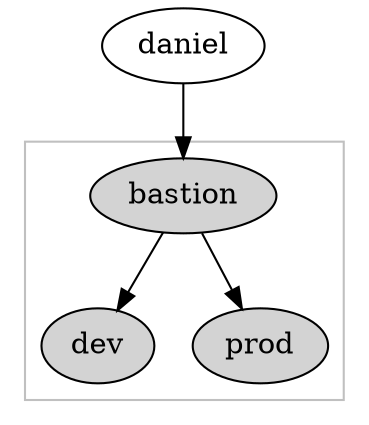

# Linux Survival Guide

## Welcome to (S)Hell

### Racourcis


| Action                                  | Raccourci                | 
|:--                                      |:--                       |
| Fin de ligne                            | **Ctrl + E**            |
| Début de ligne                          | **Ctrl + A**            | 
| Supprimer un mot                        | **Alt + Del**           |
| Copier                                  | **Ctrl + Shift + C**   |
| Coller                                  | **Ctrl + Shift + V**   |
| Recherche dans L'historique             | **Ctrl + R**            |
| Lister les fichiers                     | **Alt + L**             |
| Nettoyer le terminal                    | **Ctrl + L**            |


    
### Utilitaires

- **cat**
    - Afficher le contenu d'un fichier : 
    `cat /chemin/vers/mon/fichier`
    - options utiles : 
        - `-s`: supprime les lignes vides
        - `-n`: affiche les numéros de ligne

- **ls**: 
- **grep** : 

    la commande grep permet de rechercher des chaînes de charactères dans un fichier, et bien plus! 
    - Rechercher dans un fichier : `grep 'expression' fichier `
    - Recherche récursive dans le dossier courant: `grep -r 'expression`
    - Afficher un offset avant et après la ligne matchée : `grep -A 3 -B 3 'expression' fichier`
    - Filter le nom des fichiers à inclure dans la recherche : `grep --include="*.php" -ri "expression" .`
    - Avec des regex (ici pour trouver une addresse mail): `grep -E -o "\b[A-Za-z0-9._%+-]+@[A-Za-z0-9.-]+\.[A-Za-z]{2,6}\b" file.txt`  :no_mouth:


- **sed**
    - chercher par numéro de ligne `sed '6!d' /etc/passwd`
- **Redirection**
- **pipe**

Le caractères (|) permet de rediriger la sortie d'une commande vers l'entrée de la commande suivante. 

- `cat /etc/passwd | grep daniel`
- `cat /var/log/rabbitmq/daniel@machine.log | head -100 | tail -4 | grep $(date --date="yesterday")`

- **Substitution de Variable**


### Shell candies

1. bat 
2. zsh/oh-my-zsh
3. httpie
4. mosh

## Kata-logs

### À l'ancienne

- Afficher continuellement les erreurs d'un programme

```
tail -f /monlog.log | grep ERROR
```

### Comme les jeunes

- Show list of boots :  `journalctl --list-boot`
- Grep : `--grep=` , `-g`
- Time : `--since=`, `-S` | `--until`, `-U`
- Show logs for a specific unit : `journalctl --unit bumblebeed`, short `-u`
- Follow logs : `journalctl --follow`, short `-f`

Un exemple de la vrai vie véritable : 
```shell
$ journalctl -S "14 day ago" -U "yesterday" -u nginx
```

## Travailler avec une machine distante

- Connection SSH Simple

```shell
$ ssh user@machine.com
```
:information_source: Pour quitter une session ssh bloquée : <ENTER>~.

- Connection SSH via bastion

```shell
$ ssh -J user@bastion.com user@machine.com
```

- Transférer un fichier

_scp_

```

```

_rsync_

```

```

- Connexion à un port distant

```

```

###   Configuration persistante

- Accès direct

```
Host michel-host
  Hostname 10.0.0.42
  IdentityFile /home/daniel/.ssh/id_rsa
  IdentitiesOnly yes
  Port 6969
  User daniel
```

```shell
$ ssh michel-host
```
- Accès via un bastion


```
Host bastion 
  Hostname  bastion.example.org
  IdentityFile /home/daniel/.ssh/id_rsa 
  IdentitiesOnly yes
  localforward 9002 192.168.0.42:22 
  localforward 9001 192.168.0.24:22 
  Port 2222
  User daniel
  
Host prod 
  Hostname localhost
  NoHostAuthenticationForLocalhost yes
  ForwardAgent yes
  Port 9001

Host dev
  Hostname localhost
  NoHostAuthenticationForLocalhost yes
  ForwardAgent yes
  Port 9002
```

```shell
$ ssh prod
```
```shell
$ ssh dev
```
## Monitorer les ressources

- Monitoring général de la machine

```shell
$ htop
```

- Monitoring RAM

```shell
$ free -m
```


## Utilisateurs et groupes 

- **permissions**

| Droit | Chiffre | 
|:--    |:--      |
| r     | 4       |
| w     | 2       | 
| x     | 1       |

- chmod/chown
... ect 

- **sudo**
git 

## Système de fichiers

- Déterminer quel processus travaille dans un path donné : 

```shell
$ fuser -vm /mnt/data
```

## Package managers 

## Network Stuff


- `ss -lnt`
- `ss -lntp`
- `sudo ss -lptn 'sport = :80'`

## Dotfiles
