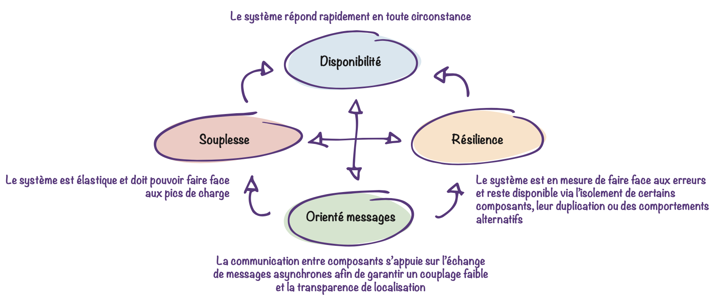
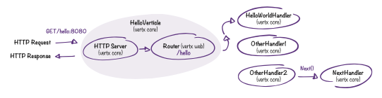
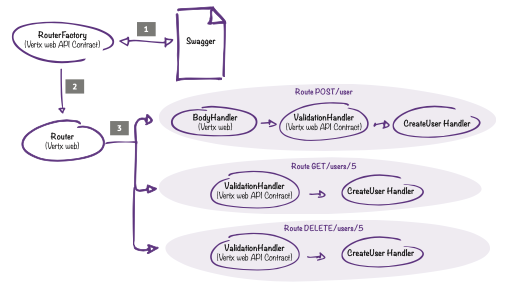
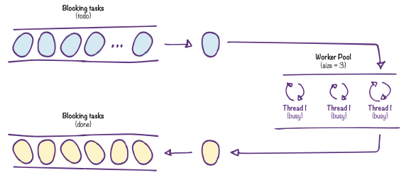
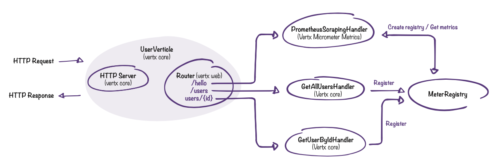

# Vertx RefCard

*English version*

Vertx 3.8.0 Usage RefCard

Written by Mathias Deremer-Accettone

## Summary

1. [Vertx, kesako?](#vertx-kesako-)
2. [Definitions and Terminology](#definitions-and-terminology)
3. [Who uses Vertx?](#who-uses-vertx-)
4. [Designing APIs with Vertx](#designing-apis-with-vertx)
     * [My first API](#my-first-api)
     * [Query parameters](#query-parameters)
     * [API Contract - Theory](#api-contract---theory)
     * [API Contract – Implementation](#api-contract---implementation)
     * [Execute blocking code – Theory](#execute-blocking-code---theory)
     * [Run blocking code – Practical](#executing-blocking-code---practical)
     * [Circuit Breaker](#circuit-breaker)
5. [Vertx for the web](#vertx-for-the-web)
     * [Serving web pages](#serving-web-pages)
     * [Store data: sessions](#store-data---sessions)
     * [Store data: cookies](#store-data---cookies)
     * [Enter data: forms](#enter-data--forms) 
6. [The Event Bus, the nervous system of Vertx](#the-event-bus-the-nervous-system-of-vertx)
     * [Event Bus – Theory](#event-bus---theory)
     * [Event Bus – Local](#event-bus---local)
     * [Event Bus – In cluster](#event-bus--in-cluster)
7. [Manage microservices effectively](#manage-effectively-micro-services)
     * [Service Discovery - Theory](#services-discovery---theory)
     * [Service Discovery - Implementation](#services-discovery---implementation)
8. [Test the application](#tester-the-application)
     * [Collections of tests with Vertx Unit](#collections-of-tests-with-vertx-unit)
     * [Chain its Vertx Unit tests](#chain-its-vertx-unit-tests)
9. [Deploy and Administer](#deploy-and-administer)
     * [The CLI Vertx](#the-cli-vertx)
     * [Configurations and logs](#configurations-and-logs)
     * [Rapid deployment of the application](#rapid-deployment-of-the-application)
     * [Advanced deployment and scalability](#advanced-deployment-and-scalability) 
10. [Observability](#observability)
     * [Check the status of an application](#check-the-status-of-an-application)
     * [Expose indicators - Theory](#expose-indicators---theory)
     * [Expose indicators - Put into practice](#expose-indicators---put-into-practice)
11. [Conclusion](#references)
12. [References](#references)
13. [About Ineat](#about-ineat)

## Vertx, kesako?

### Born to be responsive

A real event-driven toolbox, Vertx is suitable for developing applications that require flexibility and performance by perfectly fulfilling the 4 key criteria
reactive architecture.



### Polyglot

Another interesting aspect of Vertx: he is multilingual. Components can be developed in Java, Kotlin, Javascript, Ceylon, Groovy, Ruby, Scala.
You can get started with vertx or develop a first micro service without leaving your favorite language, enough to get started and take ownership of the concepts. On the other hand, a small downside, don't forget that only the Java components are the most up to date...


## Definitions and Terminology

First of all, a little focus on Vertx terminology.

### Vertical

Core component deployed and running within any Vertx application. A verticle generally has the role of exposing handlers. An application can expose one or more verticles that have different technical or functional scopes. Note that verticles can be of different types: "classic" verticles orchestrated by the Event Loop,
and the workers.
Workers have a particular life cycle since they are executed from threads available in a specific thread pool and not from the event loop. They are generally used to execute blocking code such as database writes based on JDBC.

### Handler

Remember Vertx is event-driven, so you will have to process these events: this is the role of your handlers. HTTP request or message, your processing must not be blocking: "don't block the event loop"!

### Event Loop

The Event Loop is in charge of dispatching incoming events (e.g. arrival of an HTTP request) to the correct Handler, as shown in the following diagram:


This concept is well known to Node.js developers. However, unlike Node.js, each Vertx instance can maintain multiple instances (threads) of Event Loop. By default, the number of instances corresponds to the number of cores multiplied by 2.

## Who uses Vertx?

Still not widespread a few years ago, Vertx now benefits from a large community and is used by many companies. Examples include Michelin with their platform for collecting data from connected tires, Red Hat and its Quarkus Framework which is partly based on Vertx, or the API Management solution Gravitee.


## Designing APIs with Vertx

### My first API

#### Necessary dependencies


#### First handler

Defining a handler is equivalent to implementing the __Handler__ interface. The __handle__ method is invoked each time a handler is triggered, and takes a __RoutingContext__ as a parameter that will allow you to interact with the HTTP context.

```java
public class HelloWorldHandler implements Handler<RoutingContext> { @Override
  public void handle(RoutingContext routingContext) {
    routingContext.response().end("Hello world!!"); }
  }
```

#### Verticle creation and router declaration

The router is used to determine in which cases the handler will be invoked (by HTTP method, regular expressions...).

```java
public class HelloVerticle extends AbstractVerticle {
  @Override
  public void start() {
    Router router = Router.router(vertx); router.get("/hello").handler(new HelloWorldHandler()); vertx.createHttpServer().requestHandler(router).listen(8080);
  }
}
```

By definition, a verticle is a class that extends __AbstractVerticle__, and in which the __start__ method is overridden. The __Router__ makes it possible to associate “/hello” URL and __GET__ type requests with the handler defined previously. An HTTP server is then created and listens on port 8080.



### Parameters of a request

#### Necessary dependencies


#### Query params

Query params are probably the easiest to retrieve, access being through a Multimap:

```java
MultiMap parameters = routingContext.request().params()
```

#### Path params

##### Statement

Implies the modification of the url declared in the __Router__ by declaring the parameters with __:[name]__

```java
router.delete("/example/:id").handler(new DeleteExampleHandler());
```

##### Recovery

Access to the parameter is then done as follows on the __Handler__ side:

```java
routingContext.request().getParam("id");
```

#### Body params

##### Statement

Accessing the body of a __POST__ request involves adding a __BodyHandler__ to the router (verticle side).

```java
router.route().handler(BodyHandler.create());
router.post("/example").handler(new PosExampletHandler());
```

##### Recovery

On the __Handler__ side, access to the body will be via __RoutingContext__.

```java
JsonObject jsonObject = routingContext.getBodyAsJson();
JsonArray jsonArray = routingContext.getBodyAsJsonArray();
Buffer buffer = routingContext.getBody();
String body = routingContext.getBodyAsString();
```

### API Contract - Theory

When designing APIs, we sometimes write code and generate documentation (__Swagger__ or __OpenApi__). As seen previously, quickly creating routes and associating __handlers__ to them is very simple, the documentation can be written later. But __Vertx__ also offers another approach thanks to the __API Contract__: here we write the __SwaggerDoc__ which will contain the specifics of our APIs, then we go to the code. This mechanism is based on the use of the __OpenAPI3RouterFactory__ class, whose function is to generate a router from the YAML file containing the documentation (and therefore the routes of our APIs).

However, __API Contract__ is not limited to this only since it allows, among other things, to automatically generate validation __handlers__: if an incoming request does not respect the format specified in the documentation, a 400 error will then be returned to the appellant.

The constraint (which is ultimately not one) is obviously to have rigorously maintained documentation, and the advantages are numerous: less code to write, __BodyHandler__ generated automatically for POST requests, more controls
on incoming requests, ...



1 - The __RouterFactory__ analyzes the __Swagger__ file.

2 - A __Router__ is generated by the __RouterFactory__ from the content of the __SwaggerDoc__.

3 - The routes corresponding to the __endpoints__ specified in the __SwaggerDoc__ are exposed and linked to the handlers (__BodyHandler__ and __ValidationHandler__ being automatically generated).

### API Contract - Putting it into practice

#### Necessary dependencies


#### The documentation

The __Swagger__ documentation is written in YAML and follows the __OpenApi__ specifications. We simply add an __operationId__ to each endpoint specified in the __SwaggerDoc__ (they will make the link with the __handlers__ to invoke).

```yaml
...

paths:
  /users/{userId}
    get:
    summary: Get user by id operationId: getUserById parameters:
...

```

#### Creating the RouterFactory

```java
OpenAPI3RouterFactory.create(vertx, "src/main/resources/swaggerdoc.yaml", ar -> {
  if (ar.succeeded()) {
    OpenAPI3RouterFactory routerFactory = ar.result();
  }
});
```

__OpenAPI3RouterFactory__ has a create method, taking, among other things, a YAML file path, and a __handler__ in which operations and corresponding __handlers__ will be associated.

#### Association operations / handlers and generation of the router.

```java
//...
routerFactory.addHandlerByOperationId("getUserById", new GetUserHandler()); routerFactory.addHandlerByOperationId("createUser", new PostUserHandler()); routerFactory.addHandlerByOperationId("deleteUser", new DeleteUserHandler());
//...
```

The __OpenAPIRouterFactory__ instance allows us to make the association between the operationIds specified in the __swagger__ documentation and the __handlers__.
The generation of the router can then be carried out with:

```java
Router router = routerFactory.getRouter();
```

### Executing Blocking Code - Theory

We generally opt for Vertx when the non-blocking nature of a project is an important criterion. There is therefore a rule that should not be derogated from: _never block the Event Loop_. However, it may be necessary to switch back to synchronous mode and execute blocking operations. A typical case is the writing of data files (a CVS export for example).

Vertx allows you to perform this type of operation with particular verticles, called __Workers__. These do not have the same life cycle as classic verticles because they are not administered
by an Event Loop: a __Worker__ is executed with a thread coming from the pool of __Workers__.

In order to simplify the allocation of threads dedicated to the execution of __workers__, Vertx administers Pools, thus offering us the possibility of setting the number of threads available and therefore of blocking tasks that can be executed at the same time.



### Executing Blocking Code - Practice

#### Necessary dependencies


#### Method 1: During deployment.

As mentioned above, a __worker__ is a vertex like any other.
The fundamental difference is that it will be executed from a thread from the vertx thread pool dedicated to __workers__ and not via the event loop.

```java
DeploymentOptions opts=new DeploymentOptions().setWorker(true);
Vertx.vertx().deployVerticle(new ExampleVerticle(), opts);
```

When deploying a verticle, it is possible to specify __DeploymentOptions__, allowing among other things to specify whether it should be deployed as a worker. It is also possible to set the maximum number of threads of a pool with the __setWorkerPoolSize__ method.

```java
DeploymentOptions opts=new DeploymentOptions()
  .setWorker(true)
  .setWorkerPoolSize(3);
Vertx.vertx().deployVerticle(new ExampleVerticle(), opts);
```

#### Method 2: with executors.

Another way to execute blocking code is to use the __WorkerExecutor__ class. This class has an __executeBlocking__ method allowing, as its name suggests, to execute blocking portions of code. Blocks of code wrapped by the executeBlocking method will be processed by a worker pool thread.

```java
WorkerExecutor workerExecutor = vertx.createSharedWorkerExecutor("worker-pool-example", 3);
workerExecutor.executeBlocking(future -> {
//...
}, res -> {
// ...
});
```

Here each task executed with __executeBlocking__ will be handled by a thread from the "worker-pool-example" pool, created with __createSharedWorkerExecutor__.

_Methods 1 and 2 are quite similar: you benefit from a pool of three workers allowing you to execute blocking code. In its simplest form, the execution of blocking code can also be done via the Vertx.executeBlocking method which is used in the same way as the executeBlocking of WorkerExecutor._

### Circuit Breaker

The Circuit Breaker pattern ensures the resilience of the application, by offering alternative scenarios in the event of failures in order to guarantee continuity of service.


#### Necessary dependencies


#### Initialization

```java
CircuitBreaker breaker = CircuitBreaker.create("breaker-example", vertx,
  new CircuitBreakerOptions()
    .setMaxFailures(5)// (1)
    .setMaxRetries(3)// (2)
    .setTimeout(2000)// (3)
```

The circuit breaker is set through __CircuitBreakerOptions__. Here we define the threshold of failures tolerated before switching the circuit to open status (1), the maximum number of attempts to execute a request before incrementing the failure counter (2), and the response time maximum beyond which the request is considered in error (3).

#### Management of error cases

```java
breaker.executeWithFallback(future ->
  WebClient.create(vertx)
    .get(8080, "address", "/test")
    .send(response -> { /*...*/ })
), fallback -> { System.out.print("Target application can't be called");
}).setHandler(ar -> System.out.print("Success"));
```

## Vertx for web

### Serving web pages

An ideal solution for quickly building light and responsive APIs, Vertx also allows you to serve HTML content.

#### Necessary dependencies


#### Expose static resources

Serving static resources (like css files or images) requires the use of a __StaticHandler__ which, based on requests, will pass files stored in a directory in the filesystem. By default this directory is __webroot__, but it is quite possible to point to another directory via the __setWebRoot__ method of the __StaticHandler__.

```java
router.route("/static/*").handler(StaticHandler.create());
```

#### Serve an HTML page

Just like the responses returned by APIs, serving HTML content is done
with __routingContext.response().end(...)__. The content returned here is passed as a parameter of the end method and will in this case be HTML code.

#### Template

Several template engines can be used in conjunction with Vertx to render HTML content (Thymeleaf, Freemarker, Jade, ...).

```java
router.get("/page").handler(
  routingContext -> {
    ThymeleafTemplateEngine engine = ThymeleafTemplateEngine. create();
    engine.render(routingContext, "templates", "page.html", res -> {
      if (res.succeeded()) {
        routingContext.response().end(res.result());
      }
    });
});
```

In addition to the __RoutingContext__, the __render__ method of __ThymeleafTemplateEngine__ takes as a parameter the name of the directory containing the templates, the name of the template to use and a handler to execute (in general this handler will return the generated HTML code).

### Storing data: sessions

#### Necessary dependencies


#### Storage Types

Storing data in session involves creating an instance of __SessionStore__. This class allows you to specify the name of the map that will contain the session data.

```java
SessionStore sessionStore = LocalSessionStore.create(vertx, "map");
```

In its simplest form, storage is done locally within a single HTTP server. However in production, several instances of the same verticle can exist within the same cluster. The sessions are therefore required to be shared between several HTTP servers. In this case, it will be necessary to use __ClusturedSessionStore__ and not __LocalSessionStore__. The sessions will then be stored in a distributed map.

_While quite doable with Vertx, storing data in session is however
to avoid: to follow the principles of scalability and resilience, it is advisable to favor stateless._


#### Data Access

Session data access follows the same pattern as POST request body access. We declare the __SessionHandler__, which will be associated with the __router__.

```java
SessionHandler sessionHandler = SessionHandler.create(sessionStore); router.route().handler(sessionHandler);
```

Access to the data can then be operated through a __Session__ object, obtained via a call to the __RoutingContext__. __Session__ is handled like a classic HashMap.

```java
Session session = routingContext. session();
session. put("key", "value");
```

### Store data: cookies

#### Necessary dependencies


#### Implementation

In the same way as for sessions, access to data stored in the form of cookies is done through a specific handler: __CookieHandler__.

```java
router.route().handler(CookieHandler.create());
```

The __RoutingContext__ will allow storing new cookies and manipulating their data.

```java
routingContext.addCookie(Cookie.cookie("cookie-example", "value"));
//...
Cookie cookieExample = routingContext.getCookie("cookie-example");
String value = cookieExample.getValue();
```
### Enter data: forms.

#### Necessary dependencies


#### Create the form

The creation of a form usable by Vertx has no particular prerequisites, only the __name__ attribute of the inputs is essential: it is with its name that we can search for an input and access its value.

```xml
<form method="post">
  <input type="radio" id="input1" name="radio1" value="A"/>
  <input type="radio" id="input2" name="radio2" value="B"/>
  <input type="radio" id="input3" name="radio3" value="C"/>
</form>
```

#### Retrieve entered data

As specified in the previous part, the name of the input is important, because it allows you to retrieve the value entered with the __getFormAttribute__ method of __HttpServerRequest__ (which takes the name of the input as a parameter).

```java
routingContext.request().getFormAttribute("radio1")
```

Another method (__formAttributes__), also provided by __HttpServerRequest__, offers the possibility of retrieving all the inputs in the form of a __MultiMap__.

## The Event Bus, Vertx's nervous system

### Event Bus - Theory

Veritable nervous system of Vertx, the event bus allows different entities of an application to communicate with each other via message exchange (entities that may or may not be in the same Vertx instance). One of the main advantages is that the communicating parties can be written in different languages, but that it is also entirely possible to link JavaScript code, executed in a browser, to the Event Bus (via __SockJs__ for example).

Sending messages on the bus is done on an address, which is neither more nor less than a simple string of characters. Each __consumer__ (which is usually a verticle) receives and processes messages by subscribing to this address (__publish/subscribe__ pattern).

It also supports the point-to-point model and __request/response__.
We therefore find the "message oriented" aspect of the reactive manifesto. This bus will allow us to decouple the components, and to take advantage of horizontal scalability (a vertex of the cluster will process a message).


### Event Bus - Local

#### Necessary dependencies


#### Receiving messages (Subscriptions)

```java
@Override
public void start() {
  // ...
  vertx.eventBus().consumer( "address-A", message -> System.out.println(message.body()));
```

In this example, the content of the message received at the address "address-A" is displayed.

#### Sending messages

Posting a message can be done in two ways:
- Via the __publish__ method -> all consumers subscribed to the address will process the message (__publish / subscribe__ model).
- Via the __send__ method -> a single consumer will process the message even if others are subscribed to the same address (__point to point model__).

These two methods take as parameters the publication address and the content
of the message.

```java
vertx.eventBus().publish("address-A", "Message content");
vertx.eventBus().send("address-A", "Message content");
```
### Event Bus – Clustered

In its simplest form, inter-verticle communication happens within the same Vertx instance without any complexity. However, in the case of distributed applications, several Vertx instances can coexist on the network and be executed on different JVMs.

However, each instance manages its own Event Bus. It is therefore necessary to rely on a Cluster Manager which will allow the instances to be grouped and to form a single shared Event Bus.


#### Necessary dependencies


#### Implementation

```java
//...
ClusterManager mng = new HazelcastClusterManager();
VertxOptions options = new VertxOptions().setClusterManager(mng); Vertx.clusteredVertx(options, res -> {
  if (res.succeeded()) {
    Vertx vertx = res.result(); vertx.eventBus().publish("address-B", "Message content");
  }
});
```

We instantiate a __HazelcastClusterManager__ which will then be used to initialize the cluster. If successful, the rest of the operations will be the same as for a local execution. Vertx supports other Cluster Managers like Zookeeper (__ZookeeperClusterManager__ from __vertx-zookeeper__ module), Infinispan (__InfinispanClusterManager__ from __vertx-infinispan__ module), Ignite (__IgniteClusterManager__ from __vertx-ignite__ module). Whether local or distributed, the event bus therefore allows the components of an application to easily exchange data in an asynchronous and non-blocking way, and does not require the intervention of a message broker.

## Effectively manage microservices

### Services Discovery - Theory

Each entity of a system can be seen as a service. Whether HTTP endpoints, data sources or a proxy, each service can be described and referenced in the directory in order to be called by other services without these having knowledge of the address of this service. Just like for the Event Bus, this mechanism, called service discovery, therefore guarantees a certain __transparency of location__.


This diagram illustrates this concept: __Account Service__ endpoints (exposed by __Account Verticle__) are referenced in the Service Registry. The latter is observed and used by Customer Service to retrieve the Account Service address and therefore determine how to call the endpoints exposed by __Account Verticle__.
Vertx offers its own classes for setting up a service directory, but also offers connectors for interacting with other solutions (Consul for example, via the client made available by __vertx-consul-client__).

### Services Discovery - Putting it into practice

#### Necessary dependencies


#### Create the service directory

Creating a service directory with Vertx involves instantiating a __ServiceDiscovery__ object:

```java
ServiceDiscovery discovery = ServiceDiscovery.create(vertx);
```

#### Listing a service in the directory

Publishing a service (below an HTTP endpoint) amounts to adding a __Record__ in the directory. Each referenced service is characterized by a name, a location, and optionally metadata.

```java
Record record = HttpEndpoint.createRecord("service-name", "address", 8080, "/test");
discovery. publish(record, ar -> {
  if (ar.succeeded()) {
    System.out.println("Service published");
  }
});
```

#### Find a service in the directory

It is possible to search for services using filters (applicable to different characteristics of a service):

```java
discovery.getRecord(r -> r.getName().equals("service-name"), ar -> {
  if (ar.succeeded()) {
    System.out.println("Service found");
  }
});
```

The call to the service can then be made as follows (the __getAs__ method taking the type of service to retrieve as a parameter):

```java
if (ar.succeeded()) {
  Record record = ar.result();
  ServiceReference serviceReference = discovery.getReference(record);
  HttpClient client = serviceReference.getAs(HttpClient.class);
  client.get("HTTP://address:port/resource").end();
  // ...
  serviceReference.release();}
```

## Test the application

### Test collections with Vertx Unit

Vertx Unit is a module provided by Vertx, based on existing test frameworks and allowing to write asynchronous unit tests.

#### Necessary dependencies


#### Write a test suite

In general, testing your application comes down to writing a set of test cases. The __TestSuite__ class simplifies this process by providing some useful methods to group these test cases and sequence their executions.

##### Instantiate a TestSuite

The creation of a __TestSuite__ object requires a call to the __create__ method, taking a string of characters as a parameter (the name you want to give to the __TestSuite__).

```java
TestSuite testSuite = TestSuite.create("test-suite-example");
```

##### Declare tests

The __TestSuite__ instance is used to declare __test__ cases. The test method takes the name of the test as a parameter, as well as a callback to execute.

```java
testSuite.test("test1", context -> {
   //...
});
```

##### Run a test suite

The __TestSuite__ class has a run method, which allows you to start the execution.

```java
testSuite.run();
```

It is also possible to pass parameters to this method, and in particular an instance of __TestOptions__. This class is used, among other things, to declare "reporters" to export test results to various outputs.

```java
ReportOptions fileReport = new ReportOptions().setTo("file:.").setFormat("simple");
testSuite.run(new TestOptions().addReporter(fileReport));
```

In the previous example, an instance of __ReportOptions__ allows to specify that the test execution output will be a set of files (the argument of __setTo__ will then have the form __file:$DIRECTORY__ where $DIRECTORY will be replaced by the path where will be backed up files). It is possible to specify other outputs by changing the argument of the __setTo__ method by:
- console > test results will be displayed in the console
- bus: $ADDRESS > exports in the form of messages, sent on an Event Bus (we will replace $ADDRESS by the address to which we send the messages)
- Log: $LOGGER > exports in the form of logs (replace $LOGGER with the name of the logger to use)

### Chaining your Vertx Unit tests

As we saw in the previous part, writing test cases with Vertx Unit is quite trivial. But this module is not limited to the writing of stand-alone test cases: it is possible to build real scenarios by chaining test cases.

#### Necessary dependencies


#### Implementation

The logical sequence of tests implies that they can share objects. For this, the callbacks have a __context__ available, which can be used as a Hashmap. We can therefore store data during the execution of a test case, and use it during the execution of the next one.

```java
testSuite.before(context -> {
  context. put("result", 10);
}).test("increase-result", context -> {
  int newResult = ((int)context.get("result")) + 8;
  context. assertEquals(newResult, 18);
  context. put("result", newResult);
}).test("divide-result", context -> {
  int newResult = ((int)context.get("result")) / 2;
  context. assertTrue(newResult < 10);
  context. put("result", newResult);
}).after(context -> {
  //...
});
```

In the previous example, we store in the __context__ an integer "result" from the callback of the __before__ method (method used to initialize a __TestSuite__ before its execution). The value of "result" is then updated, tested, and restored by the first "increase-result" test case. The second test case "divide-result" will be launched once "increase-result" has completed its execution and can in turn exploit the value of "result". It is also the __context__ object that provides the assertion methods.

## Deploy and administer

### The Vertx CLI

Vertx has a very convenient command-line interface for launching verticles by specifying deployment options.

#### Facility

1 - Install a JDK 8 on the development workstation (essential if you want to compile verticles written in Java).

2 - Download the latest version of Vertx from HTTPS://vertx.io/download/.

3 - Unzip the archive.

4 - Add the bin contained in the directory obtained to the PATH of the machine.

#### Some useful commands

- Compile and deploy a verticle
```shell
$vertx run HelloVerticle.java
```

- Deploy 3 instances of a verticle
```shell
$ vertx run HelloVerticle.java -instances 3
```

- Deploy a worker
```shell
$ vertx run HelloVerticle.java -worker
```

- Specify configurations during deployment
```shell
$ vertx run HelloVerticle.java -config /path/to/config.json
```

- Deploy a verticle in a clustered environment
```shell
$ vertx run HelloVerticle.java -cluster
```
Vertx will automatically create an Event Bus to allow inter-verticle communication.

- Redeploy automatically with each modification
```shell
$ vertx run HelloVerticle --redeploy="**&#47;*.class" --launcher-class=io.vertx.core.Launcher
```
The -redeploy option here takes an Ant-style regex as a parameter to indicate the set of files to observe.

- Launch a verticle in the background
```shell
$ vertx run HelloVerticle start --vertx-id=hello-verticle
```
We will use list and stop to list and stop the vertices.

### Configurations and logs

#### Necessary dependencies


#### Setups

Vertx supports different types of data sources from which it is possible to extract the configurations usable by our applications, and in particular __files__ (JSON,YAML,...), __environment variables__, __HTTP__ endpoints__ or even __repositories Git__. To access configurations stored both in a file and in environment variables, a __ConfigRetrieverOptions__ object must be defined:

```java
ConfigStoreOptions fileStore = new ConfigStoreOptions()
  .setType("file")
  .setConfig(new JsonObject().put("path", "config-file.json"));
ConfigStoreOptions envStore = new ConfigStoreOptions().setType("env"); ConfigRetrieverOptions options = new ConfigRetrieverOptions()
  .addStore(fileStore)
  .addStore(envStore);
```

It will then be used to retrieve a __JsonObject__ containing all the configurations (like a __HashMap__, each value of the __JsonObject__ is accessible via a key):

```java
ConfigRetriever.create(vertx, options).getConfig(ar -> {
  if (ar.succeeded()) {
    JsonObject config = ar.result();
  }
});
```

#### Logs

The default logging API implementation provided by Vertx relies on __java.util.logging__ (other logging frameworks such as Log4j are also supported). When the application starts, Vertx will scan the __vertx-default-jul-logging.properties__ file located under __/src/main/resources__. The logging will then be done in a very classic way.

```java
Logger logger = LoggerFactory.getLogger("ExampleVerticle")
//...
logger. error("Error during Verticle initialization");
```

### Rapid application deployment

When building a Vertx application, a fat-jar is generated and can be launched via the __java -jar__ command. However during the development phases, this method can be quite restrictive. Fear not, there are other techniques for constructing, deploying, and launching verticles.

#### Using the maven plugin

The easiest way to launch a Vertx application locally is to use the __vertx-maven-plugin__ plugin. Once added to the pom.xml, run the following command to start the application:

```shell
$ mvn vertx:start
```
And to stop it:
```shell
$ mvn vertx:stop
```

#### Using Vertx's Launcher class

Vertx provides the Launcher class, usable with __maven-shade-plugin__. After adding the plugin to the pom.xml, it is necessary to specify in its configuration which class will be used as Launcher and which verticle to launch.

```xml
<manifestEntries>
   <Main-Class>io.vertx.core.Launcher</Main-Class>
   <Main-Verticle>ExampleVerticle</Main-Verticle>
</manifestEntries>
```

#### Programmatically

Verticles can be deployed from the application code:

```java
Vertx.vertx().deployVerticle(new ExampleVerticle());
```

### Advanced deployment and scalability

#### Necessary dependencies


#### Specify deployment options

The __DeploymentOptions__ allow you to specify various criteria used by Vertx when starting verticles, including the number of instances of a single verticle.

```java
DeploymentOptions opts=new DeploymentOptions().setInstances(3);
Vertx.vertx().deployVerticle(new ExampleVerticle(), opts);
```

Here the three instances of __ExampleVerticle__ will listen to port 8080. The redirection of requests to such or such instance is automatically carried out by Vertx (__Round Robin__ strategy).

#### Outsource deployment options

Options and actual deployment can be decoupled.
Indeed, information such as the number of instances of a verticle are only parameters that can be centralized in a Json configuration file.

```json
{
  "main": "com.ineat.ExampleVerticle",
  "instances": 3,
  "worker": true
}
```

The Eclipse toolkit once again simplifies the life of the developer by providing the __ServiceFactory__ class which, once added to the Vertx instance, will take care of collecting the deployment options specified in the configuration file.

```java
vertx. registerVerticleFactory(new ServiceVerticleFactory());
```

Assuming that the file containing the deployment options of __ExampleVerticle__ is named __config-example-service.json__, the deployment will then be as follows:

```java
vertx. deployVerticle("service:config-example-service");
```

## Observability

### Check the state of an application

#### Necessary dependencies


#### HealthCheck

The main interest of a healthcheck is to be able to monitor the status of the application. It also makes it possible to check the state of the bricks linked to this application (other services, databases, etc.), which will make it possible to establish a precise diagnosis in the event of a breakdown and to identify which component is causing the problem.


Checking the health status of an application is easy thanks to the __HealthCheckHandler__ (provided by the __vertx-health-check__ module). This handler is customizable since it is quite possible to add controls in the form of a procedure using the __register__ method (taking as a parameter a string that will identify this procedure,
and the procedure itself).

```java
HealthCheckHandler healthCheckHandler = HealthCheckHandler. create(vertx);
healthCheckHandler. register("control-db", future -> {
  dbClient.getConnection(connection -> {
    if (connection. failed())
      future.complete(Status.KO());
    else
      future.complete(Status.OK());
});
healthCheckHandler. register("control-payment-service", future -> {...}); router.get("/health").handler(healthCheckHandler);
```

### Exposing Indicators - Theory

Healthchecks are reliable solutions to check if an application is available. However, it is possible to go further by exposing useful data thanks to metrics: CPU consumption, memory used, number of verticles deployed, ... __Micrometer__ is one solution among others and for which Vertx provides a module. Thus __vertx-micrometer-metrics__ contains everything needed to report metrics that can be used by solutions like __Prometheus__ or __InfluxDb__, and presented in __Grafana__ dashboards.



### Exposing indicators - Putting them into practice

#### Necessary dependencies


#### Enable metrics retrieval

In order to authorize the recovery of Micrometer metrics by Vertx, we specify the necessary __VertxOptions__.

```java
Vertx vertx = Vertx.vertx(new VertxOptions().setMetricsOptions(
  new MicrometerMetricsOptions()
    .setPrometheusOptions(new VertxPrometheusOptions()
    .setEnabled(true))
    .setEnabled(true))
  );
```

#### Create the route dedicated to metrics

Retrieving metrics can be done in a variety of ways, the most common being by calling a dedicated endpoint. In case Prometheus is used, the handler connected to the url __/metrics__ will be a __PrometheusScrapingHandler__. When instantiating this handler, it is possible to specify the name of the __MeterRegistry__ (object with which the various probes, called __Meter__, will register). If no name is specified, a default registry will be created.

```java
router.route("/metrics").handler(PrometheusScrapingHandler.create("user-metrics-registry"));
```

#### Reference and use of probes

The probes are referenced in a __MeterRegistry__ accessible from almost anywhere in the code thanks to the __BackendRegistries__ class, its __getNow__ method can take as a parameter the name of the registry passed when creating the __PrometheusScrapingHandler__.
It is entirely possible to reference and use probes from handlers (for example to count the number of calls to an endpoint over a given time interval).

```java
MeterRegistry reg = BackendRegistries.getNow("user-metrics-registry"); Counter counter = Counter.builder("user.api.number.calls").register(reg);
//...
counter. increment();
```

## Conclusion

So what should we remember from Vertx? Simply that it allows you to quickly develop responsive applications offering excellent performance, but remaining simple to understand.

Indeed, whatever the framework or toolkit, it is only really of interest if it is efficient and easy to use. It's a mission accomplished for Vertx, which in a few years has been able to gather a large community, provide complete and perfectly up-to-date documentation, while regularly providing new, very practical features.

Finally, it should be noted that Vertx was also one of the main components used
in the development of Quarkus, a project aimed, among other things, at putting the Java language back in the race for performance.

Vertx is therefore THE toolkit that every Java developer should know, so go ahead and get started!

## References

- https://vertx.io/docs/ - Official documentation
- https://vertx.io/blog/ - The Vertx Blog
- https://senelda.com/blog/nodejs-vs-vertx-part2-detailed-investigation-2/ - Vertx / Node JS comparison
- https://quarkus.io/ - Quarkus official website (project partly based on Vertx)
- https://vertx.io/blog/eclipse-vert-x-goes-native/ - Generate a native image of a Vertx project

## About Ineat

Convinced that innovation is the best response to changes in our society, Ineat aims to guide and support companies in their digital transformation process by helping them to appropriate new technologies.


This guide was written by __Mathias Deremer-Accettone__

Version: V1.0.0

Date of publication: November 2019

Printing: Pixartprinting

__Thanks to our reviewers:__
Emmanuel Peru, Ludovic Dussart, Mehdi Slimani, Lucas Declercq

Art direction and illustrations are the work of __Ineat Studio__
