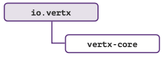

# Vertx RefCard

*Version française*

RefCard d'utilisation de Vertx 3.8.0

Ecrit par Mathias Deremer-Accettone

## Sommaire

1. [Vertx, kesako ?](#vertx-kesako-)
2. [Définitions et Terminologie](#dfinitions-et-terminologie)
3. [Qui utilise Vertx ?](#qui-utilise-vertx-)
4. [Concevoir des APIs avec Vertx](#concevoir-des-apis-avec-vertx)
    * [Ma première API](#ma-premire-api)
    * [Paramètres d’une requête](#paramtres-dune-requte)
    * [API Contract - Théorie](#api-contract---thorie)
    * [API Contract – Mise en Pratique](#api-contract---mise-en-pratique)
    * [Exécuter du code bloquant – Théorie](#executer-du-code-bloquant---thorie)
    * [Executer du code bloquant – Pratique](#executer-du-code-bloquant---pratique)
    * [Circuit Breaker](#circuit-breaker)
5. [Vertx pour le web](#vertx-pour-le-web)
    * [Servir des pages web](#servir-des-pages-web)
    * [Stocker des données : sessions](#stocker-des-donnes---sessions)
    * [Stocker des données : cookies](#stocker-des-donnes---cookies)
    * [Saisir des données : les formulaires](#saisir-des-donnes--les-formulaires)
6. [L'Event Bus, le système nerveux de Vertx](#levent-bus-le-systme-nerveux-de-vertx)
    * [Event Bus – Théorie](#event-bus---thorie)
    * [Event Bus – En local](#event-bus---en-local)
    * [Event Bus – En cluster](#event-bus--en-cluster)
7. [Gérer efficacement les micro services](#gerer-efficacement-les-micro-services)
    * [Service Discovery - Théorie](#services-discovery---thorie)
    * [Service Discovery - Mise en pratique](#services-discovery---mise-en-pratique)
8. [Tester l'application](#tester-lapplication)
    * [Les collections de tests avec Vertx Unit](#les-collections-de-tests-avec-vertx-unit)
    * [Chaîner ses tests Vertx Unit](#chaner-ses-tests-vertx-unit)
9. [Déployer et Administrer](#dployer-et-administrer)
    * [Le CLI Vertx](#le-cli-vertx)
    * [Configurations et logs](#configurations-et-logs)
    * [Déploiement rapide de l'application](#dploiement-rapide-de-lapplication)
    * [Déploiement avancé et scalabilité](#dploiement-avanc-et-scalabilit)
10. [Observabilité](#observabilit)
    * [Contrôler l'état d'une application](#contrler-ltat-dune-application)
    * [Exposer des indicateurs - Théorie](#exposer-des-indicateurs---thorie)
    * [Exposer des indicateurs - Mise en pratique](#exposer-des-indicateurs---mise-en-pratique)
11. [Conclusion](#references)
12. [Références](#references)
13. [A propos d'Ineat](#a-propos-dineat)

## Vertx, kesako ?

### Born to be reactive

Véritable boîte à outils événementielle, Vertx est adapté au développement d’applications qui nécessitent souplesse et performance en remplissant à merveille les 4 critères clé
de l’architecture réactive.


### Polyglotte

Un autre aspect intéressant de Vertx : il est polyglotte. Les composants peuvent être développés en Java, Kotlin, Javascript, Ceylon, Groovy, Ruby, Scala.
Vous pouvez vous mettre à vertx ou développer un premier micro service sans quitter votre langage favori, de quoi se mettre le pied à l’étrier et s’approprier les concepts. Par contre petit bémol, n’oubliez pas que seuls les composants Java sont les plus up to date...


## Définitions et Terminologie

Avant toute chose, petit focus sur la terminologie de Vertx.

### Verticle

Composant de base déployé et exécuté au sein de toute application Vertx. Un verticle a généralement pour rôle d’exposer des handlers. Une application peut exposer un ou plusieurs verticles qui ont des périmètres techniques ou fonctionnels différents. Soulignons que les verticles peuvent être de différents types : les verticles "classiques" orchestrés par l’Event Loop,
et les workers.
Les workers ont un cycle de vie particulier puisqu’ils sont executés à partir de threads disponibles dans un pool de threads spécifiques et non depuis l’event loop. Ils sont généralement utilisés pour exécuter du code bloquant comme les écritures en base de données s’appuyant sur JDBC.

### Handler

Rappelez-vous Vertx est évènementiel, il va donc falloir traiter ces évènements : c’est le rôle de vos handlers. Requête HTTP ou message, vos traitements devront ne pas être bloquant : "don’t block the event loop" !

### Event Loop (Boucle d'événements)

L’Event Loop est en charge de la répartition des événements entrants (ex : arrivée d’une requête HTTP) vers le bon Handler, comme le montre le schéma suivant :


Ce concept est bien connu des développeurs Node.js Cependant contrairement à Node.js, chaque instance Vertx peut maintenir plusieurs instances (threads) d’Event Loop. Par défaut le nombre d’instances correspond au nombre de core multiplié par 2.

## Qui utilise Vertx ?

Encore peu répandu il y a quelques années, Vertx bénéficie aujourd’hui d’une communauté conséquente et est utilisé par de nombreuses entreprises. Citons par exemple Michelin avec leur plateforme de collecte de données issues de pneus connectés, Red Hat et son Framework Quarkus qui s’appuie en partie sur Vertx, ou encore la solution d’API Management Gravitee.


## Concevoir des APIs avec Vertx

### Ma première API

#### Dépendances nécessaires


#### Permier handler

Définir un handler revient à implémenter l’interface __Handler__. La méthode __handle__ est invoquée à chaque déclenchement d’un handler, et prend en paramètre un __RoutingContext__ qui va vous permettre d’interagir sur le contexte HTTP.

```java
public class HelloWorldHandler implements Handler<RoutingContext> {       @Override
  public void handle(RoutingContext routingContext) {
    routingContext.response().end("Hello world !!"); }
  }
```

#### Création du verticle et déclaration du router

Le router permet de déterminer dans quels cas le handler sera invoqué (par méthode HTTP, expressions régulières...).

```java
public class HelloVerticle extends AbstractVerticle { 
  @Override
  public void start() {
    Router router = Router.router(vertx); router.get("/hello").handler(new HelloWorldHandler()); vertx.createHttpServer().requestHandler(router).listen(8080);
  } 
}
```

Par définition, un verticle est une classe qui étend __AbstractVerticle__, et dans laquelle est surchargée la méthode __start__. Le __Router__ permet d’associer les requêtes d’URL « /hello » et de type __GET__ au handler défini précédemment. Un serveur HTTP est ensuite créé et mis en écoute sur le port 8080.


### Paramètres d'une requête

#### Dépendances nécessaires


#### Query params

Les Query params sont probablement les plus simples à récupérer, l’accès se faisant au travers d’une Multimap :

```java
MultiMap parameters = routingContext.request().params()
```

#### Path params

##### Déclaration 

Implique la modification de l’url déclarée dans le __Router__ en déclarant les paramètres avec __:[nom]__

```java
router.delete("/example/:id").handler(new DeleteExampleHandler());
```

##### Récupération

L’accès au paramètre se fait ensuite comme suit côté __Handler__ :

```java
routingContext.request().getParam("id");
```

#### Body params

##### Déclaration

L’accès au body d’une requête __POST__ implique l’ajout d’un __BodyHandler__ au router (côté verticle).

```java
router.route().handler(BodyHandler.create()); 
router.post("/example").handler(new PosExampletHandler());
```

##### Récupération

Côté __Handler__ l’accès au body se fera via __RoutingContext__.

```java
JsonObject jsonObject = routingContext.getBodyAsJson(); 
JsonArray jsonArray = routingContext.getBodyAsJsonArray(); 
Buffer buffer = routingContext.getBody();
String body = routingContext.getBodyAsString();
```

### API Contract - Théorie

Lorsqu’on conçoit des APIs on a parfois l’habitude de rédiger du code et d’en générer la documentation (__Swagger__ ou __OpenApi__). Comme vu précédemment, créer rapidement des routes et y associer des __handlers__ est très simple, la documentation pouvant être écrite dans un second temps. Mais __Vertx__ offre également une autre approche grâce à l’__API Contract__ : ici on écrit la __SwaggerDoc__ qui contiendra les spécificités de nos APIs, puis on passe au code. Ce mécanisme repose sur l’utilisation de la classe __OpenAPI3RouterFactory__, dont la fonction est de générer un router à partir du fichier YAML contenant la documentation (et donc les routes de nos APIs). 

Cependant __API Contract__ ne se limite pas uniquement à cela puisqu’il permet, entre-autre, de générer automatiquement les __handlers__ de validation : si une requête entrante ne respecte pas le format spécifié dans la documentation, une erreur 400 sera alors renvoyée à l’appelant.

La contrainte (qui n’en est finalement pas une) est bien évidemment d’avoir une documentation rigoureusement maintenue, et les avantages sont nombreux : moins de code à écrire, __BodyHandler__ généré automatiquement pour les requêtes POST, davantage de contrôles
sur les requêtes entrantes, ...


1 -	La __RouterFactory__ analyse le fichier __Swagger__.

2 -	Un __Router__ est généré par la __RouterFactory__ à partir du contenu de la __SwaggerDoc__.

3 -	Les routes correspondant aux __endpoints__ spécifiés dans la __SwaggerDoc__ sont exposées et liées aux handlers (__BodyHandler__ et __ValidationHandler__ étant automatiquement générés).

### API Contract - Mise en pratique

#### Dépendances nécessaires


#### La documentation

La documentation __Swagger__ est écrite en YAML et suit les spécifications __OpenApi__. On ajoute simplement un __operationId__ à chaque endpoint spécifié dans la __SwaggerDoc__ (ils permettront de faire le lien avec les __handlers__ à invoquer).

```yaml
...

paths: 
  /users/{userId}
    get:
    summary: Get user by id operationId: getUserById parameters:
...

```

#### Création de la RouterFactory

```java
OpenAPI3RouterFactory.create(vertx, "src/main/resources/swaggerdoc.yaml", ar -> {
  if (ar.succeeded()) {
    OpenAPI3RouterFactory routerFactory = ar.result();
  } 
});
```

__OpenAPI3RouterFactory__ dispose d’une méthode create, prenant, entre autres, un path de fichier YAML, et un __handler__ dans lequel seront associés opérations et __handlers__ correspondant. 

#### Association opérations / handlers et génération du router.

```java
//...
routerFactory.addHandlerByOperationId("getUserById", new GetUserHandler()); routerFactory.addHandlerByOperationId("createUser", new PostUserHandler()); routerFactory.addHandlerByOperationId("deleteUser", new DeleteUserHan- dler());
//...
```

L’instance de __OpenAPIRouterFactory__ nous permet de faire l’association entre les operationId spécifiés dans la documentation __swagger__ et les __handlers__.
La génération du router pourra ensuite être effectuée avec :

```java
Router router = routerFactory.getRouter();
```

### Executer du code bloquant - Théorie

On opte généralement pour Vertx lorsque le caractère non-bloquant d’un projet est un critère important. Il y a donc une règle à laquelle il ne faut pas déroger : _ne jamais bloquer l’Event Loop_. Cependant il arrive qu’il soit nécessaire de repasser sur un mode synchrone et exécuter des opérations bloquantes. Un cas type est l’écriture de fichiers de données (un export CVS par exemple).

Vertx permet de réaliser ce type d’opération avec des verticles particuliers, appelés __Workers__. Ceux-ci n’ont pas le même cycle de vie que les verticles classiques car non administrés
par une Event Loop : un __Worker__ est exécuté avec un thread provenant du pool de __Workers__.

Afin de simplifier l’allocation des threads dédiés à l’exécution des __workers__, Vertx administre des Pools, nous offrant ainsi la possibilité de paramétrer le nombre de threads disponibles et donc de tâches bloquantes pouvant s’exécuter en même temps.


### Executer du code bloquant - Pratique

#### Dépendances nécessaires



#### Méthode 1 : lors du déploiement.

Comme précisé plus haut, un __worker__ est un verticle comme les autres.
La différence fondamentale est qu’il sera exécuté depuis un thread issu du pool de thread de vertx dédié aux __workers__ et non via l’event loop.

```java
DeploymentOptions opts=new DeploymentOptions().setWorker(true); 
Vertx.vertx().deployVerticle(new ExampleVerticle(), opts);
```

Lors du déploiement d’un verticle, il est possible de spécifier des __DeploymentOptions__, permettant entre autre de préciser s’il doit être déployé comme worker. Il est également possible de paramétrer le nombre maximal de threads d’un pool avec la méthode __setWorkerPoolSize__.

```java
DeploymentOptions opts=new DeploymentOptions()
  .setWorker(true)
  .setWorkerPoolSize(3); 
Vertx.vertx().deployVerticle(new ExampleVerticle(), opts);
```

#### Méthode 2 : avec les exécutors.

Une autre méthode pour exécuter du code bloquant consiste à utiliser la classe __WorkerExecutor__. Cette classe dispose d’une méthode __executeBlocking__ permettant, comme son nom l’indique, d’exécuter des portions de code bloquant. Les blocs de code encapsulés par la méthode executeBlocking seront traités par un thread du pool de workers.

```java
WorkerExecutor workerExecutor = vertx.createSharedWorkerExecutor ("worker-pool-example", 3); 
workerExecutor.executeBlocking(future -> {
//...
}, res -> {
// ... 
});
```

Ici chaque tâche exécutée avec __executeBlocking__ sera traitée par un thread du pool "worker-pool-example", créé avec __createSharedWorkerExecutor__.

_Les méthodes 1 et 2 sont assez similaires : vous bénéficiez d’un pool de trois workers vous permettant d’exécuter du code bloquant. Dans sa forme la plus simple, l’exécution de code bloquant peut également se faire via la méthode Vertx.executeBlocking qui s’utilise de la même façon que l’executeBlocking de WorkerExecutor._

### Circuit Breaker

Le pattern Circuit Breaker permet d’assurer la résilience de l’application, en offrant des scénarios alternatifs en cas de défaillances afin de garantir une continuité de service.


#### Dépendances nécessaires


#### Initialisation 

```java
CircuitBreaker breaker = CircuitBreaker.create("breaker-example", vertx,
  new CircuitBreakerOptions() 
    .setMaxFailures(5)// (1) 
    .setMaxRetries(3)// (2) 
    .setTimeout(2000)// (3)
```

Le circuit breaker est défini par le biais de __CircuitBreakerOptions__. Ici on définit le seuil d’échecs tolérés avant de passer le circuit en statut ouvert (1), le maximum de tentatives d’exécution d’une requête avant d’incrémenter le compteur d’échecs (2), et le temps de réponse maximum au-delà duquel on considère la requête en erreur (3).

#### Gestion des cas d'erreurs

```java
breaker.executeWithFallback(future -> 
  WebClient.create(vertx)
    .get(8080, "address", "/test")
    .send(response -> { /*...*/ })
), fallback -> { System.out.print("Target application can’t be called");
}).setHandler(ar -> System.out.print("Success"));
```

## Vertx pour le web

### Servir des pages web

Solution idéale pour construire rapidement des APIs légères et réactives, Vertx permet également de servir du contenu HTML.

#### Dépendances nécessaires


#### Exposer des ressources statiques

Servir des ressources statiques (comme les fichiers css ou les images) nécessite l’utilisation d’un __StaticHandler__ qui, en fonction des demandes, transmettra les fichiers stockés dans un répertoire du filesystem. Par défaut ce répertoire est __webroot__, mais il est tout à fait possible de pointer sur un autre répertoire via la méthode __setWebRoot__ du __StaticHandler__.

```java
router.route("/static/*").handler(StaticHandler.create());
```

#### Servir une page HTML

Tout comme les réponses retournées par des APIs, servir du contenu HTML se fait
avec __routingContext.response().end(...)__. Le contenu renvoyé ici est passé en paramètre de la méthode end et sera dans ce cas du code HTML.

#### Le templating

Plusieurs moteurs de templates peuvent être utilisés conjointement avec Vertx afin de rendre un contenu HTML (Thymeleaf, Freemarker, Jade, ...).

```java
router.get("/page").handler( 
  routingContext -> {
    ThymeleafTemplateEngine engine = ThymeleafTemplateEngine. create();
    engine.render(routingContext, "templates", "page.html", res -> { 
      if (res.succeeded()) {
        routingContext.response().end(res.result());
      } 
    });
});
```

Outre le __RoutingContext__, la méthode __render__ de __ThymeleafTemplateEngine__ prend en paramètre le nom du répertoire contenant les templates, le nom du template à utiliser et un handler à exécuter (en général cet handler renverra le code HTML généré).

### Stocker des données : sessions

#### Dépendances nécessaires


#### Types de stockage

Le stockage des données en session passe par la création d’une instance de __SessionStore__. Cette classe permet de spécifier le nom de la map qui contiendra les données de session.

```java
SessionStore sessionStore = LocalSessionStore.create(vertx, "map");
``` 

Dans sa forme la plus simple, le stockage se fait localement au sein d’un même serveur HTTP. Cependant en production, plusieurs instances d’un même verticle peuvent exister au sein d’un même cluster. Les sessions sont donc amenées à être partagées entre plusieurs serveurs HTTP. Dans ce cas de figure, il sera nécessaire d’utiliser __ClusturedSessionStore__ et non __LocalSessionStore__. Les sessions seront alors stockées dans une map distribuée.

_Bien que tout à fait faisable avec Vertx, le stockage des données en session est cependant
à éviter : pour suivre les principes de scalabilité et de résilience il est conseillé de favoriser le stateless._


#### Accès aux données

L’accès aux données de session suit le même schéma que l’accès au body des requêtes POST. On déclare le __SessionHandler__, qui sera associé au __router__.

```java
SessionHandler sessionHandler = SessionHandler.create(sessionStore); router.route().handler(sessionHandler);
```

L’accès aux données pourra alors être opéré par le biais d’un objet __Session__, obtenu via un appel au __RoutingContext__. __Session__ se manipule comme une HashMap classique.

```java
Session session = routingContext.session(); 
session.put("key", "value");
```

### Stocker des données : cookies

#### Dépendances nécessaires


#### Mise en oeuvre

De la même façon que pour les sessions, l’accès aux données stockées sous forme de cookies se fait par le biais d’un handler spécifique : __CookieHandler__.

```java
router.route().handler(CookieHandler.create());
```

Le __RoutingContext__ permettra de stocker de nouveaux cookies et de manipuler leurs données.

```java
routingContext.addCookie(Cookie.cookie("cookie-example", "value")); 
//...
Cookie cookieExample = routingContext.getCookie("cookie-example"); 
String value = cookieExample.getValue();
```

### Saisir des données : les formulaires.

#### Dépendances nécessaires


#### Créer le formulaire

La création d’un formulaire exploitable par Vertx n’a pas de prérequis particuliers, seul l’attribut __name__ des inputs est essentiel : c’est avec son nom qu’on pourra rechercher un input et accéder à sa valeur.

```xml
<form method="post">
  <input type="radio" id="input1" name="radio1" value="A"/> 
  <input type="radio" id="input2" name="radio2" value="B"/> 
  <input type="radio" id="input3" name="radio3" value="C"/>
</form>
```

#### Récupérer les données saisies

Comme précisé dans la partie précédente le nom de l’input est important, car il permet de récupérer la valeur saisie avec la méthode __getFormAttribute__ de __HttpServerRequest__ (qui prend en paramètre le nom de l’input).

```java
routingContext.request().getFormAttribute("radio1")
```

Une autre méthode (__formAttributes__), également fournie par __HttpServerRequest__, offre la possibilité de récupérer l’ensemble des inputs sous la forme d’une __MultiMap__.

## L'Event Bus, le système nerveux de Vertx

### Event Bus - Théorie

Véritable système nerveux de Vertx, l’event bus permet à différentes entités d’une application de communiquer entre elles via échange de messages (entités qui peuvent se trouver, ou non, dans la même instance Vertx). Un des principaux intérêts est que les parties communicantes peuvent être écrites dans des langages différents, mais qu’il est également tout à fait envisageable de lier du code Javascript, exécuté dans un navigateur, à l’Event Bus (via __SockJs__ par exemple).

L’envoi de messages sur le bus se fait sur une adresse, qui n’est ni plus ni moins qu’une simple chaine de caractères. Chaque __consumer__ (qui est généralement un verticle) reçoit et traite les messages en s’abonnant à cette adresse (modèle __publish / subscribe__).

Il supporte aussi le modèle point à point et __request/response__.
On retrouve donc l’aspect "message oriented" du manifeste reactive. Ce bus va nous permettre de découpler les composants, et de profiter d’une scalabilité horizontale (un verticle du cluster va traiter un message).


### Event Bus - En local

#### Dépendances nécessaires


#### Réception des messages (Abonnements)

```java
@Override
public void start() {
  // ...
  vertx.eventBus().consumer( "address-A", message -> System.out.println(message.body()));
```

Dans cet exemple on affiche le contenu du message réceptionné à l’adresse "address-A".

#### Envoi des messages

La publication d’un message peut se faire de deux façons :
- Via la méthode __publish__ -> l’ensemble des consommateurs abonnés à l’adresse traitera le message (__modèle publish / subscribe__).
- Via la méthode __send__ -> un seul consommateur traitera le message même si d’autres sont abonnés à la même adresse (__modèle point to point__).

Ces deux méthodes prennent en paramètre l’adresse de publication et le contenu
du message.

```java
vertx.eventBus().publish("address-A", "Message content"); 
vertx.eventBus().send("address-A", "Message content");
```

### Event Bus – En cluster

Dans sa forme la plus simple, la communication inter-verticle se fait au sein de la même instance Vertx sans aucune complexité. Cependant dans le cas d’applications distribuées, plusieurs instances Vertx peuvent coexister sur le réseau et être exécutées sur des JVM différentes.

Or chaque instance gère son propre Event Bus. Il est donc nécessaire de s’appuyer sur un Cluster Manager qui permettra de grouper les instances et de constituer un seul Event Bus partagé.


#### Dépendances nécessaires


#### Mise en oeuvre

```java
//...
ClusterManager mng = new HazelcastClusterManager();
VertxOptions options = new VertxOptions().setClusterManager(mng); Vertx.clusteredVertx(options, res -> {
  if (res.succeeded()) {
    Vertx vertx = res.result(); vertx.eventBus().publish("address-B", "Message content");
  }
});
```

On instancie un __HazelcastClusterManager__ qui sera ensuite utilisé pour initialiser le cluster. Si c’est un succès, la suite des opérations sera la même que pour une exécution locale. Vertx supporte d’autres Cluster Manager comme Zookeeper (__ZookeeperClusterManager__ du module __vertx-zookeeper__), Infinispan (__InfinispanClusterManager__ du module __vertx-infinispan__), Ignite (__IgniteClusterManager__ du module __vertx-ignite__). Qu’il soit local ou distribué l’event bus permet donc aux composants d’une application d’échanger facilement des données de manière asynchrone et non-bloquante, et ne nécessite pas l’intervention d’un broker de messages.

## Gérer efficacement les micro services

### Services Discovery - Théorie

Chaque entité d’un système peut être vue comme un service. Qu’il s’agisse de endpoints HTTP, de sources de données ou d’un proxy, chaque service peut être décrit et référencé dans l’annuaire dans le but d’être appelable par les autres services sans que ceux-ci n’aient connaissance de l’adresse de ce service. Tout comme pour l’Event Bus, ce mécanisme, appelé découverte de services, garantit donc une certaine __transparence de localisation__.


Ce schéma illustre ce concept : les endpoints d’__Account Service__ (exposés par __Account Verticle__) sont référencés dans le Service Registry. Ce dernier est observé et utilisé par le Customer Service pour récupérer l’adresse d’Account Service et donc déterminer comment appeler les endpoints exposés par __Account Verticle__.
Vertx propose ses propres classes permettant de monter un annuaire de service, mais offre également des connecteurs pour interagir avec d’autres solutions (Consul par exemple, via le client mis à disposition par __vertx-consul-client__).

### Services Discovery - Mise en pratique

#### Dépendances nécessaires


#### Créer l'annuaire de services

La création d’un annuaire de services avec Vertx implique l’instanciation d’un objet __ServiceDiscovery__ :

```java
ServiceDiscovery discovery = ServiceDiscovery.create(vertx);
```

#### Référencer un service dans l'annuaire

La publication d’un service (ci-dessous un endpoint HTTP) revient à ajouter un __Record__ dans l’annuaire. Chaque service référencé est caractérisé par un nom, une localisation, et optionnellement des métadonnées.

```java
Record record = HttpEndpoint.createRecord("service-name", "address", 8080, "/test");
discovery.publish(record, ar -> {
  if (ar.succeeded()) { 
    System.out.println("Service published"); 
  }
});
```

#### Rechercher un service dans l'annuaire

Il est possible de rechercher des services en utilisant des filtres (applicables sur différentes caractéristiques d’un service) :

```java
discovery.getRecord(r -> r.getName().equals("service-name"), ar -> {
  if (ar.succeeded()) { 
    System.out.println("Service found"); 
  }
});
```

L’appel au service pourra ensuite se faire comme suit (la méthode __getAs__ prenant en paramètre le type de service à récupérer) :

```java
if (ar.succeeded()) {
  Record record = ar.result();
  ServiceReference serviceReference = discovery.getReference(record);
  HttpClient client = serviceReference.getAs(HttpClient.class); 
  client.get("HTTP://address:port/resource").end();
  // ...
  serviceReference.release();}
```

## Tester L'application

### Les collections de tests avec Vertx Unit

Vertx Unit est un module apporté par Vertx, se basant sur des frameworks de tests existants et permettant d’écrire des tests unitaires asynchrones.

#### Dépendances nécessaires


#### Ecrire une suite de tests

En règle générale, tester son application revient à écrire un ensemble de cas de tests. La classe __TestSuite__ simplifie cette démarche en apportant quelques méthodes utiles pour grouper ces cas de tests et séquencer leurs exécutions.

##### Instancier une TestSuite

La création d’un objet __TestSuite__ passe par un appel à la méthode __create__, prenant en paramètre une chaine de caractères (le nom que l’on souhaite donner à la __TestSuite__).

```java
TestSuite testSuite = TestSuite.create("test-suite-example");
```

##### Déclarer des tests

L’instance de __TestSuite__ est utilisée pour déclarer des cas de __test__. La méthode test prend en paramètre le nom du test, ainsi qu’un callback à exécuter.

```java
testSuite.test("test1", context -> { 
   //...
});
```

##### Exécuter une test suite

La classe __TestSuite__ dispose d’une méthode run, qui permet de lancer l’exécution.

```java
testSuite.run() ;
```

Il est également possible de passer des paramètres à cette méthode, et notamment une instance de __TestOptions__. Cette classe est entre autres utilisée pour déclarer des "reporters" permettant d’exporter les résultats des tests vers des sorties diverses.

```java
ReportOptions fileReport = new ReportOptions().setTo("file:.").setFormat("simple"); 
testSuite.run(new TestOptions().addReporter(fileReport));
```

Dans l’exemple précédent, une instance de __ReportOptions__ permet de spécifier que la sortie d’exécution des tests sera un ensemble de fichiers (l’argument de __setTo__ aura alors la forme __file:$DIRECTORY__ où $DIRECTORY sera remplacé par le chemin où seront sauvegardés les fichiers). Il est possible de spécifier d’autres sorties en changeant l’argument de la méthode __setTo__ par :
- console > les résultats des tests seront affichés dans la console
- bus :$ADDRESS > exports sous forme de messages, envoyé sur un Event Bus (on remplacera $ADDRESS par l’adresse à laquelle on envoie les messages)
- Log :$LOGGER > exports sous forme de logs (on remplacera $LOGGER par le nom du logger à utiliser)

### Chaîner ses tests Vertx Unit

Comme nous l’avons vu dans la partie précédente, l’écriture de cas de tests avec Vertx Unit est assez triviale. Mais ce module ne se limite pas à l’écriture de cas de tests autonomes : il est possible de construire de véritables scénarios en chaînant les cas de tests.

#### Dépendances nécessaires


#### Mise en oeuvre

L’enchainement logique des tests implique que ceux-ci puissent partager des objets. Pour cela les callbacks ont à disposition un __context__, s’utilisant comme une Hashmap. On peut donc stocker une donnée lors de l’exécution d’un cas de test, et l’utiliser durant l’exécution du suivant.

```java
testSuite.before(context -> { 
  context.put("result", 10);
}).test("increase-result", context -> {
  int newResult = ((int)context.get("result")) + 8; 
  context.assertEquals(newResult, 18); 
  context.put("result", newResult);
}).test("divide-result", context -> {
  int newResult = ((int)context.get("result")) / 2; 
  context.assertTrue(newResult < 10); 
  context.put("result", newResult);
}).after(context -> { 
  //...
});
```

Dans l’exemple précédent, on stocke dans le __context__ un entier "result" depuis le callback de la méthode __before__ (méthode utilisée pour initialiser une __TestSuite__ avant son exécution). La valeur de "result" est ensuite mise à jour, testée et restockée par le premier cas de test "increase-result". Le second cas de test "divide-result" sera lancé une fois que "increase-result" aura terminé son exécution et pourra à son tour exploiter la valeur de "result". C’est également l’objet __context__ qui fournit les méthodes d’assertions.

## Déployer et administrer

### Le CLI Vertx

Vertx dispose d’une interface en ligne de commande très pratique permettant de lancer des verticles en précisant des options de déploiement.

#### Installation

1 - Installer une JDK 8 sur le poste de développement (impératif si on souhaite compiler des verticles écrits en Java).

2 - Télécharger la dernière version de Vertx depuis HTTPS://vertx.io/download/.

3 - Dézipper l’archive.

4 - Ajouter le bin contenu dans le répertoire obtenu au PATH de la machine.

#### Quelques commandes utiles

- Compiler et déployer un verticle 
```shell
$ vertx run HelloVerticle.java
```

- Déployer 3 instances d'un verticle
```shell
$ vertx run HelloVerticle.java -instances 3
```

- Déployer un worker
```shell
$ vertx run HelloVerticle.java -worker
```

- Spécifier des configurations lors du déploiement
```shell
$ vertx run HelloVerticle.java -config /path/to/config.json
```

- Déployer un verticle dans un environnement clusterisé 
```shell
$ vertx run HelloVerticle.java -cluster
```
Vertx créera automatiquement un Event Bus pour permettre la communication inter-verticles.

- Redéployer automatiquement à chaque modification
```shell
$ vertx run HelloVerticle --redeploy="**&#47;*.class" --launcher-class=io.vertx.core.Launcher
```
L’option -redeploy prend ici en paramètre une regex Ant-style permettant d’indiquer l’ensemble de fichiers à observer.

- Lancer un verticle en tâche de fond
```shell
$ vertx run HelloVerticle start — -vertx-id=hello-verticle
```
On utilisera list et stop pour lister et stopper les verticles.

### Configurations et logs

#### Dépendances nécessaires


#### Configurations

Vertx supporte différents types de sources de données depuis lesquelles il est possible d’extraire les configurations utilisables par nos applications, et notamment les __fichiers__ (JSON,YAML,...), les __variables d’environnement__,les __endpoints HTTP__ ou encore les __dépôts Git__. Pour d’accéder aux configurations stockées à la fois dans un fichier et dans des variables d’environnement, un objet __ConfigRetrieverOptions__ doit être défini :

```java
ConfigStoreOptions fileStore = new ConfigStoreOptions()
  .setType("file")
  .setConfig(new JsonObject().put("path", "config-file.json"));
ConfigStoreOptions envStore = new ConfigStoreOptions().setType("env"); ConfigRetrieverOptions options = new ConfigRetrieverOptions()
  .addStore(fileStore) 
  .addStore(envStore);
```

Il sera ensuite utilisé pour récupérer un __JsonObject__ contenant l’ensemble des configurations (à l’instar d’une __HashMap__, chaque valeur du __JsonObject__ est accessible via une clé) :

```java
ConfigRetriever.create(vertx, options).getConfig(ar -> { 
  if (ar.succeeded()) {
    JsonObject config = ar.result(); 
  }
});
```

#### Logs

L’implémentation par défaut de l’API de logging fournie par Vertx s’appuie sur __java.util.logging__ (d’autres frameworks de logging tel-que Log4j sont également supportés). Au démarrage de l’application, Vertx ira scruter le fichier __vertx-default-jul-logging.properties__ situé sous __/src/main/resources__. Le logging se fera alors de façon très classique.

```java
Logger logger = LoggerFactory.getLogger("ExampleVerticle") 
//...
logger.error("Error during Verticle initialization");
```

### Déploiement rapide de l'application

Lors du build d’une application Vertx, un fat-jar est généré et peut être lancé via la commande __java -jar__. Cependant durant les phases de développement, cette méthode peut être assez contraignante. N’ayez crainte, il existe d’autres techniques pour construire, déployer et lancer des verticles.

#### En utilisant le plugin maven

La méthode la plus simple pour lancer localement une application Vertx est d’utiliser le plugin __vertx-maven-plugin__. Une fois ajouté au pom.xml, lancez la commande suivante pour démarrer l’application :

```shell
$ mvn vertx:start
```
Et pour la stopper :
```shell
$ mvn vertx:stop
```

#### En utilisant la classe Launcher de Vertx

Vertx fournit la classe Launcher, utilisable avec __maven-shade-plugin__. Après avoir ajouté le plugin au pom.xml, il est nécessaire de spécifier dans sa configuration quelle sera la classe utilisée comme Launcher et quel est le verticle à lancer.

```xml
<manifestEntries>
   <Main-Class>io.vertx.core.Launcher</Main-Class>
   <Main-Verticle>ExampleVerticle</Main-Verticle>
</manifestEntries>
```

#### Programmatiquement

Les verticles sont déployables depuis le code de l’application :

```java
Vertx.vertx().deployVerticle(new ExampleVerticle());
```

### Déploiement avancé et scalabilité

#### Dépendances nécessaires


#### Préciser des options de déploiement

Les __DeploymentOptions__ permettent de spécifier divers critères utilisés par Vertx lors du démarrage des verticles, notamment le nombre d’instances d’un même verticle.

```java
DeploymentOptions opts=new DeploymentOptions().setInstances(3); 
Vertx.vertx().deployVerticle(new ExampleVerticle(), opts);
```

Ici les trois instances d’__ExampleVerticle__ écouteront le port 8080. La redirection des requêtes sur telle ou telle instance est automatiquement réalisée par Vertx (stratégie __Round Robin__).

#### Externaliser les options de déploiements

Les options et le déploiement à proprement parlé peuvent être découplés.
En effet, les informations comme le nombre d’instances d’un verticle ne sont que des paramètres pouvant être centralisés dans un fichier de configuration Json.

```json
{
  "main": "com.ineat.ExampleVerticle",
  "instances": 3,
  "worker": true
}
```

Le toolkit d’Eclipse simplifie une nouvelle fois la vie du développeur en mettant à disposition la classe __ServiceFactory__ qui, une fois ajoutée à l’instance Vertx, se chargera de collecter les options de déploiement spécifiées dans le fichier de configuration.

```java
vertx.registerVerticleFactory(new ServiceVerticleFactory());
```

En supposant que le fichier contenant les options de déploiement d’__ExampleVerticle__ se nomme __config-example-service.json__, le déploiement se fera alors comme suit :

```java
vertx.deployVerticle("service:config-example-service");
```

## Observabilité

### Contrôler l'état d'une application

#### Dépendances nécessaires


#### HealthCheck

Le principal intérêt d’un healthcheck est de pouvoir surveiller le statut de l’application. Il permet aussi de contrôler l’état des briques liées à cette application (autres services, bases de données, ...) ce qui permettra d’établir un diagnostic précis en cas de panne et d’identifier quel composant pose problème.


Contrôler l’état de santé d’une application est facile grâce au __HealthCheckHandler__ (fourni par le module __vertx-health-check__). Cet handler est personnalisable puisqu’il est tout à fait possible d’ajouter des contrôles sous la forme de procédure en utilisant la méthode __register__ (prenant en paramètre une chaine qui permettra d’identifier cette procédure,
et la procédure elle-même).

```java
HealthCheckHandler healthCheckHandler = HealthCheckHandler. create(vertx);
healthCheckHandler.register("control-db", future -> {
  dbClient.getConnection(connection -> { 
    if (connection.failed())
      future.complete(Status.KO()); 
    else
      future.complete(Status.OK());
});
healthCheckHandler.register("control-payment-service", future -> {...}); router.get("/health").handler(healthCheckHandler);
```

### Exposer des indicateurs - Théorie

Les healthchecks sont des solutions fiables pour contrôler si une application est disponible. Cependant, il est possible d’aller plus loin en exposant des données utiles grâce aux métriques : la consommation CPU, la mémoire utilisée, le nombre de verticles déployés, ... __Micrometer__ est une solution parmi d’autres et pour laquelle Vertx fournit un module. Ainsi __vertx-micrometer-metrics__ contient tout le nécessaire pour remonter des métriques qui pourront être exploitées par des solutions comme __Prometheus__ ou __InfluxDb__, et présentées dans des dashboard __Grafana__.


### Exposer des indicateurs - Mise en pratique

#### Dépendances nécessaires


#### Activer la récupération des métriques

Afin d’autoriser la récupération de métriques Micrometer par Vertx, on spécifie les __VertxOptions__ nécessaires.

```java
Vertx vertx = Vertx.vertx(new VertxOptions().setMetricsOptions(
  new MicrometerMetricsOptions()
    .setPrometheusOptions(new VertxPrometheusOptions()
    .setEnabled(true))
    .setEnabled(true))
  );
```

#### Créer la route dédiée aux métriques

La récupération des métriques peut se faire de diverses façons, la plus commune étant en appelant un endpoint dédié. Dans le cas où Prometheus est utilisé, le handler connecté à l’url __/metrics__ sera un __PrometheusScrapingHandler__. Lors d’instanciation de cet handler, il est possible de spécifier le nom la __MeterRegistry__ (objet auprès duquel les différentes sondes, appelées __Meter__, vont s’enregistrer). Si aucun nom n’est précisé, une registry par défaut sera créée.

```java
router.route("/metrics").handler(PrometheusScrapingHandler.create ("user-metrics-registry")) ;
```

#### Référencement et utilisation des sondes

Les sondes sont référencées dans une __MeterRegistry__ accessible depuis presque n’importe où dans le code grâce à la classe __BackendRegistries__, sa méthode __getNow__ pouvant prendre en paramètre le nom de la registry passé lors de la création du __PrometheusScrapingHandler__.
Il est tout à fait envisageable de référencer et utiliser des sondes depuis les handlers (par exemple pour comptabiliser le nombre d’appels à un endpoint sur un intervalle de temps donné).

```java
MeterRegistry reg = BackendRegistries.getNow("user-metrics-registry"); Counter counter = Counter.builder("user.api.number.calls").regis- ter(reg);
//...
counter.increment();
```

## Conclusion

Alors que faut il retenir de Vertx ? Simplement qu’il permet de développer rapidement des applications réactives offrant d’excellentes performances, mais en restant simple à appréhender.

En effet, quel que soit le framework ou toolkit, il n’a réellement d’intérêt que s’il est efficace et simple a utiliser. C’est une mission accomplie pour Vertx, qui a su en quelques années rassembler une importante communauté, mettre à disposition une documentation complète et parfaitement à jour, tout en fournissant régulièrement de nouvelles features très pratiques.

Soulignons enfin que Vertx fut également un des principaux composant employé
dans le développement de Quarkus, projet visant, entre autres, à remettre le langage Java dans la course à la performance.

Vertx est donc LE toolkit que tout developpeur Java devrait connaître, alors n’hésitez plus et lancez vous !

## Références

- https://vertx.io/docs/ - Documentation officielle
- https://vertx.io/blog/ - Le blog Vertx
- https://senelda.com/blog/nodejs-vs-vertx-part2-detailed-investigation-2/ - Comparatif Vertx / Node JS
- https://quarkus.io/ - Site officiel de Quarkus (projet s’appuyant en partie sur Vertx)
- https://vertx.io/blog/eclipse-vert-x-goes-native/ - Générer une image native d’un projet Vertx

## A propos d'Ineat

Convaincu que l’innovation constitue la meilleure réponse aux évolutions de notre société, Ineat a pour vocation de guider et accompagner les entreprises dans leur processus de transformation digitale en les aidants à s’approprier les nouvelles technologies. 


Ce guide a été écrit par __Mathias Deremer-Accettone__

Version : V1.0.0

Date d’édition : Novembre 2019 

Impression : Pixartprinting

__Merci à nos relecteurs :__
Emmanuel Peru, Ludovic Dussart, Mehdi Slimani, Lucas Declercq 

La direction artistique et les illustrations sont l’œuvre d’__Ineat Studio__


